# DevAPI Manager API接口管理功能设计文档

## 1. 项目概述

### 1.1 设计背景
基于现有的DevAPI Manager数据模型管理功能，设计一套完整的API接口管理系统，实现从数据模型到API接口的全链路管理，为开发团队提供一体化的API开发和管理解决方案。

### 1.2 核心目标
- **模型驱动开发**：基于数据模型自动生成API接口
- **智能化管理**：AI辅助API设计、文档生成和测试
- **全生命周期**：覆盖API设计、开发、测试、部署、监控的完整流程
- **团队协作**：支持多人协作的API开发和版本管理
- **标准化规范**：遵循RESTful、OpenAPI等行业标准

### 1.3 技术架构
- **前端框架**：React 18 + TypeScript + Tailwind CSS
- **后端服务**：Node.js + Express + Prisma ORM
- **数据存储**：SQLite（开发）/PostgreSQL（生产）
- **AI集成**：支持多AI服务商的智能化功能
- **API标准**：RESTful API + OpenAPI 3.0规范

## 2. 功能架构设计

### 2.1 整体功能架构

```mermaid
graph TB
    A[API接口管理] --> B[接口设计]
    A --> C[文档管理]
    A --> D[测试管理]
    A --> E[版本控制]
    A --> F[监控分析]
    A --> G[团队协作]
    A --> H[AI助手]
    
    B --> B1[模型驱动设计]
    B --> B2[手动设计]
    B --> B3[导入设计]
    B --> B4[模板设计]
    
    C --> C1[自动文档生成]
    C --> C2[交互式文档]
    C --> C3[代码示例]
    C --> C4[变更日志]
    
    D --> D1[单元测试]
    D --> D2[集成测试]
    D --> D3[自动化测试]
    D --> D4[性能测试]
    
    E --> E1[版本管理]
    E --> E2[变更追踪]
    E --> E3[回滚机制]
    E --> E4[发布管理]
    
    F --> F1[性能监控]
    F --> F2[错误追踪]
    F --> F3[使用统计]
    F --> F4[告警机制]
    
    G --> G1[权限管理]
    G --> G2[评论讨论]
    G --> G3[审核流程]
    G --> G4[变更通知]
    
    H --> H1[智能设计]
    H --> H2[代码生成]
    H --> H3[测试生成]
    H --> H4[文档生成]
```



### 2.2 模块详细设计

#### 2.2.1 接口设计模块
**核心功能**：
- 基于数据模型自动生成CRUD接口
- 手动设计自定义接口
- 支持RESTful和GraphQL风格
- 参数验证和响应定义
- 接口分组和标签管理

**设计要点**：
- 与数据模型深度集成，表变更自动同步接口
- 支持复杂查询参数（分页、排序、筛选）
- 标准化响应格式和错误处理
- 支持接口继承和复用
- 可视化接口设计器

#### 2.2.2 文档管理模块
**核心功能**：
- 基于OpenAPI 3.0自动生成文档
- 交互式API文档界面
- 多语言代码示例生成
- 文档版本管理
- 自定义文档主题

**设计要点**：
- 实时同步接口变更到文档
- 支持Markdown扩展文档
- 代码示例自动生成（多语言）
- 文档导出（PDF、HTML、Word）
- SEO友好的文档站点

#### 2.2.3 测试管理模块
**核心功能**：
- 接口单元测试
- 集成测试套件
- 自动化测试流水线
- 性能测试和压力测试
- Mock数据生成

**设计要点**：
- 基于接口定义自动生成测试用例
- 支持数据驱动测试
- 测试结果可视化报告
- CI/CD集成
- 实时测试环境

#### 2.2.4 版本控制模块
**核心功能**：
- API版本语义化管理
- 向前兼容性检查
- 变更影响分析
- 发布计划管理
- 废弃API管理

**设计要点**：
- Git风格的版本管理
- 自动化兼容性检测
- 渐进式发布策略
- 版本差异对比
- 回滚和恢复机制

## 3. 数据库设计

### 3.1 核心数据模型

#### 3.1.1 API接口相关表

```sql
-- API接口定义表（扩展现有API表）
CREATE TABLE api_endpoints (
  id VARCHAR(36) PRIMARY KEY,
  project_id VARCHAR(36) NOT NULL,
  
  -- 基础信息
  name VARCHAR(100) NOT NULL,
  display_name VARCHAR(200),
  description TEXT,
  summary TEXT,
  
  -- 接口定义
  method VARCHAR(10) NOT NULL, -- GET, POST, PUT, DELETE, PATCH
  path VARCHAR(500) NOT NULL,
  operation_id VARCHAR(100),
  
  -- 分类和标签
  category VARCHAR(50),
  tags JSON, -- 标签数组
  
  -- 状态管理
  status VARCHAR(20) DEFAULT 'DRAFT', -- DRAFT, ACTIVE, DEPRECATED, DELETED
  visibility VARCHAR(20) DEFAULT 'PUBLIC', -- PUBLIC, PRIVATE, INTERNAL
  
  -- 版本信息
  version VARCHAR(20) DEFAULT '1.0.0',
  api_version VARCHAR(20), -- API版本（用于版本控制）
  
  -- 安全配置
  auth_required BOOLEAN DEFAULT TRUE,
  auth_type VARCHAR(20), -- bearer, api_key, oauth2, basic
  rate_limit_rpm INTEGER, -- 每分钟请求限制
  
  -- 业务配置
  timeout_ms INTEGER DEFAULT 30000,
  retry_count INTEGER DEFAULT 3,
  cache_ttl INTEGER, -- 缓存时间（秒）
  
  -- 关联数据模型
  primary_table_id VARCHAR(36), -- 主要关联的数据表
  related_tables JSON, -- 关联的其他表
  
  -- 元数据
  created_by VARCHAR(36),
  last_modified_by VARCHAR(36),
  created_at TIMESTAMP DEFAULT CURRENT_TIMESTAMP,
  updated_at TIMESTAMP DEFAULT CURRENT_TIMESTAMP,
  
  FOREIGN KEY (project_id) REFERENCES projects(id),
  FOREIGN KEY (primary_table_id) REFERENCES database_tables(id),
  INDEX idx_project_id (project_id),
  INDEX idx_method_path (method, path),
  INDEX idx_status (status),
  INDEX idx_category (category)
);

-- API参数定义表
CREATE TABLE api_parameters (
  id VARCHAR(36) PRIMARY KEY,
  endpoint_id VARCHAR(36) NOT NULL,
  
  -- 参数基础信息
  name VARCHAR(100) NOT NULL,
  display_name VARCHAR(200),
  description TEXT,
  
  -- 参数类型
  param_type VARCHAR(20) NOT NULL, -- path, query, header, body, form
  data_type VARCHAR(50) NOT NULL, -- string, integer, boolean, array, object
  format VARCHAR(50), -- email, date, uuid, etc.
  
  -- 约束
  required BOOLEAN DEFAULT FALSE,
  default_value TEXT,
  example_value TEXT,
  
  -- 数值约束
  min_value DECIMAL,
  max_value DECIMAL,
  min_length INTEGER,
  max_length INTEGER,
  pattern VARCHAR(500), -- 正则表达式
  
  -- 数组/对象约束
  min_items INTEGER,
  max_items INTEGER,
  enum_values JSON, -- 枚举值数组
  
  -- 关联字段
  related_field_id VARCHAR(36), -- 关联的数据表字段
  
  -- 排序和分组
  sort_order INTEGER DEFAULT 0,
  parameter_group VARCHAR(50),
  
  created_at TIMESTAMP DEFAULT CURRENT_TIMESTAMP,
  updated_at TIMESTAMP DEFAULT CURRENT_TIMESTAMP,
  
  FOREIGN KEY (endpoint_id) REFERENCES api_endpoints(id) ON DELETE CASCADE,
  FOREIGN KEY (related_field_id) REFERENCES database_fields(id),
  INDEX idx_endpoint_id (endpoint_id),
  INDEX idx_param_type (param_type),
  INDEX idx_required (required)
);

-- API响应定义表
CREATE TABLE api_responses (
  id VARCHAR(36) PRIMARY KEY,
  endpoint_id VARCHAR(36) NOT NULL,
  
  -- 响应信息
  status_code INTEGER NOT NULL, -- 200, 201, 400, 404, 500, etc.
  description TEXT,
  
  -- 响应内容
  content_type VARCHAR(100) DEFAULT 'application/json',
  schema_definition JSON, -- JSON Schema定义
  example_response TEXT, -- 示例响应
  
  -- 响应头
  headers JSON, -- 响应头定义
  
  -- 是否默认响应
  is_default BOOLEAN DEFAULT FALSE,
  
  created_at TIMESTAMP DEFAULT CURRENT_TIMESTAMP,
  updated_at TIMESTAMP DEFAULT CURRENT_TIMESTAMP,
  
  FOREIGN KEY (endpoint_id) REFERENCES api_endpoints(id) ON DELETE CASCADE,
  INDEX idx_endpoint_id (endpoint_id),
  INDEX idx_status_code (status_code)
);

-- API分组表
CREATE TABLE api_groups (
  id VARCHAR(36) PRIMARY KEY,
  project_id VARCHAR(36) NOT NULL,
  
  -- 分组信息
  name VARCHAR(100) NOT NULL,
  display_name VARCHAR(200),
  description TEXT,
  
  -- 层级结构
  parent_group_id VARCHAR(36),
  sort_order INTEGER DEFAULT 0,
  
  -- 分组配置
  base_path VARCHAR(200), -- 基础路径前缀
  common_headers JSON, -- 公共请求头
  common_auth JSON, -- 公共认证配置
  
  created_at TIMESTAMP DEFAULT CURRENT_TIMESTAMP,
  updated_at TIMESTAMP DEFAULT CURRENT_TIMESTAMP,
  
  FOREIGN KEY (project_id) REFERENCES projects(id),
  FOREIGN KEY (parent_group_id) REFERENCES api_groups(id),
  INDEX idx_project_id (project_id),
  INDEX idx_parent_group (parent_group_id)
);

-- API与分组关联表
CREATE TABLE api_group_members (
  endpoint_id VARCHAR(36),
  group_id VARCHAR(36),
  sort_order INTEGER DEFAULT 0,
  
  PRIMARY KEY (endpoint_id, group_id),
  FOREIGN KEY (endpoint_id) REFERENCES api_endpoints(id) ON DELETE CASCADE,
  FOREIGN KEY (group_id) REFERENCES api_groups(id) ON DELETE CASCADE
);
```

#### 3.1.2 测试管理相关表

```sql
-- 测试集合表
CREATE TABLE test_collections (
  id VARCHAR(36) PRIMARY KEY,
  project_id VARCHAR(36) NOT NULL,
  
  -- 集合信息
  name VARCHAR(100) NOT NULL,
  description TEXT,
  
  -- 集合类型
  collection_type VARCHAR(20) DEFAULT 'MANUAL', -- MANUAL, AUTO_GENERATED, IMPORTED
  
  -- 执行配置
  environment VARCHAR(50), -- dev, test, staging, prod
  base_url VARCHAR(500),
  global_headers JSON,
  global_auth JSON,
  
  -- 统计信息
  total_tests INTEGER DEFAULT 0,
  last_run_at TIMESTAMP,
  last_run_status VARCHAR(20), -- PENDING, RUNNING, PASSED, FAILED
  
  created_by VARCHAR(36),
  created_at TIMESTAMP DEFAULT CURRENT_TIMESTAMP,
  updated_at TIMESTAMP DEFAULT CURRENT_TIMESTAMP,
  
  FOREIGN KEY (project_id) REFERENCES projects(id),
  INDEX idx_project_id (project_id),
  INDEX idx_collection_type (collection_type)
);

-- 测试用例表
CREATE TABLE test_cases (
  id VARCHAR(36) PRIMARY KEY,
  collection_id VARCHAR(36) NOT NULL,
  endpoint_id VARCHAR(36),
  
  -- 用例信息
  name VARCHAR(200) NOT NULL,
  description TEXT,
  
  -- 测试配置
  method VARCHAR(10) NOT NULL,
  url VARCHAR(500) NOT NULL,
  headers JSON,
  query_params JSON,
  body_data TEXT,
  
  -- 断言配置
  assertions JSON, -- 断言规则数组
  
  -- 执行配置
  timeout_ms INTEGER DEFAULT 10000,
  retry_count INTEGER DEFAULT 1,
  depends_on JSON, -- 依赖的其他测试用例
  
  -- 测试数据
  test_data JSON, -- 测试数据集
  
  -- 排序
  sort_order INTEGER DEFAULT 0,
  
  created_at TIMESTAMP DEFAULT CURRENT_TIMESTAMP,
  updated_at TIMESTAMP DEFAULT CURRENT_TIMESTAMP,
  
  FOREIGN KEY (collection_id) REFERENCES test_collections(id) ON DELETE CASCADE,
  FOREIGN KEY (endpoint_id) REFERENCES api_endpoints(id),
  INDEX idx_collection_id (collection_id),
  INDEX idx_endpoint_id (endpoint_id)
);

-- 测试执行结果表
CREATE TABLE test_executions (
  id VARCHAR(36) PRIMARY KEY,
  collection_id VARCHAR(36) NOT NULL,
  
  -- 执行信息
  execution_type VARCHAR(20) DEFAULT 'MANUAL', -- MANUAL, SCHEDULED, CI_CD
  trigger_by VARCHAR(36),
  
  -- 执行状态
  status VARCHAR(20) DEFAULT 'PENDING', -- PENDING, RUNNING, COMPLETED, FAILED
  start_time TIMESTAMP,
  end_time TIMESTAMP,
  duration_ms INTEGER,
  
  -- 执行结果
  total_tests INTEGER DEFAULT 0,
  passed_tests INTEGER DEFAULT 0,
  failed_tests INTEGER DEFAULT 0,
  skipped_tests INTEGER DEFAULT 0,
  
  -- 执行环境
  environment VARCHAR(50),
  executor_info JSON, -- 执行器信息
  
  created_at TIMESTAMP DEFAULT CURRENT_TIMESTAMP,
  
  FOREIGN KEY (collection_id) REFERENCES test_collections(id),
  INDEX idx_collection_id (collection_id),
  INDEX idx_status (status),
  INDEX idx_start_time (start_time)
);

-- 测试用例执行结果表
CREATE TABLE test_case_results (
  id VARCHAR(36) PRIMARY KEY,
  execution_id VARCHAR(36) NOT NULL,
  test_case_id VARCHAR(36) NOT NULL,
  
  -- 执行结果
  status VARCHAR(20) NOT NULL, -- PASSED, FAILED, SKIPPED, ERROR
  start_time TIMESTAMP,
  end_time TIMESTAMP,
  duration_ms INTEGER,
  
  -- 请求响应
  request_data JSON, -- 实际发送的请求
  response_data JSON, -- 收到的响应
  
  -- 断言结果
  assertion_results JSON, -- 断言结果详情
  
  -- 错误信息
  error_message TEXT,
  error_stack TEXT,
  
  created_at TIMESTAMP DEFAULT CURRENT_TIMESTAMP,
  
  FOREIGN KEY (execution_id) REFERENCES test_executions(id) ON DELETE CASCADE,
  FOREIGN KEY (test_case_id) REFERENCES test_cases(id),
  INDEX idx_execution_id (execution_id),
  INDEX idx_test_case_id (test_case_id),
  INDEX idx_status (status)
);
```

#### 3.1.3 文档和版本管理相关表

```sql
-- API文档表
CREATE TABLE api_documentations (
  id VARCHAR(36) PRIMARY KEY,
  project_id VARCHAR(36) NOT NULL,
  
  -- 文档信息
  title VARCHAR(200) NOT NULL,
  description TEXT,
  version VARCHAR(20) DEFAULT '1.0.0',
  
  -- 文档内容
  content TEXT, -- Markdown内容
  openapi_spec JSON, -- OpenAPI 3.0规范
  
  -- 发布配置
  is_published BOOLEAN DEFAULT FALSE,
  publish_url VARCHAR(500),
  custom_domain VARCHAR(200),
  
  -- 主题配置
  theme_config JSON,
  custom_css TEXT,
  
  -- 访问控制
  is_public BOOLEAN DEFAULT TRUE,
  access_token VARCHAR(100),
  
  created_by VARCHAR(36),
  created_at TIMESTAMP DEFAULT CURRENT_TIMESTAMP,
  updated_at TIMESTAMP DEFAULT CURRENT_TIMESTAMP,
  
  FOREIGN KEY (project_id) REFERENCES projects(id),
  INDEX idx_project_id (project_id),
  INDEX idx_is_published (is_published)
);

-- API版本表
CREATE TABLE api_versions (
  id VARCHAR(36) PRIMARY KEY,
  project_id VARCHAR(36) NOT NULL,
  
  -- 版本信息
  version_number VARCHAR(20) NOT NULL,
  version_name VARCHAR(100),
  description TEXT,
  
  -- 版本类型
  version_type VARCHAR(20) DEFAULT 'MINOR', -- MAJOR, MINOR, PATCH
  is_stable BOOLEAN DEFAULT FALSE,
  is_deprecated BOOLEAN DEFAULT FALSE,
  
  -- 发布信息
  release_date TIMESTAMP,
  deprecation_date TIMESTAMP,
  sunset_date TIMESTAMP,
  
  -- 变更信息
  changelog TEXT,
  breaking_changes JSON,
  migration_guide TEXT,
  
  -- 快照
  api_snapshot JSON, -- 该版本的API快照
  
  created_by VARCHAR(36),
  created_at TIMESTAMP DEFAULT CURRENT_TIMESTAMP,
  
  FOREIGN KEY (project_id) REFERENCES projects(id),
  INDEX idx_project_id (project_id),
  INDEX idx_version_number (version_number),
  INDEX idx_is_stable (is_stable)
);

-- API变更日志表
CREATE TABLE api_change_logs (
  id VARCHAR(36) PRIMARY KEY,
  project_id VARCHAR(36) NOT NULL,
  endpoint_id VARCHAR(36),
  
  -- 变更信息
  change_type VARCHAR(20) NOT NULL, -- CREATE, UPDATE, DELETE, DEPRECATE
  change_category VARCHAR(20), -- BREAKING, NON_BREAKING, INTERNAL
  
  -- 变更内容
  field_name VARCHAR(100), -- 变更的字段名
  old_value TEXT, -- 变更前的值
  new_value TEXT, -- 变更后的值
  change_description TEXT,
  
  -- 影响分析
  impact_level VARCHAR(20), -- HIGH, MEDIUM, LOW
  affected_consumers JSON, -- 受影响的消费者
  
  -- 版本信息
  from_version VARCHAR(20),
  to_version VARCHAR(20),
  
  -- 操作信息
  changed_by VARCHAR(36),
  change_reason TEXT,
  created_at TIMESTAMP DEFAULT CURRENT_TIMESTAMP,
  
  FOREIGN KEY (project_id) REFERENCES projects(id),
  FOREIGN KEY (endpoint_id) REFERENCES api_endpoints(id),
  INDEX idx_project_id (project_id),
  INDEX idx_endpoint_id (endpoint_id),
  INDEX idx_change_type (change_type),
  INDEX idx_created_at (created_at)
);
```

#### 3.1.4 监控和分析相关表

```sql
-- API使用统计表
CREATE TABLE api_usage_stats (
  id VARCHAR(36) PRIMARY KEY,
  endpoint_id VARCHAR(36) NOT NULL,
  
  -- 时间维度
  stat_date DATE NOT NULL,
  stat_hour INTEGER, -- 0-23，为null表示日统计
  
  -- 使用统计
  request_count INTEGER DEFAULT 0,
  success_count INTEGER DEFAULT 0,
  error_count INTEGER DEFAULT 0,
  
  -- 响应时间统计
  avg_response_time DECIMAL(10,2),
  min_response_time DECIMAL(10,2),
  max_response_time DECIMAL(10,2),
  p95_response_time DECIMAL(10,2),
  
  -- 数据传输统计
  total_bytes_sent BIGINT DEFAULT 0,
  total_bytes_received BIGINT DEFAULT 0,
  
  -- 错误统计
  error_4xx_count INTEGER DEFAULT 0,
  error_5xx_count INTEGER DEFAULT 0,
  timeout_count INTEGER DEFAULT 0,
  
  created_at TIMESTAMP DEFAULT CURRENT_TIMESTAMP,
  updated_at TIMESTAMP DEFAULT CURRENT_TIMESTAMP,
  
  FOREIGN KEY (endpoint_id) REFERENCES api_endpoints(id),
  UNIQUE KEY idx_endpoint_date_hour (endpoint_id, stat_date, stat_hour),
  INDEX idx_stat_date (stat_date),
  INDEX idx_endpoint_id (endpoint_id)
);

-- API错误日志表
CREATE TABLE api_error_logs (
  id VARCHAR(36) PRIMARY KEY,
  endpoint_id VARCHAR(36) NOT NULL,
  
  -- 请求信息
  request_id VARCHAR(100),
  method VARCHAR(10),
  path VARCHAR(500),
  query_string TEXT,
  user_agent TEXT,
  ip_address VARCHAR(45),
  
  -- 错误信息
  status_code INTEGER,
  error_type VARCHAR(50), -- VALIDATION, AUTHENTICATION, AUTHORIZATION, SERVER_ERROR
  error_message TEXT,
  error_stack TEXT,
  
  -- 时间信息
  request_time TIMESTAMP,
  response_time TIMESTAMP,
  duration_ms INTEGER,
  
  -- 请求响应数据
  request_headers JSON,
  request_body TEXT,
  response_headers JSON,
  response_body TEXT,
  
  created_at TIMESTAMP DEFAULT CURRENT_TIMESTAMP,
  
  FOREIGN KEY (endpoint_id) REFERENCES api_endpoints(id),
  INDEX idx_endpoint_id (endpoint_id),
  INDEX idx_status_code (status_code),
  INDEX idx_error_type (error_type),
  INDEX idx_request_time (request_time)
);

-- API性能监控表
CREATE TABLE api_performance_monitors (
  id VARCHAR(36) PRIMARY KEY,
  endpoint_id VARCHAR(36) NOT NULL,
  
  -- 监控配置
  monitor_name VARCHAR(100) NOT NULL,
  monitor_type VARCHAR(20) DEFAULT 'AVAILABILITY', -- AVAILABILITY, PERFORMANCE, FUNCTIONAL
  
  -- 检查配置
  check_interval INTEGER DEFAULT 300, -- 检查间隔（秒）
  timeout_ms INTEGER DEFAULT 10000,
  
  -- 阈值配置
  response_time_threshold INTEGER, -- 响应时间阈值（毫秒）
  error_rate_threshold DECIMAL(5,2), -- 错误率阈值（百分比）
  
  -- 告警配置
  alert_enabled BOOLEAN DEFAULT TRUE,
  alert_contacts JSON, -- 告警联系人
  
  -- 状态
  is_active BOOLEAN DEFAULT TRUE,
  last_check_at TIMESTAMP,
  current_status VARCHAR(20), -- UP, DOWN, DEGRADED
  
  created_by VARCHAR(36),
  created_at TIMESTAMP DEFAULT CURRENT_TIMESTAMP,
  updated_at TIMESTAMP DEFAULT CURRENT_TIMESTAMP,
  
  FOREIGN KEY (endpoint_id) REFERENCES api_endpoints(id),
  INDEX idx_endpoint_id (endpoint_id),
  INDEX idx_is_active (is_active),
  INDEX idx_current_status (current_status)
);
```

### 3.2 与现有数据模型的关联

#### 3.2.1 数据表驱动API生成
```sql
-- 为数据表添加API生成配置
ALTER TABLE database_tables ADD COLUMN api_enabled BOOLEAN DEFAULT TRUE;
ALTER TABLE database_tables ADD COLUMN api_base_path VARCHAR(200);
ALTER TABLE database_tables ADD COLUMN api_auth_required BOOLEAN DEFAULT TRUE;
ALTER TABLE database_tables ADD COLUMN api_operations JSON; -- 启用的操作：CREATE, READ, UPDATE, DELETE

-- 字段级API配置
ALTER TABLE database_fields ADD COLUMN api_visible BOOLEAN DEFAULT TRUE;
ALTER TABLE database_fields ADD COLUMN api_required BOOLEAN;
ALTER TABLE database_fields ADD COLUMN api_readonly BOOLEAN DEFAULT FALSE;
ALTER TABLE database_fields ADD COLUMN api_validation_rules JSON;
```

#### 3.2.2 API与数据模型同步机制
```sql
-- API数据模型同步日志
CREATE TABLE api_model_sync_logs (
  id VARCHAR(36) PRIMARY KEY,
  table_id VARCHAR(36) NOT NULL,
  endpoint_id VARCHAR(36),
  
  -- 同步类型
  sync_type VARCHAR(20) NOT NULL, -- TABLE_CREATED, TABLE_UPDATED, TABLE_DELETED, FIELD_CHANGED
  sync_action VARCHAR(20), -- AUTO_SYNC, MANUAL_SYNC, SKIP_SYNC
  
  -- 同步内容
  changes_detected JSON,
  sync_result JSON,
  
  -- 同步状态
  sync_status VARCHAR(20) DEFAULT 'PENDING', -- PENDING, SUCCESS, FAILED, SKIPPED
  error_message TEXT,
  
  created_at TIMESTAMP DEFAULT CURRENT_TIMESTAMP,
  
  FOREIGN KEY (table_id) REFERENCES database_tables(id),
  FOREIGN KEY (endpoint_id) REFERENCES api_endpoints(id),
  INDEX idx_table_id (table_id),
  INDEX idx_sync_type (sync_type),
  INDEX idx_sync_status (sync_status)
);
```

## 4. 后端架构设计

### 4.1 服务层架构

#### 4.1.1 API管理服务
```typescript
// API端点管理服务
class APIEndpointService {
  constructor(
    private prisma: PrismaClient,
    private codeGenerator: CodeGeneratorService,
    private documentGenerator: DocumentGeneratorService
  ) {}

  // 基于数据表生成CRUD接口
  async generateCRUDEndpoints(tableId: string, options: CRUDGenerationOptions): Promise<APIEndpoint[]> {
    const table = await this.prisma.databaseTable.findUnique({
      where: { id: tableId },
      include: { fields: true, indexes: true }
    })

    if (!table) throw new Error('Table not found')

    const endpoints: CreateAPIEndpointData[] = []

    // 生成标准CRUD接口
    if (options.enableCreate) {
      endpoints.push(this.generateCreateEndpoint(table))
    }
    if (options.enableRead) {
      endpoints.push(this.generateReadEndpoint(table))
      endpoints.push(this.generateListEndpoint(table))
    }
    if (options.enableUpdate) {
      endpoints.push(this.generateUpdateEndpoint(table))
    }
    if (options.enableDelete) {
      endpoints.push(this.generateDeleteEndpoint(table))
    }

    // 批量创建接口
    return await Promise.all(
      endpoints.map(data => this.createEndpoint(data))
    )
  }

  // 生成创建接口
  private generateCreateEndpoint(table: DatabaseTable): CreateAPIEndpointData {
    return {
      projectId: table.projectId,
      name: `create${table.displayName || table.name}`,
      displayName: `创建${table.displayName || table.name}`,
      method: 'POST',
      path: `/${table.name}`,
      primaryTableId: table.id,
      category: 'CRUD',
      tags: ['auto-generated', table.category].filter(Boolean),
      parameters: this.generateCreateParameters(table),
      responses: this.generateCreateResponses(table)
    }
  }

  // 参数生成
  private generateCreateParameters(table: DatabaseTable): CreateAPIParameterData[] {
    return table.fields
      .filter(field => !field.isAutoIncrement && field.apiVisible !== false)
      .map(field => ({
        name: field.name,
        displayName: field.comment || field.name,
        paramType: 'body',
        dataType: this.mapFieldTypeToAPIType(field.type),
        required: field.isRequired || !field.nullable,
        relatedFieldId: field.id,
        description: field.comment,
        example: this.generateExampleValue(field)
      }))
  }

  // 响应生成
  private generateCreateResponses(table: DatabaseTable): CreateAPIResponseData[] {
    return [
      {
        statusCode: 201,
        description: '创建成功',
        contentType: 'application/json',
        schemaDefinition: this.generateResponseSchema(table),
        exampleResponse: this.generateExampleResponse(table)
      },
      {
        statusCode: 400,
        description: '请求参数错误',
        contentType: 'application/json',
        schemaDefinition: this.generateErrorSchema(),
        exampleResponse: JSON.stringify({ error: 'Invalid request parameters' })
      }
    ]
  }

  // 同步数据模型变更到API
  async syncModelChanges(tableId: string, changeType: string): Promise<void> {
    const syncLog = await this.prisma.apiModelSyncLog.create({
      data: {
        tableId,
        syncType: changeType,
        syncStatus: 'PENDING'
      }
    })

    try {
      const relatedEndpoints = await this.prisma.apiEndpoint.findMany({
        where: { primaryTableId: tableId }
      })

      for (const endpoint of relatedEndpoints) {
        await this.updateEndpointFromModel(endpoint.id)
      }

      await this.prisma.apiModelSyncLog.update({
        where: { id: syncLog.id },
        data: { syncStatus: 'SUCCESS' }
      })
    } catch (error) {
      await this.prisma.apiModelSyncLog.update({
        where: { id: syncLog.id },
        data: {
          syncStatus: 'FAILED',
          errorMessage: error.message
        }
      })
      throw error
    }
  }
}
```

#### 4.1.2 代码生成服务
```typescript
// 代码生成服务
class CodeGeneratorService {
  constructor(private templateEngine: TemplateEngine) {}

  // 生成控制器代码
  async generateController(endpoint: APIEndpoint, language: 'typescript' | 'javascript' | 'python'): Promise<string> {
    const template = await this.loadTemplate(`controller.${language}.hbs`)
    
    const templateData = {
      endpoint,
      className: this.generateClassName(endpoint.name),
      methods: this.generateMethodDefinitions(endpoint),
      imports: this.generateImports(endpoint, language),
      validation: this.generateValidationRules(endpoint)
    }

    return this.templateEngine.render(template, templateData)
  }

  // 生成路由代码
  async generateRoutes(endpoints: APIEndpoint[], framework: 'express' | 'fastify' | 'koa'): Promise<string> {
    const template = await this.loadTemplate(`routes.${framework}.hbs`)
    
    const groupedEndpoints = this.groupEndpointsByPath(endpoints)
    
    return this.templateEngine.render(template, { groupedEndpoints })
  }

  // 生成客户端SDK
  async generateClientSDK(endpoints: APIEndpoint[], language: 'typescript' | 'python' | 'java'): Promise<string> {
    const template = await this.loadTemplate(`client.${language}.hbs`)
    
    const clientData = {
      endpoints: endpoints.map(endpoint => ({
        ...endpoint,
        methodName: this.generateMethodName(endpoint),
        requestType: this.generateRequestType(endpoint),
        responseType: this.generateResponseType(endpoint)
      })),
      baseUrl: '${baseUrl}',
      authConfig: this.generateAuthConfig(endpoints)
    }

    return this.templateEngine.render(template, clientData)
  }

  // 生成数据传输对象(DTO)
  async generateDTOs(endpoint: APIEndpoint, language: 'typescript' | 'python'): Promise<string> {
    const template = await this.loadTemplate(`dto.${language}.hbs`)
    
    const dtoData = {
      requestDTO: this.generateRequestDTO(endpoint),
      responseDTO: this.generateResponseDTO(endpoint),
      validationRules: this.generateValidationRules(endpoint)
    }

    return this.templateEngine.render(template, dtoData)
  }
}
```

#### 4.1.3 测试管理服务
```typescript
// 测试管理服务
class TestManagementService {
  constructor(
    private prisma: PrismaClient,
    private httpClient: HttpClient,
    private assertionEngine: AssertionEngine
  ) {}

  // 基于接口定义自动生成测试用例
  async generateTestCases(endpointId: string): Promise<TestCase[]> {
    const endpoint = await this.prisma.apiEndpoint.findUnique({
      where: { id: endpointId },
      include: { parameters: true, responses: true }
    })

    if (!endpoint) throw new Error('Endpoint not found')

    const testCases: CreateTestCaseData[] = []

    // 生成正常情况测试
    testCases.push(this.generateHappyPathTest(endpoint))

    // 生成边界值测试
    testCases.push(...this.generateBoundaryTests(endpoint))

    // 生成错误情况测试
    testCases.push(...this.generateErrorTests(endpoint))

    // 生成安全测试
    if (endpoint.authRequired) {
      testCases.push(...this.generateSecurityTests(endpoint))
    }

    return await Promise.all(
      testCases.map(data => this.createTestCase(data))
    )
  }

  // 执行测试集合
  async executeTestCollection(collectionId: string, environment: string): Promise<TestExecution> {
    const collection = await this.prisma.testCollection.findUnique({
      where: { id: collectionId },
      include: { testCases: true }
    })

    if (!collection) throw new Error('Test collection not found')

    const execution = await this.prisma.testExecution.create({
      data: {
        collectionId,
        environment,
        status: 'RUNNING',
        startTime: new Date(),
        totalTests: collection.testCases.length
      }
    })

    let passedTests = 0
    let failedTests = 0
    let skippedTests = 0

    for (const testCase of collection.testCases) {
      try {
        const result = await this.executeTestCase(testCase, environment)
        
        await this.prisma.testCaseResult.create({
          data: {
            executionId: execution.id,
            testCaseId: testCase.id,
            status: result.status,
            startTime: result.startTime,
            endTime: result.endTime,
            durationMs: result.durationMs,
            requestData: result.requestData,
            responseData: result.responseData,
            assertionResults: result.assertionResults,
            errorMessage: result.errorMessage
          }
        })

        if (result.status === 'PASSED') passedTests++
        else if (result.status === 'FAILED') failedTests++
        else skippedTests++

      } catch (error) {
        failedTests++
        console.error(`Test case ${testCase.id} execution failed:`, error)
      }
    }

    // 更新执行结果
    const updatedExecution = await this.prisma.testExecution.update({
      where: { id: execution.id },
      data: {
        status: failedTests > 0 ? 'FAILED' : 'COMPLETED',
        endTime: new Date(),
        passedTests,
        failedTests,
        skippedTests
      }
    })

    return updatedExecution
  }

  // 执行单个测试用例
  private async executeTestCase(testCase: TestCase, environment: string): Promise<TestCaseExecutionResult> {
    const startTime = new Date()
    
    try {
      // 构建请求
      const request = await this.buildTestRequest(testCase, environment)
      
      // 发送请求
      const response = await this.httpClient.request(request)
      
      const endTime = new Date()
      const durationMs = endTime.getTime() - startTime.getTime()

      // 执行断言
      const assertionResults = await this.assertionEngine.executeAssertions(
        testCase.assertions,
        response
      )

      const allPassed = assertionResults.every(result => result.passed)

      return {
        status: allPassed ? 'PASSED' : 'FAILED',
        startTime,
        endTime,
        durationMs,
        requestData: request,
        responseData: response,
        assertionResults
      }
    } catch (error) {
      return {
        status: 'ERROR',
        startTime,
        endTime: new Date(),
        durationMs: new Date().getTime() - startTime.getTime(),
        errorMessage: error.message,
        requestData: null,
        responseData: null,
        assertionResults: []
      }
    }
  }
}
```

### 4.2 AI集成服务

#### 4.2.1 AI API设计助手
```typescript
// AI API设计助手
class AIAPIDesignService {
  constructor(
    private aiService: AIServiceManager,
    private validationService: ValidationService
  ) {}

  // 基于需求描述生成API设计
  async generateAPIDesign(requirements: string, context: APIDesignContext): Promise<APIDesignSuggestion> {
    const prompt = this.buildAPIDesignPrompt(requirements, context)
    
    const response = await this.aiService.generateCompletion({
      prompt,
      maxTokens: 2000,
      temperature: 0.3
    })

    const suggestion = this.parseAPIDesignResponse(response)
    
    // 验证生成的设计
    const validation = await this.validationService.validateAPIDesign(suggestion)
    
    return {
      ...suggestion,
      validation,
      confidence: this.calculateConfidence(suggestion, validation)
    }
  }

  // 生成API文档
  async generateAPIDocumentation(endpoint: APIEndpoint): Promise<string> {
    const prompt = `
基于以下API接口定义，生成详细的API文档：

接口名称: ${endpoint.displayName}
HTTP方法: ${endpoint.method}
路径: ${endpoint.path}
描述: ${endpoint.description}

请生成包含以下内容的Markdown文档：
1. 接口概述
2. 请求参数说明
3. 响应数据结构
4. 错误码说明
5. 请求示例
6. 响应示例
7. 注意事项

要求：
- 使用中文
- 格式清晰易读
- 包含完整的代码示例
- 考虑各种边界情况
    `

    const response = await this.aiService.generateCompletion({
      prompt,
      maxTokens: 1500,
      temperature: 0.2
    })

    return response.trim()
  }

  // 生成测试用例
  async generateTestCases(endpoint: APIEndpoint): Promise<TestCaseTemplate[]> {
    const prompt = this.buildTestGenerationPrompt(endpoint)
    
    const response = await this.aiService.generateCompletion({
      prompt,
      maxTokens: 1000,
      temperature: 0.4
    })

    const testCases = this.parseTestCasesResponse(response)
    
    return testCases.map(testCase => ({
      ...testCase,
      assertions: this.generateAssertions(endpoint, testCase)
    }))
  }

  // 分析API性能优化建议
  async analyzePerformanceOptimization(endpoint: APIEndpoint, usageStats: APIUsageStats): Promise<OptimizationSuggestion[]> {
    const analysisData = {
      endpoint,
      avgResponseTime: usageStats.avgResponseTime,
      requestCount: usageStats.requestCount,
      errorRate: (usageStats.errorCount / usageStats.requestCount) * 100,
      parameters: endpoint.parameters.length,
      responseSize: this.estimateResponseSize(endpoint)
    }

    const prompt = this.buildPerformanceAnalysisPrompt(analysisData)
    
    const response = await this.aiService.generateCompletion({
      prompt,
      maxTokens: 800,
      temperature: 0.1
    })

    return this.parseOptimizationSuggestions(response)
  }

  private buildAPIDesignPrompt(requirements: string, context: APIDesignContext): string {
    return `
作为一个API设计专家，请基于以下需求设计RESTful API接口：

需求描述：
${requirements}

项目上下文：
- 项目类型: ${context.projectType}
- 现有数据表: ${context.existingTables.map(t => t.name).join(', ')}
- 技术栈: ${context.techStack}

请设计合适的API接口，包括：
1. HTTP方法和路径
2. 请求参数（路径参数、查询参数、请求体）
3. 响应数据结构
4. 错误处理
5. 认证授权要求

请以JSON格式返回，遵循OpenAPI 3.0规范。
    `
  }
}
```

## 5. 前端架构设计

### 5.1 页面架构

#### 5.1.1 API管理主页面
```typescript
// APIManagementPage.tsx
import React, { useState, useEffect } from 'react'
import { useParams } from 'react-router-dom'
import {
  Code,
  FileText,
  TestTube,
  BarChart3,
  Settings,
  Plus,
  Play,
  Download
} from 'lucide-react'

import APIEndpointList from '../components/api/APIEndpointList'
import APIDesigner from '../components/api/APIDesigner'
import APIDocumentation from '../components/api/APIDocumentation'
import APITesting from '../components/api/APITesting'
import APIMonitoring from '../components/api/APIMonitoring'
import ModelDrivenGenerator from '../components/api/ModelDrivenGenerator'

type TabType = 'endpoints' | 'designer' | 'documentation' | 'testing' | 'monitoring' | 'generator'

const APIManagementPage: React.FC = () => {
  const { projectId } = useParams<{ projectId: string }>()
  const [activeTab, setActiveTab] = useState<TabType>('endpoints')
  const [endpoints, setEndpoints] = useState<APIEndpoint[]>([])
  const [selectedEndpoint, setSelectedEndpoint] = useState<APIEndpoint | null>(null)
  const [isLoading, setIsLoading] = useState(true)

  // 数据加载
  useEffect(() => {
    const loadAPIData = async () => {
      if (!projectId) return
      
      setIsLoading(true)
      try {
        const response = await getAPIEndpoints({ projectId })
        setEndpoints(response.data?.endpoints || [])
      } catch (error) {
        console.error('加载API数据失败:', error)
      } finally {
        setIsLoading(false)
      }
    }

    loadAPIData()
  }, [projectId])

  const tabs = [
    { id: 'endpoints', label: 'API列表', icon: Code, count: endpoints.length },
    { id: 'generator', label: '模型驱动生成', icon: Plus },
    { id: 'designer', label: 'API设计器', icon: FileText },
    { id: 'documentation', label: 'API文档', icon: FileText },
    { id: 'testing', label: 'API测试', icon: TestTube },
    { id: 'monitoring', label: '监控分析', icon: BarChart3 }
  ] as const

  return (
    <div className="min-h-screen bg-gray-50">
      {/* 页面头部 */}
      <div className="bg-white border-b border-gray-200">
        <div className="max-w-7xl mx-auto px-4 sm:px-6 lg:px-8">
          <div className="flex items-center justify-between h-16">
            <div className="flex items-center space-x-3">
              <Code className="w-8 h-8 text-blue-500" />
              <div>
                <h1 className="text-xl font-semibold text-gray-900">API接口管理</h1>
                <p className="text-sm text-gray-500">设计、测试和管理API接口</p>
              </div>
            </div>
            
            <div className="flex items-center space-x-3">
              <button className="btn-outline flex items-center space-x-2">
                <Download className="w-4 h-4" />
                <span>导出OpenAPI</span>
              </button>
              
              <button className="btn-primary flex items-center space-x-2">
                <Plus className="w-4 h-4" />
                <span>创建接口</span>
              </button>
            </div>
          </div>
        </div>
      </div>

      {/* 标签导航 */}
      <div className="bg-white border-b border-gray-200">
        <div className="max-w-7xl mx-auto px-4 sm:px-6 lg:px-8">
          <nav className="flex space-x-8 overflow-x-auto">
            {tabs.map((tab) => {
              const Icon = tab.icon
              return (
                <button
                  key={tab.id}
                  onClick={() => setActiveTab(tab.id)}
                  className={`flex items-center space-x-2 py-4 px-1 border-b-2 text-sm font-medium transition-colors whitespace-nowrap ${
                    activeTab === tab.id
                      ? 'border-blue-500 text-blue-600'
                      : 'border-transparent text-gray-500 hover:text-gray-700'
                  }`}
                >
                  <Icon className="w-4 h-4" />
                  <span>{tab.label}</span>
                  {tab.count !== undefined && (
                    <span className={`px-2 py-1 text-xs rounded-full ${
                      activeTab === tab.id
                        ? 'bg-blue-100 text-blue-600'
                        : 'bg-gray-100 text-gray-600'
                    }`}>
                      {tab.count}
                    </span>
                  )}
                </button>
              )
            })}
          </nav>
        </div>
      </div>

      {/* 主要内容区域 */}
      <div className="max-w-7xl mx-auto px-4 sm:px-6 lg:px-8 py-8">
        {activeTab === 'endpoints' && (
          <APIEndpointList
            projectId={projectId || ''}
            endpoints={endpoints}
            onEndpointSelect={setSelectedEndpoint}
            onEndpointCreate={(endpoint) => setEndpoints(prev => [...prev, endpoint])}
            onEndpointUpdate={(id, updates) => {
              setEndpoints(prev => prev.map(ep => ep.id === id ? { ...ep, ...updates } : ep))
            }}
            onEndpointDelete={(id) => setEndpoints(prev => prev.filter(ep => ep.id !== id))}
          />
        )}

        {activeTab === 'generator' && (
          <ModelDrivenGenerator
            projectId={projectId || ''}
            onEndpointsGenerated={(newEndpoints) => {
              setEndpoints(prev => [...prev, ...newEndpoints])
            }}
          />
        )}

        {activeTab === 'designer' && (
          <APIDesigner
            projectId={projectId || ''}
            selectedEndpoint={selectedEndpoint}
            onEndpointSave={(endpoint) => {
              if (selectedEndpoint) {
                setEndpoints(prev => prev.map(ep => ep.id === endpoint.id ? endpoint : ep))
              } else {
                setEndpoints(prev => [...prev, endpoint])
              }
            }}
          />
        )}

        {activeTab === 'documentation' && (
          <APIDocumentation
            projectId={projectId || ''}
            endpoints={endpoints}
          />
        )}

        {activeTab === 'testing' && (
          <APITesting
            projectId={projectId || ''}
            endpoints={endpoints}
          />
        )}

        {activeTab === 'monitoring' && (
          <APIMonitoring
            projectId={projectId || ''}
            endpoints={endpoints}
          />
        )}
      </div>
    </div>
  )
}

export default APIManagementPage
```

#### 5.1.2 模型驱动API生成器
```typescript
// ModelDrivenGenerator.tsx
import React, { useState, useEffect } from 'react'
import {
  Database,
  Code,
  Settings,
  Play,
  CheckCircle,
  AlertTriangle
} from 'lucide-react'

interface ModelDrivenGeneratorProps {
  projectId: string
  onEndpointsGenerated: (endpoints: APIEndpoint[]) => void
}

const ModelDrivenGenerator: React.FC<ModelDrivenGeneratorProps> = ({
  projectId,
  onEndpointsGenerated
}) => {
  const [tables, setTables] = useState<DatabaseTable[]>([])
  const [selectedTables, setSelectedTables] = useState<Set<string>>(new Set())
  const [generationConfig, setGenerationConfig] = useState({
    enableCRUD: true,
    enableBatch: false,
    enableSearch: true,
    enableExport: false,
    authRequired: true,
    includeRelations: true,
    apiPrefix: '/api/v1',
    namingConvention: 'camelCase' as 'camelCase' | 'snake_case'
  })
  const [isGenerating, setIsGenerating] = useState(false)
  const [generationResult, setGenerationResult] = useState<GenerationResult | null>(null)

  // 加载数据表
  useEffect(() => {
    const loadTables = async () => {
      try {
        const response = await getDataTables({ projectId })
        setTables(response.data?.tables || [])
      } catch (error) {
        console.error('加载数据表失败:', error)
      }
    }

    loadTables()
  }, [projectId])

  // 执行生成
  const handleGenerate = async () => {
    setIsGenerating(true)
    setGenerationResult(null)

    try {
      const response = await generateAPIFromModels({
        projectId,
        tableIds: Array.from(selectedTables),
        config: generationConfig
      })

      if (response.success) {
        setGenerationResult(response.data)
        onEndpointsGenerated(response.data.endpoints)
      } else {
        throw new Error(response.error || '生成失败')
      }
    } catch (error) {
      console.error('API生成失败:', error)
      setGenerationResult({
        success: false,
        error: error.message,
        endpoints: [],
        summary: { total: 0, created: 0, updated: 0, failed: 0 }
      })
    } finally {
      setIsGenerating(false)
    }
  }

  return (
    <div className="space-y-6">
      {/* 配置面板 */}
      <div className="bg-white rounded-lg border border-gray-200 p-6">
        <h3 className="text-lg font-medium text-gray-900 mb-4 flex items-center">
          <Settings className="w-5 h-5 mr-2" />
          生成配置
        </h3>

        <div className="grid grid-cols-1 md:grid-cols-2 lg:grid-cols-3 gap-6">
          {/* 基础配置 */}
          <div className="space-y-4">
            <h4 className="font-medium text-gray-800">基础设置</h4>
            
            <div>
              <label className="block text-sm font-medium text-gray-700 mb-2">
                API前缀
              </label>
              <input
                type="text"
                value={generationConfig.apiPrefix}
                onChange={(e) => setGenerationConfig(prev => ({ ...prev, apiPrefix: e.target.value }))}
                className="input w-full"
                placeholder="/api/v1"
              />
            </div>

            <div>
              <label className="block text-sm font-medium text-gray-700 mb-2">
                命名规范
              </label>
              <select
                value={generationConfig.namingConvention}
                onChange={(e) => setGenerationConfig(prev => ({ 
                  ...prev, 
                  namingConvention: e.target.value as 'camelCase' | 'snake_case' 
                }))}
                className="input w-full"
              >
                <option value="camelCase">驼峰命名 (camelCase)</option>
                <option value="snake_case">下划线命名 (snake_case)</option>
              </select>
            </div>
          </div>

          {/* 功能配置 */}
          <div className="space-y-4">
            <h4 className="font-medium text-gray-800">功能选项</h4>
            
            <div className="space-y-3">
              <label className="flex items-center space-x-2">
                <input
                  type="checkbox"
                  checked={generationConfig.enableCRUD}
                  onChange={(e) => setGenerationConfig(prev => ({ ...prev, enableCRUD: e.target.checked }))}
                  className="rounded border-gray-300"
                />
                <span className="text-sm">基础CRUD操作</span>
              </label>

              <label className="flex items-center space-x-2">
                <input
                  type="checkbox"
                  checked={generationConfig.enableBatch}
                  onChange={(e) => setGenerationConfig(prev => ({ ...prev, enableBatch: e.target.checked }))}
                  className="rounded border-gray-300"
                />
                <span className="text-sm">批量操作接口</span>
              </label>

              <label className="flex items-center space-x-2">
                <input
                  type="checkbox"
                  checked={generationConfig.enableSearch}
                  onChange={(e) => setGenerationConfig(prev => ({ ...prev, enableSearch: e.target.checked }))}
                  className="rounded border-gray-300"
                />
                <span className="text-sm">搜索和筛选</span>
              </label>

              <label className="flex items-center space-x-2">
                <input
                  type="checkbox"
                  checked={generationConfig.enableExport}
                  onChange={(e) => setGenerationConfig(prev => ({ ...prev, enableExport: e.target.checked }))}
                  className="rounded border-gray-300"
                />
                <span className="text-sm">数据导出接口</span>
              </label>
            </div>
          </div>

          {/* 安全配置 */}
          <div className="space-y-4">
            <h4 className="font-medium text-gray-800">安全设置</h4>
            
            <div className="space-y-3">
              <label className="flex items-center space-x-2">
                <input
                  type="checkbox"
                  checked={generationConfig.authRequired}
                  onChange={(e) => setGenerationConfig(prev => ({ ...prev, authRequired: e.target.checked }))}
                  className="rounded border-gray-300"
                />
                <span className="text-sm">需要身份验证</span>
              </label>

              <label className="flex items-center space-x-2">
                <input
                  type="checkbox"
                  checked={generationConfig.includeRelations}
                  onChange={(e) => setGenerationConfig(prev => ({ ...prev, includeRelations: e.target.checked }))}
                  className="rounded border-gray-300"
                />
                <span className="text-sm">包含关联数据</span>
              </label>
            </div>
          </div>
        </div>
      </div>

      {/* 数据表选择 */}
      <div className="bg-white rounded-lg border border-gray-200 p-6">
        <div className="flex items-center justify-between mb-4">
          <h3 className="text-lg font-medium text-gray-900 flex items-center">
            <Database className="w-5 h-5 mr-2" />
            选择数据表 ({selectedTables.size}/{tables.length})
          </h3>
          
          <div className="flex space-x-2">
            <button
              onClick={() => setSelectedTables(new Set(tables.map(t => t.id)))}
              className="btn-outline text-sm"
            >
              全选
            </button>
            <button
              onClick={() => setSelectedTables(new Set())}
              className="btn-outline text-sm"
            >
              清空
            </button>
          </div>
        </div>

        <div className="grid grid-cols-1 md:grid-cols-2 lg:grid-cols-3 gap-4 max-h-96 overflow-y-auto">
          {tables.map(table => (
            <label
              key={table.id}
              className={`flex items-center space-x-3 p-4 rounded-lg border cursor-pointer transition-colors ${
                selectedTables.has(table.id)
                  ? 'bg-blue-50 border-blue-500'
                  : 'bg-gray-50 border-gray-200 hover:bg-gray-100'
              }`}
            >
              <input
                type="checkbox"
                checked={selectedTables.has(table.id)}
                onChange={(e) => {
                  const newSelected = new Set(selectedTables)
                  if (e.target.checked) {
                    newSelected.add(table.id)
                  } else {
                    newSelected.delete(table.id)
                  }
                  setSelectedTables(newSelected)
                }}
                className="rounded border-gray-300"
              />
              <div className="flex-1 min-w-0">
                <div className="flex items-center space-x-2">
                  <Database className="w-4 h-4 text-gray-500" />
                  <span className="font-medium text-gray-900 text-sm truncate">
                    {table.displayName || table.name}
                  </span>
                </div>
                <div className="text-xs text-gray-500 mt-1">
                  {table.fields?.length || 0} 字段 · {table.comment || '无描述'}
                </div>
              </div>
            </label>
          ))}
        </div>
      </div>

      {/* 生成按钮 */}
      <div className="flex justify-center">
        <button
          onClick={handleGenerate}
          disabled={isGenerating || selectedTables.size === 0}
          className="btn-primary flex items-center space-x-2 px-8 py-3"
        >
          {isGenerating ? (
            <>
              <div className="animate-spin rounded-full h-4 w-4 border-b-2 border-white"></div>
              <span>生成中...</span>
            </>
          ) : (
            <>
              <Play className="w-4 h-4" />
              <span>生成API接口</span>
            </>
          )}
        </button>
      </div>

      {/* 生成结果 */}
      {generationResult && (
        <div className="bg-white rounded-lg border border-gray-200 p-6">
          <h3 className="text-lg font-medium text-gray-900 mb-4 flex items-center">
            {generationResult.success ? (
              <CheckCircle className="w-5 h-5 mr-2 text-green-500" />
            ) : (
              <AlertTriangle className="w-5 h-5 mr-2 text-red-500" />
            )}
            生成结果
          </h3>

          {generationResult.success ? (
            <div className="space-y-4">
              <div className="grid grid-cols-2 md:grid-cols-4 gap-4">
                <div className="bg-green-50 rounded-lg p-4 text-center">
                  <div className="text-2xl font-bold text-green-600">
                    {generationResult.summary.total}
                  </div>
                  <div className="text-sm text-green-700">接口总数</div>
                </div>
                <div className="bg-blue-50 rounded-lg p-4 text-center">
                  <div className="text-2xl font-bold text-blue-600">
                    {generationResult.summary.created}
                  </div>
                  <div className="text-sm text-blue-700">新建接口</div>
                </div>
                <div className="bg-yellow-50 rounded-lg p-4 text-center">
                  <div className="text-2xl font-bold text-yellow-600">
                    {generationResult.summary.updated}
                  </div>
                  <div className="text-sm text-yellow-700">更新接口</div>
                </div>
                <div className="bg-red-50 rounded-lg p-4 text-center">
                  <div className="text-2xl font-bold text-red-600">
                    {generationResult.summary.failed}
                  </div>
                  <div className="text-sm text-red-700">失败数量</div>
                </div>
              </div>

              <div className="border-t border-gray-200 pt-4">
                <h4 className="font-medium text-gray-800 mb-2">生成的接口列表</h4>
                <div className="space-y-2 max-h-64 overflow-y-auto">
                  {generationResult.endpoints.map(endpoint => (
                    <div key={endpoint.id} className="flex items-center space-x-3 p-2 bg-gray-50 rounded">
                      <span className={`px-2 py-1 text-xs rounded font-medium ${
                        endpoint.method === 'GET' ? 'bg-green-100 text-green-800' :
                        endpoint.method === 'POST' ? 'bg-blue-100 text-blue-800' :
                        endpoint.method === 'PUT' ? 'bg-yellow-100 text-yellow-800' :
                        'bg-red-100 text-red-800'
                      }`}>
                        {endpoint.method}
                      </span>
                      <span className="font-mono text-sm">{endpoint.path}</span>
                      <span className="text-sm text-gray-600">{endpoint.displayName}</span>
                    </div>
                  ))}
                </div>
              </div>
            </div>
          ) : (
            <div className="bg-red-50 rounded-lg p-4">
              <p className="text-red-700">{generationResult.error}</p>
            </div>
          )}
        </div>
      )}
    </div>
  )
}

export default ModelDrivenGenerator
```

## 6. 集成方案设计

### 6.1 数据模型与API接口的双向同步

#### 6.1.1 模型变更自动同步API
```typescript
// 数据模型变更监听器
class ModelChangeListener {
  constructor(
    private apiSyncService: APISyncService,
    private notificationService: NotificationService
  ) {}

  // 监听表结构变更
  async onTableChanged(event: TableChangeEvent): Promise<void> {
    const { tableId, changeType, changes } = event

    // 查找关联的API接口
    const relatedEndpoints = await this.apiSyncService.findRelatedEndpoints(tableId)
    
    if (relatedEndpoints.length === 0) return

    // 分析变更影响
    const impact = await this.analyzeChangeImpact(changes, relatedEndpoints)
    
    // 根据影响级别决定处理方式
    if (impact.level === 'LOW') {
      // 自动同步
      await this.autoSyncEndpoints(relatedEndpoints, changes)
    } else {
      // 提醒用户手动处理
      await this.notificationService.notifyBreakingChange({
        tableId,
        endpoints: relatedEndpoints,
        impact,
        suggestedActions: this.generateSuggestedActions(impact)
      })
    }
  }

  // 分析变更影响
  private async analyzeChangeImpact(
    changes: FieldChange[], 
    endpoints: APIEndpoint[]
  ): Promise<ChangeImpact> {
    let level: 'LOW' | 'MEDIUM' | 'HIGH' = 'LOW'
    const affectedEndpoints: string[] = []
    const breakingChanges: string[] = []

    for (const change of changes) {
      switch (change.type) {
        case 'FIELD_DELETED':
          level = 'HIGH'
          breakingChanges.push(`字段 ${change.fieldName} 被删除`)
          break
        
        case 'FIELD_TYPE_CHANGED':
          if (this.isBreakingTypeChange(change.oldType, change.newType)) {
            level = 'HIGH'
            breakingChanges.push(`字段 ${change.fieldName} 类型从 ${change.oldType} 改为 ${change.newType}`)
          }
          break
        
        case 'FIELD_NULLABLE_CHANGED':
          if (!change.oldNullable && change.newNullable) {
            level = 'MEDIUM'
          } else if (change.oldNullable && !change.newNullable) {
            level = 'HIGH'
            breakingChanges.push(`字段 ${change.fieldName} 变为必填`)
          }
          break
        
        case 'FIELD_ADDED':
          if (!change.nullable && !change.defaultValue) {
            level = 'HIGH'
            breakingChanges.push(`新增必填字段 ${change.fieldName}`)
          }
          break
      }
    }

    return {
      level,
      affectedEndpoints,
      breakingChanges,
      recommendations: this.generateRecommendations(changes)
    }
  }
}
```

#### 6.1.2 API接口反向同步到数据模型
```typescript
// API变更同步到数据模型
class APIToModelSyncService {
  constructor(
    private prisma: PrismaClient,
    private validationService: ValidationService
  ) {}

  // 同步API参数变更到字段定义
  async syncParameterToField(parameterId: string): Promise<void> {
    const parameter = await this.prisma.apiParameter.findUnique({
      where: { id: parameterId },
      include: { 
        endpoint: { include: { primaryTable: true } },
        relatedField: true
      }
    })

    if (!parameter?.relatedField || !parameter.endpoint.primaryTable) {
      return
    }

    const field = parameter.relatedField
    const updates: Partial<DatabaseField> = {}

    // 同步数据类型
    if (this.shouldSyncType(parameter.dataType, field.type)) {
      updates.type = this.mapAPITypeToFieldType(parameter.dataType)
    }

    // 同步是否必填
    if (parameter.required !== undefined && parameter.required !== !field.nullable) {
      updates.nullable = !parameter.required
    }

    // 同步长度限制
    if (parameter.maxLength && parameter.maxLength !== field.length) {
      updates.length = parameter.maxLength
    }

    // 同步默认值
    if (parameter.defaultValue !== field.defaultValue) {
      updates.defaultValue = parameter.defaultValue
    }

    // 执行更新
    if (Object.keys(updates).length > 0) {
      await this.prisma.databaseField.update({
        where: { id: field.id },
        data: {
          ...updates,
          lastModifiedBy: 'system_api_sync',
          updatedAt: new Date()
        }
      })

      // 记录同步日志
      await this.prisma.apiModelSyncLog.create({
        data: {
          tableId: parameter.endpoint.primaryTable.id,
          endpointId: parameter.endpoint.id,
          syncType: 'API_TO_MODEL',
          syncAction: 'AUTO_SYNC',
          changesDetected: updates,
          syncStatus: 'SUCCESS'
        }
      })
    }
  }

  // 检测API定义与数据模型的不一致
  async detectInconsistencies(projectId: string): Promise<Inconsistency[]> {
    const inconsistencies: Inconsistency[] = []

    const endpoints = await this.prisma.apiEndpoint.findMany({
      where: { projectId },
      include: {
        parameters: { include: { relatedField: true } },
        primaryTable: { include: { fields: true } }
      }
    })

    for (const endpoint of endpoints) {
      if (!endpoint.primaryTable) continue

      // 检查参数与字段的一致性
      for (const parameter of endpoint.parameters) {
        if (!parameter.relatedField) continue

        const field = parameter.relatedField
        const issues = this.compareParameterWithField(parameter, field)
        
        if (issues.length > 0) {
          inconsistencies.push({
            type: 'PARAMETER_FIELD_MISMATCH',
            endpointId: endpoint.id,
            parameterId: parameter.id,
            fieldId: field.id,
            issues,
            severity: this.calculateSeverity(issues),
            suggestedActions: this.generateSuggestedActions(issues)
          })
        }
      }

      // 检查缺失的字段
      const mappedFieldIds = new Set(
        endpoint.parameters
          .filter(p => p.relatedField)
          .map(p => p.relatedField!.id)
      )

      const unmappedFields = endpoint.primaryTable.fields.filter(
        field => !mappedFieldIds.has(field.id) && 
                 field.apiVisible !== false &&
                 !field.isAutoIncrement
      )

      if (unmappedFields.length > 0) {
        inconsistencies.push({
          type: 'MISSING_PARAMETERS',
          endpointId: endpoint.id,
          unmappedFields: unmappedFields.map(f => f.id),
          severity: 'MEDIUM',
          suggestedActions: ['ADD_MISSING_PARAMETERS', 'MARK_FIELDS_HIDDEN']
        })
      }
    }

    return inconsistencies
  }
}
```

### 6.2 统一的项目视图

#### 6.2.1 项目总览集成
```typescript
// 项目总览页面集成数据模型和API
const ProjectOverviewPage: React.FC = () => {
  const { projectId } = useParams<{ projectId: string }>()
  const [projectData, setProjectData] = useState<ProjectOverview | null>(null)
  const [activeSection, setActiveSection] = useState<'overview' | 'models' | 'apis'>('overview')

  useEffect(() => {
    const loadProjectOverview = async () => {
      try {
        const response = await getProjectOverview(projectId!)
        setProjectData(response.data)
      } catch (error) {
        console.error('加载项目概览失败:', error)
      }
    }

    loadProjectOverview()
  }, [projectId])

  if (!projectData) return <div>加载中...</div>

  return (
    <div className="min-h-screen bg-gray-50">
      {/* 项目头部 */}
      <div className="bg-white border-b border-gray-200">
        <div className="max-w-7xl mx-auto px-4 sm:px-6 lg:px-8 py-6">
          <div className="flex items-center justify-between">
            <div>
              <h1 className="text-2xl font-bold text-gray-900">{projectData.name}</h1>
              <p className="text-gray-600">{projectData.description}</p>
            </div>
            <div className="flex space-x-3">
              <button className="btn-outline">设置</button>
              <button className="btn-primary">导出项目</button>
            </div>
          </div>
        </div>
      </div>

      {/* 统计卡片 */}
      <div className="max-w-7xl mx-auto px-4 sm:px-6 lg:px-8 py-8">
        <div className="grid grid-cols-1 md:grid-cols-2 lg:grid-cols-4 gap-6 mb-8">
          <StatCard
            title="数据表"
            value={projectData.stats.totalTables}
            trend={projectData.stats.tablesTrend}
            icon={Database}
            color="blue"
            onClick={() => setActiveSection('models')}
          />
          <StatCard
            title="API接口"
            value={projectData.stats.totalEndpoints}
            trend={projectData.stats.endpointsTrend}
            icon={Code}
            color="green"
            onClick={() => setActiveSection('apis')}
          />
          <StatCard
            title="字段总数"
            value={projectData.stats.totalFields}
            trend={projectData.stats.fieldsTrend}
            icon={Layers}
            color="purple"
          />
          <StatCard
            title="API调用"
            value={projectData.stats.totalRequests}
            trend={projectData.stats.requestsTrend}
            icon={BarChart3}
            color="orange"
          />
        </div>

        {/* 数据模型与API关联视图 */}
        <div className="grid grid-cols-1 lg:grid-cols-2 gap-6 mb-8">
          {/* 数据模型关联图 */}
          <div className="bg-white rounded-lg border border-gray-200 p-6">
            <h3 className="text-lg font-medium text-gray-900 mb-4">数据模型关联</h3>
            <ModelRelationshipChart
              tables={projectData.models.tables}
              relationships={projectData.models.relationships}
              onTableClick={(tableId) => {
                // 跳转到数据模型页面
                navigate(`/projects/${projectId}/models?table=${tableId}`)
              }}
            />
          </div>

          {/* API接口分布 */}
          <div className="bg-white rounded-lg border border-gray-200 p-6">
            <h3 className="text-lg font-medium text-gray-900 mb-4">API接口分布</h3>
            <APIDistributionChart
              endpoints={projectData.apis.endpoints}
              groups={projectData.apis.groups}
              onEndpointClick={(endpointId) => {
                // 跳转到API管理页面
                navigate(`/projects/${projectId}/apis?endpoint=${endpointId}`)
              }}
            />
          </div>
        </div>

        {/* 集成状态面板 */}
        <div className="bg-white rounded-lg border border-gray-200 p-6 mb-8">
          <h3 className="text-lg font-medium text-gray-900 mb-4">模型-API集成状态</h3>
          <IntegrationStatusPanel
            inconsistencies={projectData.integration.inconsistencies}
            syncHistory={projectData.integration.syncHistory}
            onSyncNow={() => handleSyncNow()}
            onResolveInconsistency={(id) => handleResolveInconsistency(id)}
          />
        </div>

        {/* 最近活动 */}
        <div className="grid grid-cols-1 lg:grid-cols-2 gap-6">
          <RecentActivity
            title="数据模型变更"
            activities={projectData.activities.modelChanges}
            onViewAll={() => navigate(`/projects/${projectId}/models?tab=history`)}
          />
          <RecentActivity
            title="API接口变更"
            activities={projectData.activities.apiChanges}
            onViewAll={() => navigate(`/projects/${projectId}/apis?tab=changelog`)}
          />
        </div>
      </div>
    </div>
  )
}
```

## 7. 实施计划

### 7.1 开发阶段规划

#### 第一阶段：基础架构（第1-2周）
- ✅ 数据库Schema设计和迁移
- ✅ 基础API服务层搭建
- ✅ 前端基础组件开发
- ✅ 项目集成架构搭建

#### 第二阶段：核心功能（第3-5周）
- 🔄 API接口CRUD管理
- 🔄 模型驱动API生成
- 🔄 参数和响应定义
- 🔄 基础文档生成

#### 第三阶段：高级功能（第6-8周）
- ⏳ API测试管理
- ⏳ 版本控制和变更追踪
- ⏳ 集成监控和分析
- ⏳ AI辅助功能

#### 第四阶段：集成优化（第9-10周）
- ⏳ 数据模型与API双向同步
- ⏳ 项目总览页面集成
- ⏳ 性能优化和用户体验
- ⏳ 测试和文档完善

### 7.2 技术风险和缓解措施

**主要风险**：
1. **数据模型与API同步复杂性** - 通过增量同步和冲突检测机制缓解
2. **API测试执行性能** - 采用异步执行和结果缓存
3. **大量API接口的界面性能** - 虚拟滚动和分页加载
4. **AI集成的稳定性** - 多服务商备份和降级策略

### 7.3 成功标准

**功能完成度**：
- [ ] 完整的API接口管理功能（100%）
- [ ] 模型驱动API生成（90%准确率）
- [ ] 自动化测试执行（≥95%可靠性）
- [ ] 双向同步机制（100%数据一致性）

**用户体验**：
- [ ] 新用户上手时间（< 20分钟）
- [ ] 核心操作流程（< 3步完成）
- [ ] 系统响应时间（< 2秒）
- [ ] 用户满意度（≥ 4.6/5.0）

## 8. 总结

本设计方案将API接口管理功能与现有的数据模型管理深度集成，实现了从数据模型到API接口的全链路管理。通过模型驱动的API生成、智能化的文档和测试、完整的版本控制，以及双向同步机制，为开发团队提供了一体化的API开发和管理解决方案。

**核心价值**：
1. **模型驱动**：基于数据模型自动生成标准化API接口
2. **智能化**：AI辅助API设计、文档生成和测试用例生成
3. **一体化**：数据模型与API接口的统一管理和同步
4. **标准化**：遵循RESTful和OpenAPI规范的最佳实践
5. **自动化**：完整的测试、文档和部署自动化流程

通过本方案的实施，DevAPI Manager将成为业界领先的全栈API管理平台。

---

**文档版本**: v1.0  
**创建时间**: 2025-08-16  
**预计完成**: 2025-10-30  
**维护团队**: DevAPI团队