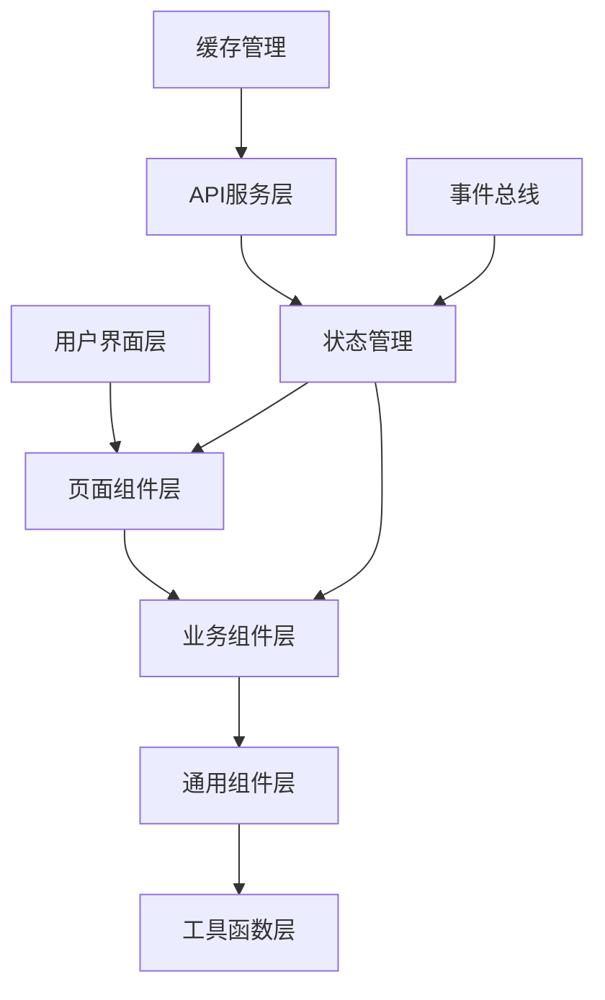

# API接口管理前端组件设计

## 1. 前端架构概述

### 1.1 整体架构



### 1.2 技术栈

- **框架**: React 18 + TypeScript
- **状态管理**: Zustand + React Query
- **样式系统**: Tailwind CSS + Headless UI
- **表单处理**: React Hook Form + Zod
- **图表可视化**: Recharts + D3.js
- **代码编辑**: Monaco Editor
- **文件操作**: React Dropzone
- **动画**: Framer Motion

### 1.3 目录结构

```
packages/frontend/src/
├── pages/                    # 页面组件
│   ├── APIManagementPage.tsx
│   ├── APIDesignerPage.tsx
│   ├── APITestingPage.tsx
│   └── APIDocumentationPage.tsx
├── components/               # 组件库
│   ├── api/                 # API管理组件
│   │   ├── endpoint/        # 端点管理
│   │   ├── parameter/       # 参数管理
│   │   ├── response/        # 响应管理
│   │   ├── testing/         # 测试组件
│   │   ├── documentation/   # 文档组件
│   │   └── monitoring/      # 监控组件
│   ├── shared/              # 共享组件
│   │   ├── editors/         # 编辑器组件
│   │   ├── forms/           # 表单组件
│   │   ├── charts/          # 图表组件
│   │   └── layout/          # 布局组件
│   └── ui/                  # 基础UI组件
├── hooks/                   # 自定义Hooks
├── services/                # API服务
├── stores/                  # 状态管理
├── utils/                   # 工具函数
└── types/                   # 类型定义
```

## 2. 核心页面组件

### 2.1 API管理主页面

```typescript
// src/pages/APIManagementPage.tsx
import React, { useState, useEffect } from 'react'
import { useParams, useSearchParams } from 'react-router-dom'
import { Tabs, TabsList, TabsTrigger, TabsContent } from '@/components/ui/tabs'
import { Button } from '@/components/ui/button'
import { Input } from '@/components/ui/input'
import {
  Code,
  FileText,
  TestTube,
  BarChart3,
  Settings,
  Plus,
  Search,
  Filter,
  Download
} from 'lucide-react'

import APIEndpointList from '@/components/api/endpoint/APIEndpointList'
import APIDesigner from '@/components/api/endpoint/APIDesigner'
import APITesting from '@/components/api/testing/APITesting'
import APIDocumentation from '@/components/api/documentation/APIDocumentation'
import APIMonitoring from '@/components/api/monitoring/APIMonitoring'
import ModelDrivenGenerator from '@/components/api/generator/ModelDrivenGenerator'

import { useAPIEndpoints } from '@/hooks/useAPIEndpoints'
import { useAPIFilters } from '@/hooks/useAPIFilters'

type TabType = 'endpoints' | 'generator' | 'designer' | 'testing' | 'documentation' | 'monitoring'

const APIManagementPage: React.FC = () => {
  const { projectId } = useParams<{ projectId: string }>()
  const [searchParams, setSearchParams] = useSearchParams()
  const [activeTab, setActiveTab] = useState<TabType>('endpoints')
  const [selectedEndpoint, setSelectedEndpoint] = useState<string | null>(null)

  // 状态管理
  const {
    endpoints,
    isLoading,
    error,
    refetch,
    createEndpoint,
    updateEndpoint,
    deleteEndpoint
  } = useAPIEndpoints(projectId!)

  const {
    filters,
    searchQuery,
    setSearchQuery,
    setFilter,
    clearFilters,
    filteredEndpoints
  } = useAPIFilters(endpoints)

  // URL同步
  useEffect(() => {
    const tab = searchParams.get('tab') as TabType
    if (tab) setActiveTab(tab)

    const endpoint = searchParams.get('endpoint')
    if (endpoint) setSelectedEndpoint(endpoint)
  }, [searchParams])

  const handleTabChange = (tab: TabType) => {
    setActiveTab(tab)
    setSearchParams(prev => {
      prev.set('tab', tab)
      return prev
    })
  }

  const handleEndpointSelect = (endpointId: string) => {
    setSelectedEndpoint(endpointId)
    setSearchParams(prev => {
      prev.set('endpoint', endpointId)
      return prev
    })
  }

  const tabs = [
    {
      id: 'endpoints',
      label: 'API列表',
      icon: Code,
      count: filteredEndpoints.length,
      description: '管理所有API接口'
    },
    {
      id: 'generator',
      label: '模型驱动生成',
      icon: Plus,
      description: '基于数据模型自动生成API'
    },
    {
      id: 'designer',
      label: 'API设计器',
      icon: FileText,
      description: '可视化设计API接口'
    },
    {
      id: 'testing',
      label: 'API测试',
      icon: TestTube,
      description: '执行API接口测试'
    },
    {
      id: 'documentation',
      label: 'API文档',
      icon: FileText,
      description: '生成和管理API文档'
    },
    {
      id: 'monitoring',
      label: '监控分析',
      icon: BarChart3,
      description: 'API性能监控和分析'
    }
  ] as const

  if (error) {
    return (
      <div className="flex items-center justify-center h-64">
        <div className="text-center">
          <div className="text-red-500 mb-2">加载失败</div>
          <Button onClick={refetch} variant="outline">重试</Button>
        </div>
      </div>
    )
  }

  return (
    <div className="min-h-screen bg-bg-paper">
      {/* 页面头部 */}
      <div className="bg-bg-paper border-b border-gray-200">
        <div className="max-w-7xl mx-auto px-4 sm:px-6 lg:px-8">
          <div className="flex items-center justify-between h-16">
            <div className="flex items-center space-x-4">
              <Code className="w-8 h-8 text-blue-500" />
              <div>
                <h1 className="text-xl font-semibold text-text-primary">API接口管理</h1>
                <p className="text-sm text-gray-500">设计、测试和管理API接口</p>
              </div>
            </div>

            <div className="flex items-center space-x-3">
              {/* 搜索框 */}
              <div className="relative">
                <Search className="absolute left-3 top-1/2 transform -translate-y-1/2 text-gray-400 w-4 h-4" />
                <Input
                  placeholder="搜索API接口..."
                  value={searchQuery}
                  onChange={(e) => setSearchQuery(e.target.value)}
                  className="pl-10 w-64"
                />
              </div>

              {/* 操作按钮 */}
              <Button variant="outline" size="sm">
                <Download className="w-4 h-4 mr-2" />
                导出OpenAPI
              </Button>

              <Button size="sm">
                <Plus className="w-4 h-4 mr-2" />
                创建接口
              </Button>
            </div>
          </div>
        </div>
      </div>

      {/* 标签导航 */}
      <div className="bg-bg-paper border-b border-gray-200">
        <div className="max-w-7xl mx-auto px-4 sm:px-6 lg:px-8">
          <Tabs value={activeTab} onValueChange={handleTabChange}>
            <TabsList className="grid grid-cols-6 w-full">
              {tabs.map((tab) => {
                const Icon = tab.icon
                return (
                  <TabsTrigger
                    key={tab.id}
                    value={tab.id}
                    className="flex items-center space-x-2 py-3"
                  >
                    <Icon className="w-4 h-4" />
                    <span className="hidden sm:inline">{tab.label}</span>
                    {tab.count !== undefined && (
                      <span className="bg-gray-100 text-text-secondary px-2 py-1 text-xs rounded-full">
                        {tab.count}
                      </span>
                    )}
                  </TabsTrigger>
                )
              })}
            </TabsList>
          </Tabs>
        </div>
      </div>

      {/* 主要内容区域 */}
      <div className="max-w-7xl mx-auto px-4 sm:px-6 lg:px-8 py-8">
        <Tabs value={activeTab}>
          <TabsContent value="endpoints">
            <APIEndpointList
              projectId={projectId!}
              endpoints={filteredEndpoints}
              selectedEndpoint={selectedEndpoint}
              onEndpointSelect={handleEndpointSelect}
              onEndpointCreate={createEndpoint}
              onEndpointUpdate={updateEndpoint}
              onEndpointDelete={deleteEndpoint}
              isLoading={isLoading}
            />
          </TabsContent>

          <TabsContent value="generator">
            <ModelDrivenGenerator
              projectId={projectId!}
              onEndpointsGenerated={(endpoints) => {
                refetch()
                setActiveTab('endpoints')
              }}
            />
          </TabsContent>

          <TabsContent value="designer">
            <APIDesigner
              projectId={projectId!}
              selectedEndpoint={selectedEndpoint}
              onEndpointSave={(endpoint) => {
                if (selectedEndpoint) {
                  updateEndpoint({ id: selectedEndpoint, ...endpoint })
                } else {
                  createEndpoint(endpoint)
                }
              }}
            />
          </TabsContent>

          <TabsContent value="testing">
            <APITesting
              projectId={projectId!}
              endpoints={endpoints}
              selectedEndpoint={selectedEndpoint}
            />
          </TabsContent>

          <TabsContent value="documentation">
            <APIDocumentation
              projectId={projectId!}
              endpoints={endpoints}
            />
          </TabsContent>

          <TabsContent value="monitoring">
            <APIMonitoring
              projectId={projectId!}
              endpoints={endpoints}
            />
          </TabsContent>
        </Tabs>
      </div>
    </div>
  )
}

export default APIManagementPage
```

### 2.2 API设计器页面

```typescript
// src/components/api/endpoint/APIDesigner.tsx
import React, { useState, useCallback } from 'react'
import { Card, CardHeader, CardTitle, CardContent } from '@/components/ui/card'
import { Button } from '@/components/ui/button'
import { Input } from '@/components/ui/input'
import { Textarea } from '@/components/ui/textarea'
import { Select, SelectContent, SelectItem, SelectTrigger, SelectValue } from '@/components/ui/select'
import { Badge } from '@/components/ui/badge'
import { Tabs, TabsList, TabsTrigger, TabsContent } from '@/components/ui/tabs'
import {
  Settings,
  Plus,
  Trash2,
  Copy,
  Play,
  Code,
  Eye,
  Save
} from 'lucide-react'

import ParameterEditor from './ParameterEditor'
import ResponseEditor from './ResponseEditor'
import APIPreview from './APIPreview'
import CodeGenerator from '../code/CodeGenerator'

import { useForm } from 'react-hook-form'
import { zodResolver } from '@hookform/resolvers/zod'
import { apiEndpointSchema } from '@/schemas/api'
import { APIEndpoint, APIParameter, APIResponse } from '@/types/api'

interface APIDesignerProps {
  projectId: string
  selectedEndpoint?: string | null
  endpoint?: APIEndpoint
  onEndpointSave: (endpoint: Partial<APIEndpoint>) => void
}

const APIDesigner: React.FC<APIDesignerProps> = ({
  projectId,
  selectedEndpoint,
  endpoint,
  onEndpointSave
}) => {
  const [activeTab, setActiveTab] = useState<'basic' | 'parameters' | 'responses' | 'settings'>('basic')
  const [parameters, setParameters] = useState<APIParameter[]>(endpoint?.parameters || [])
  const [responses, setResponses] = useState<APIResponse[]>(endpoint?.responses || [])
  const [showPreview, setShowPreview] = useState(false)
  const [showCodeGen, setShowCodeGen] = useState(false)

  const {
    register,
    handleSubmit,
    watch,
    setValue,
    formState: { errors, isDirty }
  } = useForm<Partial<APIEndpoint>>({
    resolver: zodResolver(apiEndpointSchema.partial()),
    defaultValues: endpoint || {
      method: 'GET',
      status: 'DRAFT',
      authRequired: true
    }
  })

  const watchedValues = watch()

  const onSubmit = useCallback((data: Partial<APIEndpoint>) => {
    const endpointData = {
      ...data,
      projectId,
      parameters,
      responses
    }
    onEndpointSave(endpointData)
  }, [projectId, parameters, responses, onEndpointSave])

  const handleParameterChange = useCallback((newParameters: APIParameter[]) => {
    setParameters(newParameters)
  }, [])

  const handleResponseChange = useCallback((newResponses: APIResponse[]) => {
    setResponses(newResponses)
  }, [])

  const generateOperationId = useCallback(() => {
    const method = watchedValues.method?.toLowerCase()
    const path = watchedValues.path
    if (method && path) {
      const pathSegments = path.split('/').filter(Boolean)
      const resource = pathSegments[pathSegments.length - 1]?.replace(/[{}]/g, '') || 'resource'
      const operation = method === 'get' && path.includes('{') ? 'get' : method
      const operationId = `${operation}${resource.charAt(0).toUpperCase() + resource.slice(1)}`
      setValue('operationId', operationId)
    }
  }, [watchedValues.method, watchedValues.path, setValue])

  const tabs = [
    { id: 'basic', label: '基本信息', icon: Settings },
    { id: 'parameters', label: '请求参数', icon: Plus, count: parameters.length },
    { id: 'responses', label: '响应定义', icon: Code, count: responses.length },
    { id: 'settings', label: '高级设置', icon: Settings }
  ] as const

  return (
    <div className="space-y-6">
      {/* 工具栏 */}
      <div className="flex items-center justify-between">
        <div className="flex items-center space-x-4">
          <h2 className="text-2xl font-bold text-text-primary">
            {endpoint ? '编辑API接口' : '创建API接口'}
          </h2>
          {watchedValues.status && (
            <Badge variant={watchedValues.status === 'ACTIVE' ? 'default' : 'secondary'}>
              {watchedValues.status}
            </Badge>
          )}
        </div>

        <div className="flex items-center space-x-3">
          <Button
            variant="outline"
            size="sm"
            onClick={() => setShowPreview(!showPreview)}
          >
            <Eye className="w-4 h-4 mr-2" />
            {showPreview ? '隐藏预览' : '预览'}
          </Button>

          <Button
            variant="outline"
            size="sm"
            onClick={() => setShowCodeGen(!showCodeGen)}
          >
            <Code className="w-4 h-4 mr-2" />
            生成代码
          </Button>

          <Button
            onClick={handleSubmit(onSubmit)}
            disabled={!isDirty}
            size="sm"
          >
            <Save className="w-4 h-4 mr-2" />
            保存
          </Button>
        </div>
      </div>

      <div className="grid grid-cols-1 lg:grid-cols-3 gap-6">
        {/* 主编辑区域 */}
        <div className="lg:col-span-2">
          <Card>
            <CardHeader>
              <Tabs value={activeTab} onValueChange={setActiveTab}>
                <TabsList className="grid grid-cols-4 w-full">
                  {tabs.map(tab => {
                    const Icon = tab.icon
                    return (
                      <TabsTrigger
                        key={tab.id}
                        value={tab.id}
                        className="flex items-center space-x-2"
                      >
                        <Icon className="w-4 h-4" />
                        <span className="hidden sm:inline">{tab.label}</span>
                        {tab.count !== undefined && (
                          <span className="bg-gray-100 text-text-secondary px-1.5 py-0.5 text-xs rounded">
                            {tab.count}
                          </span>
                        )}
                      </TabsTrigger>
                    )
                  })}
                </TabsList>
              </Tabs>
            </CardHeader>

            <CardContent>
              <form onSubmit={handleSubmit(onSubmit)} className="space-y-6">
                <Tabs value={activeTab}>
                  {/* 基本信息 */}
                  <TabsContent value="basic" className="space-y-4">
                    <div className="grid grid-cols-1 md:grid-cols-2 gap-4">
                      <div>
                        <label className="block text-sm font-medium text-text-secondary mb-2">
                          HTTP方法 *
                        </label>
                        <Select
                          value={watchedValues.method}
                          onValueChange={(value) => setValue('method', value)}
                        >
                          <SelectTrigger>
                            <SelectValue placeholder="选择HTTP方法" />
                          </SelectTrigger>
                          <SelectContent>
                            <SelectItem value="GET">GET</SelectItem>
                            <SelectItem value="POST">POST</SelectItem>
                            <SelectItem value="PUT">PUT</SelectItem>
                            <SelectItem value="DELETE">DELETE</SelectItem>
                            <SelectItem value="PATCH">PATCH</SelectItem>
                          </SelectContent>
                        </Select>
                        {errors.method && (
                          <p className="text-red-500 text-sm mt-1">{errors.method.message}</p>
                        )}
                      </div>

                      <div>
                        <label className="block text-sm font-medium text-text-secondary mb-2">
                          API路径 *
                        </label>
                        <Input
                          {...register('path')}
                          placeholder="/api/v1/users/{id}"
                          onChange={(e) => {
                            register('path').onChange(e)
                            generateOperationId()
                          }}
                        />
                        {errors.path && (
                          <p className="text-red-500 text-sm mt-1">{errors.path.message}</p>
                        )}
                      </div>
                    </div>

                    <div>
                      <label className="block text-sm font-medium text-text-secondary mb-2">
                        API名称 *
                      </label>
                      <Input
                        {...register('name')}
                        placeholder="getUserById"
                      />
                      {errors.name && (
                        <p className="text-red-500 text-sm mt-1">{errors.name.message}</p>
                      )}
                    </div>

                    <div>
                      <label className="block text-sm font-medium text-text-secondary mb-2">
                        显示名称
                      </label>
                      <Input
                        {...register('displayName')}
                        placeholder="获取用户信息"
                      />
                    </div>

                    <div>
                      <label className="block text-sm font-medium text-text-secondary mb-2">
                        操作ID
                      </label>
                      <div className="flex space-x-2">
                        <Input
                          {...register('operationId')}
                          placeholder="getUserById"
                          className="flex-1"
                        />
                        <Button
                          type="button"
                          variant="outline"
                          size="sm"
                          onClick={generateOperationId}
                        >
                          自动生成
                        </Button>
                      </div>
                    </div>

                    <div>
                      <label className="block text-sm font-medium text-text-secondary mb-2">
                        API描述
                      </label>
                      <Textarea
                        {...register('description')}
                        placeholder="详细描述该API的功能和用途"
                        rows={3}
                      />
                    </div>

                    <div className="grid grid-cols-1 md:grid-cols-2 gap-4">
                      <div>
                        <label className="block text-sm font-medium text-text-secondary mb-2">
                          分类
                        </label>
                        <Input
                          {...register('category')}
                          placeholder="用户管理"
                        />
                      </div>

                      <div>
                        <label className="block text-sm font-medium text-text-secondary mb-2">
                          状态
                        </label>
                        <Select
                          value={watchedValues.status}
                          onValueChange={(value) => setValue('status', value)}
                        >
                          <SelectTrigger>
                            <SelectValue />
                          </SelectTrigger>
                          <SelectContent>
                            <SelectItem value="DRAFT">草稿</SelectItem>
                            <SelectItem value="ACTIVE">活跃</SelectItem>
                            <SelectItem value="DEPRECATED">已废弃</SelectItem>
                          </SelectContent>
                        </Select>
                      </div>
                    </div>
                  </TabsContent>

                  {/* 请求参数 */}
                  <TabsContent value="parameters">
                    <ParameterEditor
                      parameters={parameters}
                      onChange={handleParameterChange}
                      endpoint={watchedValues}
                    />
                  </TabsContent>

                  {/* 响应定义 */}
                  <TabsContent value="responses">
                    <ResponseEditor
                      responses={responses}
                      onChange={handleResponseChange}
                      endpoint={watchedValues}
                    />
                  </TabsContent>

                  {/* 高级设置 */}
                  <TabsContent value="settings" className="space-y-4">
                    <div className="grid grid-cols-1 md:grid-cols-2 gap-4">
                      <div>
                        <label className="block text-sm font-medium text-text-secondary mb-2">
                          认证类型
                        </label>
                        <Select
                          value={watchedValues.authType}
                          onValueChange={(value) => setValue('authType', value)}
                        >
                          <SelectTrigger>
                            <SelectValue placeholder="选择认证类型" />
                          </SelectTrigger>
                          <SelectContent>
                            <SelectItem value="bearer">Bearer Token</SelectItem>
                            <SelectItem value="api_key">API Key</SelectItem>
                            <SelectItem value="oauth2">OAuth 2.0</SelectItem>
                            <SelectItem value="basic">Basic Auth</SelectItem>
                          </SelectContent>
                        </Select>
                      </div>

                      <div>
                        <label className="block text-sm font-medium text-text-secondary mb-2">
                          超时时间 (ms)
                        </label>
                        <Input
                          {...register('timeoutMs', { valueAsNumber: true })}
                          type="number"
                          placeholder="30000"
                        />
                      </div>
                    </div>

                    <div className="grid grid-cols-1 md:grid-cols-2 gap-4">
                      <div>
                        <label className="block text-sm font-medium text-text-secondary mb-2">
                          速率限制 (RPM)
                        </label>
                        <Input
                          {...register('rateLimitRpm', { valueAsNumber: true })}
                          type="number"
                          placeholder="1000"
                        />
                      </div>

                      <div>
                        <label className="block text-sm font-medium text-text-secondary mb-2">
                          缓存时间 (秒)
                        </label>
                        <Input
                          {...register('cacheTtl', { valueAsNumber: true })}
                          type="number"
                          placeholder="300"
                        />
                      </div>
                    </div>

                    <div className="space-y-3">
                      <div className="flex items-center space-x-3">
                        <input
                          {...register('authRequired')}
                          type="checkbox"
                          className="rounded border-gray-300 bg-bg-secondary"
                        />
                        <label className="text-sm font-medium text-text-secondary">
                          需要身份验证
                        </label>
                      </div>

                      <div className="flex items-center space-x-3">
                        <input
                          {...register('isAutoGenerated')}
                          type="checkbox"
                          className="rounded border-gray-300 bg-bg-secondary"
                        />
                        <label className="text-sm font-medium text-text-secondary">
                          自动生成的接口
                        </label>
                      </div>
                    </div>

                    <div>
                      <label className="block text-sm font-medium text-text-secondary mb-2">
                        标签
                      </label>
                      <Input
                        placeholder="输入标签，用逗号分隔"
                        onChange={(e) => {
                          const tags = e.target.value.split(',').map(tag => tag.trim()).filter(Boolean)
                          setValue('tags', tags)
                        }}
                      />
                    </div>
                  </TabsContent>
                </Tabs>
              </form>
            </CardContent>
          </Card>
        </div>

        {/* 预览区域 */}
        {showPreview && (
          <div className="lg:col-span-1">
            <APIPreview
              endpoint={{
                ...watchedValues,
                parameters,
                responses
              }}
            />
          </div>
        )}
      </div>

      {/* 代码生成器模态框 */}
      {showCodeGen && (
        <CodeGenerator
          endpoint={{
            ...watchedValues,
            parameters,
            responses
          }}
          onClose={() => setShowCodeGen(false)}
        />
      )}
    </div>
  )
}

export default APIDesigner
```

## 3. 业务组件设计

### 3.1 API端点列表组件

```typescript
// src/components/api/endpoint/APIEndpointList.tsx
import React, { useState, useMemo } from 'react'
import { Card, CardContent } from '@/components/ui/card'
import { Button } from '@/components/ui/button'
import { Input } from '@/components/ui/input'
import { Badge } from '@/components/ui/badge'
import {
  Search,
  Filter,
  MoreVertical,
  Play,
  Edit,
  Copy,
  Trash2,
  Eye
} from 'lucide-react'
import {
  DropdownMenu,
  DropdownMenuContent,
  DropdownMenuItem,
  DropdownMenuTrigger,
  DropdownMenuSeparator
} from '@/components/ui/dropdown-menu'

import APIEndpointCard from './APIEndpointCard'
import APIFilterPanel from './APIFilterPanel'
import { APIEndpoint } from '@/types/api'

interface APIEndpointListProps {
  projectId: string
  endpoints: APIEndpoint[]
  selectedEndpoint?: string | null
  onEndpointSelect: (endpointId: string) => void
  onEndpointCreate: (endpoint: Partial<APIEndpoint>) => void
  onEndpointUpdate: (endpoint: Partial<APIEndpoint> & { id: string }) => void
  onEndpointDelete: (endpointId: string) => void
  isLoading?: boolean
}

const APIEndpointList: React.FC<APIEndpointListProps> = ({
  projectId,
  endpoints,
  selectedEndpoint,
  onEndpointSelect,
  onEndpointCreate,
  onEndpointUpdate,
  onEndpointDelete,
  isLoading = false
}) => {
  const [searchQuery, setSearchQuery] = useState('')
  const [showFilters, setShowFilters] = useState(false)
  const [viewMode, setViewMode] = useState<'grid' | 'list'>('grid')
  const [sortBy, setSortBy] = useState<'name' | 'path' | 'method' | 'category' | 'updated'>('updated')
  const [sortOrder, setSortOrder] = useState<'asc' | 'desc'>('desc')

  // 过滤和排序逻辑
  const filteredAndSortedEndpoints = useMemo(() => {
    let filtered = endpoints

    // 搜索过滤
    if (searchQuery.trim()) {
      const query = searchQuery.toLowerCase()
      filtered = filtered.filter(endpoint =>
        endpoint.name.toLowerCase().includes(query) ||
        endpoint.displayName?.toLowerCase().includes(query) ||
        endpoint.path.toLowerCase().includes(query) ||
        endpoint.description?.toLowerCase().includes(query)
      )
    }

    // 排序
    filtered.sort((a, b) => {
      let comparison = 0

      switch (sortBy) {
        case 'name':
          comparison = a.name.localeCompare(b.name)
          break
        case 'path':
          comparison = a.path.localeCompare(b.path)
          break
        case 'method':
          comparison = a.method.localeCompare(b.method)
          break
        case 'category':
          comparison = (a.category || '').localeCompare(b.category || '')
          break
        case 'updated':
          comparison = new Date(a.updatedAt).getTime() - new Date(b.updatedAt).getTime()
          break
        default:
          comparison = 0
      }

      return sortOrder === 'asc' ? comparison : -comparison
    })

    return filtered
  }, [endpoints, searchQuery, sortBy, sortOrder])

  // 分组逻辑
  const groupedEndpoints = useMemo(() => {
    const groups = new Map<string, APIEndpoint[]>()

    filteredAndSortedEndpoints.forEach(endpoint => {
      const groupKey = endpoint.category || '未分类'
      if (!groups.has(groupKey)) {
        groups.set(groupKey, [])
      }
      groups.get(groupKey)!.push(endpoint)
    })

    return groups
  }, [filteredAndSortedEndpoints])

  const handleEndpointAction = (action: string, endpoint: APIEndpoint) => {
    switch (action) {
      case 'view':
        onEndpointSelect(endpoint.id)
        break
      case 'edit':
        // 跳转到设计器
        break
      case 'test':
        // 跳转到测试页面
        break
      case 'copy':
        // 复制端点
        const copyData = {
          ...endpoint,
          name: `${endpoint.name}_copy`,
          displayName: `${endpoint.displayName} (副本)`
        }
        delete copyData.id
        onEndpointCreate(copyData)
        break
      case 'delete':
        if (confirm('确定要删除这个API接口吗？')) {
          onEndpointDelete(endpoint.id)
        }
        break
    }
  }

  if (isLoading) {
    return (
      <div className="space-y-4">
        {Array.from({ length: 6 }).map((_, i) => (
          <div key={i} className="animate-pulse">
            <div className="bg-gray-200 rounded-lg h-32"></div>
          </div>
        ))}
      </div>
    )
  }

  return (
    <div className="space-y-6">
      {/* 工具栏 */}
      <div className="flex flex-col sm:flex-row sm:items-center sm:justify-between space-y-4 sm:space-y-0">
        <div className="flex items-center space-x-4">
          <div className="relative">
            <Search className="absolute left-3 top-1/2 transform -translate-y-1/2 text-gray-400 w-4 h-4" />
            <Input
              placeholder="搜索API接口..."
              value={searchQuery}
              onChange={(e) => setSearchQuery(e.target.value)}
              className="pl-10 w-64"
            />
          </div>

          <Button
            variant="outline"
            size="sm"
            onClick={() => setShowFilters(!showFilters)}
          >
            <Filter className="w-4 h-4 mr-2" />
            筛选
          </Button>
        </div>

        <div className="flex items-center space-x-2">
          <select
            value={sortBy}
            onChange={(e) => setSortBy(e.target.value as any)}
            className="border border-gray-300 bg-bg-secondary focus:outline-none rounded-md px-3 py-1 text-sm"
          >
            <option value="updated">最近更新</option>
            <option value="name">名称</option>
            <option value="path">路径</option>
            <option value="method">方法</option>
            <option value="category">分类</option>
          </select>

          <Button
            variant="outline"
            size="sm"
            onClick={() => setSortOrder(sortOrder === 'asc' ? 'desc' : 'asc')}
          >
            {sortOrder === 'asc' ? '↑' : '↓'}
          </Button>
        </div>
      </div>

      {/* 筛选面板 */}
      {showFilters && (
        <APIFilterPanel
          endpoints={endpoints}
          onFilterChange={(filters) => {
            // 处理筛选逻辑
          }}
        />
      )}

      {/* 统计信息 */}
      <div className="bg-bg-paper rounded-lg border p-4">
        <div className="grid grid-cols-2 md:grid-cols-4 gap-4">
          <div className="text-center">
            <div className="text-2xl font-bold text-blue-600">{endpoints.length}</div>
            <div className="text-sm text-gray-500">总接口数</div>
          </div>
          <div className="text-center">
            <div className="text-2xl font-bold text-green-600">
              {endpoints.filter(e => e.status === 'ACTIVE').length}
            </div>
            <div className="text-sm text-gray-500">活跃接口</div>
          </div>
          <div className="text-center">
            <div className="text-2xl font-bold text-yellow-600">
              {endpoints.filter(e => e.status === 'DRAFT').length}
            </div>
            <div className="text-sm text-gray-500">草稿接口</div>
          </div>
          <div className="text-center">
            <div className="text-2xl font-bold text-red-600">
              {endpoints.filter(e => e.status === 'DEPRECATED').length}
            </div>
            <div className="text-sm text-gray-500">已废弃</div>
          </div>
        </div>
      </div>

      {/* 接口列表 */}
      {filteredAndSortedEndpoints.length === 0 ? (
        <div className="text-center py-12">
          <div className="text-gray-400 mb-4">
            <Search className="w-16 h-16 mx-auto" />
          </div>
          <h3 className="text-lg font-medium text-text-primary mb-2">
            {searchQuery ? '未找到匹配的接口' : '暂无API接口'}
          </h3>
          <p className="text-text-secondary mb-6">
            {searchQuery ? '尝试调整搜索条件' : '开始创建你的第一个API接口'}
          </p>
          {!searchQuery && (
            <Button onClick={() => onEndpointCreate({})}>
              创建API接口
            </Button>
          )}
        </div>
      ) : (
        <div className="space-y-6">
          {Array.from(groupedEndpoints.entries()).map(([category, groupEndpoints]) => (
            <div key={category}>
              <h3 className="text-lg font-medium text-text-primary mb-4 flex items-center">
                {category}
                <Badge variant="secondary" className="ml-2">
                  {groupEndpoints.length}
                </Badge>
              </h3>

              <div className={`grid gap-4 ${
                viewMode === 'grid'
                  ? 'grid-cols-1 md:grid-cols-2 lg:grid-cols-3'
                  : 'grid-cols-1'
              }`}>
                {groupEndpoints.map(endpoint => (
                  <APIEndpointCard
                    key={endpoint.id}
                    endpoint={endpoint}
                    isSelected={selectedEndpoint === endpoint.id}
                    viewMode={viewMode}
                    onClick={() => onEndpointSelect(endpoint.id)}
                    onAction={(action) => handleEndpointAction(action, endpoint)}
                  />
                ))}
              </div>
            </div>
          ))}
        </div>
      )}
    </div>
  )
}

export default APIEndpointList
```

### 3.2 API端点卡片组件

```typescript
// src/components/api/endpoint/APIEndpointCard.tsx
import React from 'react'
import { Card, CardContent } from '@/components/ui/card'
import { Button } from '@/components/ui/button'
import { Badge } from '@/components/ui/badge'
import {
  MoreVertical,
  Play,
  Edit,
  Copy,
  Trash2,
  Eye,
  Clock,
  User,
  AlertCircle
} from 'lucide-react'
import {
  DropdownMenu,
  DropdownMenuContent,
  DropdownMenuItem,
  DropdownMenuTrigger,
  DropdownMenuSeparator
} from '@/components/ui/dropdown-menu'
import { formatDistanceToNow } from 'date-fns'
import { zhCN } from 'date-fns/locale'

import { APIEndpoint } from '@/types/api'

interface APIEndpointCardProps {
  endpoint: APIEndpoint
  isSelected?: boolean
  viewMode?: 'grid' | 'list'
  onClick: () => void
  onAction: (action: string) => void
}

const APIEndpointCard: React.FC<APIEndpointCardProps> = ({
  endpoint,
  isSelected = false,
  viewMode = 'grid',
  onClick,
  onAction
}) => {
  const getMethodColor = (method: string) => {
    const colors = {
      GET: 'bg-green-100 text-green-800 border-green-200',
      POST: 'bg-blue-100 text-blue-800 border-blue-200',
      PUT: 'bg-yellow-100 text-yellow-800 border-yellow-200',
      DELETE: 'bg-red-100 text-red-800 border-red-200',
      PATCH: 'bg-purple-100 text-purple-800 border-purple-200'
    }
    return colors[method as keyof typeof colors] || 'bg-gray-100 text-gray-800 border-gray-200'
  }

  const getStatusColor = (status: string) => {
    const colors = {
      ACTIVE: 'bg-green-100 text-green-800',
      DRAFT: 'bg-yellow-100 text-yellow-800',
      DEPRECATED: 'bg-red-100 text-red-800',
      DELETED: 'bg-gray-100 text-gray-800'
    }
    return colors[status as keyof typeof colors] || 'bg-gray-100 text-gray-800'
  }

  const formatRelativeTime = (date: string | Date) => {
    return formatDistanceToNow(new Date(date), {
      addSuffix: true,
      locale: zhCN
    })
  }

  if (viewMode === 'list') {
    return (
      <Card
        className={`cursor-pointer transition-all hover:shadow-md ${
          isSelected ? 'ring-2 ring-blue-500 border-blue-500' : ''
        }`}
        onClick={onClick}
      >
        <CardContent className="p-4">
          <div className="flex items-center justify-between">
            <div className="flex items-center space-x-4 flex-1">
              <Badge className={`${getMethodColor(endpoint.method)} border font-mono text-xs`}>
                {endpoint.method}
              </Badge>

              <div className="flex-1 min-w-0">
                <div className="flex items-center space-x-2">
                  <h3 className="font-medium text-text-primary truncate">
                    {endpoint.displayName || endpoint.name}
                  </h3>
                  <Badge className={getStatusColor(endpoint.status)}>
                    {endpoint.status}
                  </Badge>
                </div>
                <p className="text-sm text-text-secondary font-mono truncate">
                  {endpoint.path}
                </p>
                {endpoint.description && (
                  <p className="text-sm text-gray-500 truncate">
                    {endpoint.description}
                  </p>
                )}
              </div>
            </div>

            <div className="flex items-center space-x-2">
              <div className="text-xs text-gray-500 text-right">
                <div className="flex items-center space-x-1">
                  <Clock className="w-3 h-3" />
                  <span>{formatRelativeTime(endpoint.updatedAt)}</span>
                </div>
                {endpoint.lastModifiedBy && (
                  <div className="flex items-center space-x-1 mt-1">
                    <User className="w-3 h-3" />
                    <span>{endpoint.lastModifiedBy}</span>
                  </div>
                )}
              </div>

              <DropdownMenu>
                <DropdownMenuTrigger asChild>
                  <Button variant="ghost" size="sm">
                    <MoreVertical className="w-4 h-4" />
                  </Button>
                </DropdownMenuTrigger>
                <DropdownMenuContent align="end">
                  <DropdownMenuItem onClick={() => onAction('view')}>
                    <Eye className="w-4 h-4 mr-2" />
                    查看详情
                  </DropdownMenuItem>
                  <DropdownMenuItem onClick={() => onAction('edit')}>
                    <Edit className="w-4 h-4 mr-2" />
                    编辑
                  </DropdownMenuItem>
                  <DropdownMenuItem onClick={() => onAction('test')}>
                    <Play className="w-4 h-4 mr-2" />
                    测试
                  </DropdownMenuItem>
                  <DropdownMenuSeparator />
                  <DropdownMenuItem onClick={() => onAction('copy')}>
                    <Copy className="w-4 h-4 mr-2" />
                    复制
                  </DropdownMenuItem>
                  <DropdownMenuItem
                    onClick={() => onAction('delete')}
                    className="text-red-600"
                  >
                    <Trash2 className="w-4 h-4 mr-2" />
                    删除
                  </DropdownMenuItem>
                </DropdownMenuContent>
              </DropdownMenu>
            </div>
          </div>
        </CardContent>
      </Card>
    )
  }

  return (
    <Card
      className={`cursor-pointer transition-all hover:shadow-md ${
        isSelected ? 'ring-2 ring-blue-500 border-blue-500' : ''
      }`}
      onClick={onClick}
    >
      <CardContent className="p-4">
        <div className="space-y-3">
          {/* 头部 */}
          <div className="flex items-start justify-between">
            <div className="flex items-center space-x-2">
              <Badge className={`${getMethodColor(endpoint.method)} border font-mono text-xs`}>
                {endpoint.method}
              </Badge>
              <Badge className={getStatusColor(endpoint.status)}>
                {endpoint.status}
              </Badge>
            </div>

            <DropdownMenu>
              <DropdownMenuTrigger asChild>
                <Button variant="ghost" size="sm">
                  <MoreVertical className="w-4 h-4" />
                </Button>
              </DropdownMenuTrigger>
              <DropdownMenuContent align="end">
                <DropdownMenuItem onClick={() => onAction('view')}>
                  <Eye className="w-4 h-4 mr-2" />
                  查看详情
                </DropdownMenuItem>
                <DropdownMenuItem onClick={() => onAction('edit')}>
                  <Edit className="w-4 h-4 mr-2" />
                  编辑
                </DropdownMenuItem>
                <DropdownMenuItem onClick={() => onAction('test')}>
                  <Play className="w-4 h-4 mr-2" />
                  测试
                </DropdownMenuItem>
                <DropdownMenuSeparator />
                <DropdownMenuItem onClick={() => onAction('copy')}>
                  <Copy className="w-4 h-4 mr-2" />
                  复制
                </DropdownMenuItem>
                <DropdownMenuItem
                  onClick={() => onAction('delete')}
                  className="text-red-600"
                >
                  <Trash2 className="w-4 h-4 mr-2" />
                  删除
                </DropdownMenuItem>
              </DropdownMenuContent>
            </DropdownMenu>
          </div>

          {/* 接口信息 */}
          <div>
            <h3 className="font-medium text-text-primary mb-1">
              {endpoint.displayName || endpoint.name}
            </h3>
            <p className="text-sm text-text-secondary font-mono break-all">
              {endpoint.path}
            </p>
            {endpoint.description && (
              <p className="text-sm text-gray-500 mt-1 line-clamp-2">
                {endpoint.description}
              </p>
            )}
          </div>

          {/* 统计信息 */}
          <div className="flex items-center justify-between text-xs text-gray-500">
            <div className="flex items-center space-x-4">
              <span>{endpoint.parameters?.length || 0} 参数</span>
              <span>{endpoint.responses?.length || 0} 响应</span>
              {endpoint.authRequired && (
                <div className="flex items-center space-x-1">
                  <AlertCircle className="w-3 h-3" />
                  <span>需认证</span>
                </div>
              )}
            </div>

            <div className="text-right">
              <div className="flex items-center space-x-1">
                <Clock className="w-3 h-3" />
                <span>{formatRelativeTime(endpoint.updatedAt)}</span>
              </div>
            </div>
          </div>

          {/* 标签 */}
          {endpoint.tags && endpoint.tags.length > 0 && (
            <div className="flex flex-wrap gap-1">
              {endpoint.tags.slice(0, 3).map((tag, index) => (
                <Badge key={index} variant="outline" className="text-xs">
                  {tag}
                </Badge>
              ))}
              {endpoint.tags.length > 3 && (
                <Badge variant="outline" className="text-xs">
                  +{endpoint.tags.length - 3}
                </Badge>
              )}
            </div>
          )}
        </div>
      </CardContent>
    </Card>
  )
}

export default APIEndpointCard
```

## 4. 通用组件设计

### 4.1 代码编辑器组件

```typescript
// src/components/shared/editors/CodeEditor.tsx
import React, { useRef, useEffect } from 'react'
import * as monaco from 'monaco-editor'
import { Card, CardContent, CardHeader, CardTitle } from '@/components/ui/card'
import { Button } from '@/components/ui/button'
import { Copy, Download, Expand } from 'lucide-react'

interface CodeEditorProps {
  value: string
  language: string
  onChange?: (value: string) => void
  readOnly?: boolean
  height?: number
  title?: string
  onCopy?: () => void
  onDownload?: () => void
  onFullscreen?: () => void
}

const CodeEditor: React.FC<CodeEditorProps> = ({
  value,
  language,
  onChange,
  readOnly = false,
  height = 400,
  title,
  onCopy,
  onDownload,
  onFullscreen
}) => {
  const editorRef = useRef<HTMLDivElement>(null)
  const monacoRef = useRef<monaco.editor.IStandaloneCodeEditor>()

  useEffect(() => {
    if (!editorRef.current) return

    // 创建编辑器实例
    monacoRef.current = monaco.editor.create(editorRef.current, {
      value,
      language,
      theme: 'vs-dark',
      readOnly,
      automaticLayout: true,
      minimap: { enabled: false },
      scrollBeyondLastLine: false,
      fontSize: 14,
      lineNumbers: 'on',
      glyphMargin: false,
      folding: true,
      lineDecorationsWidth: 0,
      lineNumbersMinChars: 3
    })

    // 监听内容变化
    if (onChange) {
      monacoRef.current.onDidChangeModelContent(() => {
        const currentValue = monacoRef.current?.getValue() || ''
        onChange(currentValue)
      })
    }

    return () => {
      monacoRef.current?.dispose()
    }
  }, [])

  // 更新值
  useEffect(() => {
    if (monacoRef.current && monacoRef.current.getValue() !== value) {
      monacoRef.current.setValue(value)
    }
  }, [value])

  // 更新语言
  useEffect(() => {
    if (monacoRef.current) {
      const model = monacoRef.current.getModel()
      if (model) {
        monaco.editor.setModelLanguage(model, language)
      }
    }
  }, [language])

  const handleCopy = () => {
    navigator.clipboard.writeText(value)
    onCopy?.()
  }

  const handleDownload = () => {
    const blob = new Blob([value], { type: 'text/plain' })
    const url = URL.createObjectURL(blob)
    const link = document.createElement('a')
    link.href = url
    link.download = `code.${language}`
    link.click()
    URL.revokeObjectURL(url)
    onDownload?.()
  }

  return (
    <Card>
      {title && (
        <CardHeader className="pb-3">
          <div className="flex items-center justify-between">
            <CardTitle className="text-lg">{title}</CardTitle>
            <div className="flex items-center space-x-2">
              <Button variant="ghost" size="sm" onClick={handleCopy}>
                <Copy className="w-4 h-4" />
              </Button>
              <Button variant="ghost" size="sm" onClick={handleDownload}>
                <Download className="w-4 h-4" />
              </Button>
              {onFullscreen && (
                <Button variant="ghost" size="sm" onClick={onFullscreen}>
                  <Expand className="w-4 h-4" />
                </Button>
              )}
            </div>
          </div>
        </CardHeader>
      )}
      <CardContent className="p-0">
        <div
          ref={editorRef}
          style={{ height: `${height}px` }}
          className="w-full border-none"
        />
      </CardContent>
    </Card>
  )
}

export default CodeEditor
```

### 4.2 JSON编辑器组件

```typescript
// src/components/shared/editors/JSONEditor.tsx
import React, { useState, useCallback } from 'react'
import { Card, CardContent, CardHeader, CardTitle } from '@/components/ui/card'
import { Button } from '@/components/ui/button'
import { Alert, AlertDescription } from '@/components/ui/alert'
import { Check, X, AlertCircle } from 'lucide-react'
import CodeEditor from './CodeEditor'

interface JSONEditorProps {
  value: object | string
  onChange: (value: object) => void
  title?: string
  height?: number
  validateSchema?: object
}

const JSONEditor: React.FC<JSONEditorProps> = ({
  value,
  onChange,
  title = 'JSON编辑器',
  height = 300,
  validateSchema
}) => {
  const [jsonString, setJsonString] = useState(() => {
    return typeof value === 'string' ? value : JSON.stringify(value, null, 2)
  })
  const [isValid, setIsValid] = useState(true)
  const [error, setError] = useState<string>('')

  const validateJSON = useCallback((jsonStr: string) => {
    try {
      const parsed = JSON.parse(jsonStr)

      // 如果有Schema验证
      if (validateSchema) {
        // 这里可以集成JSON Schema验证库
        // 例如 ajv
      }

      setIsValid(true)
      setError('')
      return parsed
    } catch (err) {
      setIsValid(false)
      setError(err instanceof Error ? err.message : '无效的JSON格式')
      return null
    }
  }, [validateSchema])

  const handleChange = useCallback((newValue: string) => {
    setJsonString(newValue)
    const parsed = validateJSON(newValue)
    if (parsed !== null) {
      onChange(parsed)
    }
  }, [onChange, validateJSON])

  const formatJSON = useCallback(() => {
    try {
      const parsed = JSON.parse(jsonString)
      const formatted = JSON.stringify(parsed, null, 2)
      setJsonString(formatted)
      handleChange(formatted)
    } catch (err) {
      // 忽略格式化错误
    }
  }, [jsonString, handleChange])

  const minifyJSON = useCallback(() => {
    try {
      const parsed = JSON.parse(jsonString)
      const minified = JSON.stringify(parsed)
      setJsonString(minified)
      handleChange(minified)
    } catch (err) {
      // 忽略压缩错误
    }
  }, [jsonString, handleChange])

  return (
    <Card>
      <CardHeader className="pb-3">
        <div className="flex items-center justify-between">
          <div className="flex items-center space-x-2">
            <CardTitle className="text-lg">{title}</CardTitle>
            {isValid ? (
              <Check className="w-4 h-4 text-green-500" />
            ) : (
              <X className="w-4 h-4 text-red-500" />
            )}
          </div>

          <div className="flex items-center space-x-2">
            <Button variant="ghost" size="sm" onClick={formatJSON}>
              格式化
            </Button>
            <Button variant="ghost" size="sm" onClick={minifyJSON}>
              压缩
            </Button>
          </div>
        </div>
      </CardHeader>

      <CardContent className="p-0">
        {!isValid && error && (
          <Alert className="m-4 mb-0">
            <AlertCircle className="w-4 h-4" />
            <AlertDescription>{error}</AlertDescription>
          </Alert>
        )}

        <CodeEditor
          value={jsonString}
          language="json"
          onChange={handleChange}
          height={height}
        />
      </CardContent>
    </Card>
  )
}

export default JSONEditor
```

## 5. 状态管理设计

### 5.1 API状态管理

```typescript
// src/stores/apiStore.ts
import { create } from 'zustand'
import { devtools, persist } from 'zustand/middleware'
import { APIEndpoint, APIParameter, APIResponse } from '@/types/api'

interface APIState {
  // 端点管理
  endpoints: APIEndpoint[]
  selectedEndpoint: APIEndpoint | null

  // UI状态
  isLoading: boolean
  error: string | null

  // 过滤和搜索
  filters: {
    status: string[]
    method: string[]
    category: string
    search: string
  }

  // 操作方法
  setEndpoints: (endpoints: APIEndpoint[]) => void
  addEndpoint: (endpoint: APIEndpoint) => void
  updateEndpoint: (id: string, updates: Partial<APIEndpoint>) => void
  removeEndpoint: (id: string) => void
  selectEndpoint: (endpoint: APIEndpoint | null) => void

  // 过滤方法
  setFilters: (filters: Partial<APIState['filters']>) => void
  clearFilters: () => void

  // 状态管理
  setLoading: (loading: boolean) => void
  setError: (error: string | null) => void
}

export const useAPIStore = create<APIState>()(
  devtools(
    persist(
      (set, get) => ({
        // 初始状态
        endpoints: [],
        selectedEndpoint: null,
        isLoading: false,
        error: null,
        filters: {
          status: [],
          method: [],
          category: '',
          search: '',
        },

        // 端点操作
        setEndpoints: endpoints => set({ endpoints }, false, 'setEndpoints'),

        addEndpoint: endpoint =>
          set(state => ({ endpoints: [...state.endpoints, endpoint] }), false, 'addEndpoint'),

        updateEndpoint: (id, updates) =>
          set(
            state => ({
              endpoints: state.endpoints.map(ep => (ep.id === id ? { ...ep, ...updates } : ep)),
              selectedEndpoint:
                state.selectedEndpoint?.id === id
                  ? { ...state.selectedEndpoint, ...updates }
                  : state.selectedEndpoint,
            }),
            false,
            'updateEndpoint'
          ),

        removeEndpoint: id =>
          set(
            state => ({
              endpoints: state.endpoints.filter(ep => ep.id !== id),
              selectedEndpoint: state.selectedEndpoint?.id === id ? null : state.selectedEndpoint,
            }),
            false,
            'removeEndpoint'
          ),

        selectEndpoint: endpoint => set({ selectedEndpoint: endpoint }, false, 'selectEndpoint'),

        // 过滤操作
        setFilters: newFilters =>
          set(
            state => ({
              filters: { ...state.filters, ...newFilters },
            }),
            false,
            'setFilters'
          ),

        clearFilters: () =>
          set(
            {
              filters: {
                status: [],
                method: [],
                category: '',
                search: '',
              },
            },
            false,
            'clearFilters'
          ),

        // 状态管理
        setLoading: loading => set({ isLoading: loading }, false, 'setLoading'),
        setError: error => set({ error }, false, 'setError'),
      }),
      {
        name: 'api-store',
        partialize: state => ({
          filters: state.filters,
        }),
      }
    )
  )
)
```

### 5.2 自定义Hooks

```typescript
// src/hooks/useAPIEndpoints.ts
import { useQuery, useMutation, useQueryClient } from '@tanstack/react-query'
import { useAPIStore } from '@/stores/apiStore'
import { apiService } from '@/services/apiService'
import { APIEndpoint } from '@/types/api'
import { toast } from 'react-hot-toast'

export const useAPIEndpoints = (projectId: string) => {
  const queryClient = useQueryClient()
  const { setEndpoints, addEndpoint, updateEndpoint, removeEndpoint } = useAPIStore()

  // 查询端点列表
  const {
    data: endpoints = [],
    isLoading,
    error,
    refetch,
  } = useQuery({
    queryKey: ['api-endpoints', projectId],
    queryFn: () => apiService.getProjectEndpoints(projectId),
    onSuccess: data => setEndpoints(data),
    enabled: !!projectId,
  })

  // 创建端点
  const createMutation = useMutation({
    mutationFn: (endpoint: Partial<APIEndpoint>) =>
      apiService.createEndpoint({ ...endpoint, projectId }),
    onSuccess: newEndpoint => {
      addEndpoint(newEndpoint)
      queryClient.invalidateQueries(['api-endpoints', projectId])
      toast.success('API接口创建成功')
    },
    onError: (error: any) => {
      toast.error(`创建失败: ${error.message}`)
    },
  })

  // 更新端点
  const updateMutation = useMutation({
    mutationFn: ({ id, ...updates }: Partial<APIEndpoint> & { id: string }) =>
      apiService.updateEndpoint(id, updates),
    onSuccess: updatedEndpoint => {
      updateEndpoint(updatedEndpoint.id, updatedEndpoint)
      queryClient.invalidateQueries(['api-endpoints', projectId])
      toast.success('API接口更新成功')
    },
    onError: (error: any) => {
      toast.error(`更新失败: ${error.message}`)
    },
  })

  // 删除端点
  const deleteMutation = useMutation({
    mutationFn: (id: string) => apiService.deleteEndpoint(id),
    onSuccess: (_, id) => {
      removeEndpoint(id)
      queryClient.invalidateQueries(['api-endpoints', projectId])
      toast.success('API接口删除成功')
    },
    onError: (error: any) => {
      toast.error(`删除失败: ${error.message}`)
    },
  })

  return {
    endpoints,
    isLoading,
    error,
    refetch,
    createEndpoint: createMutation.mutate,
    updateEndpoint: updateMutation.mutate,
    deleteEndpoint: deleteMutation.mutate,
    isCreating: createMutation.isLoading,
    isUpdating: updateMutation.isLoading,
    isDeleting: deleteMutation.isLoading,
  }
}
```

## 6. 工具函数和服务

### 6.1 API服务

```typescript
// src/services/apiService.ts
import { APIEndpoint, APIParameter, APIResponse } from '@/types/api'
import { httpClient } from '@/utils/httpClient'

class APIService {
  private baseURL = '/api/v1'

  async getProjectEndpoints(projectId: string): Promise<APIEndpoint[]> {
    const response = await httpClient.get(`${this.baseURL}/projects/${projectId}/endpoints`)
    return response.data.endpoints
  }

  async createEndpoint(endpoint: Partial<APIEndpoint>): Promise<APIEndpoint> {
    const response = await httpClient.post(
      `${this.baseURL}/projects/${endpoint.projectId}/endpoints`,
      endpoint
    )
    return response.data
  }

  async updateEndpoint(id: string, updates: Partial<APIEndpoint>): Promise<APIEndpoint> {
    const response = await httpClient.put(`${this.baseURL}/endpoints/${id}`, updates)
    return response.data
  }

  async deleteEndpoint(id: string): Promise<void> {
    await httpClient.delete(`${this.baseURL}/endpoints/${id}`)
  }

  async generateCRUDEndpoints(tableId: string, options: any): Promise<APIEndpoint[]> {
    const response = await httpClient.post(
      `${this.baseURL}/tables/${tableId}/generate-crud`,
      options
    )
    return response.data.endpoints
  }

  async generateCode(endpointId: string, options: any): Promise<string> {
    const response = await httpClient.post(
      `${this.baseURL}/endpoints/${endpointId}/generate-code`,
      options
    )
    return response.data.code
  }

  async exportOpenAPI(projectId: string): Promise<object> {
    const response = await httpClient.get(`${this.baseURL}/projects/${projectId}/openapi`)
    return response.data
  }
}

export const apiService = new APIService()
```

### 6.2 工具函数

```typescript
// src/utils/apiUtils.ts
import { APIEndpoint, APIParameter } from '@/types/api'

export const generateOpenAPIPath = (endpoint: APIEndpoint): string => {
  return endpoint.path.replace(/{([^}]+)}/g, '{$1}')
}

export const validateEndpointPath = (path: string): boolean => {
  // 验证API路径格式
  const pathRegex = /^\/[a-zA-Z0-9\-_.{}\/]*$/
  return pathRegex.test(path)
}

export const generateExampleValue = (parameter: APIParameter): any => {
  switch (parameter.dataType) {
    case 'string':
      if (parameter.format === 'email') return 'user@example.com'
      if (parameter.format === 'date') return '2023-12-01'
      if (parameter.format === 'uuid') return '123e4567-e89b-12d3-a456-426614174000'
      return parameter.name === 'password' ? '********' : `example_${parameter.name}`

    case 'integer':
      return parameter.minValue || 1

    case 'number':
      return parameter.minValue || 1.0

    case 'boolean':
      return true

    case 'array':
      return []

    case 'object':
      return {}

    default:
      return null
  }
}

export const groupEndpointsByMethod = (endpoints: APIEndpoint[]): Record<string, APIEndpoint[]> => {
  return endpoints.reduce(
    (groups, endpoint) => {
      const method = endpoint.method
      if (!groups[method]) {
        groups[method] = []
      }
      groups[method].push(endpoint)
      return groups
    },
    {} as Record<string, APIEndpoint[]>
  )
}

export const sortEndpoints = (
  endpoints: APIEndpoint[],
  sortBy: string,
  order: 'asc' | 'desc' = 'asc'
): APIEndpoint[] => {
  return [...endpoints].sort((a, b) => {
    let comparison = 0

    switch (sortBy) {
      case 'name':
        comparison = a.name.localeCompare(b.name)
        break
      case 'path':
        comparison = a.path.localeCompare(b.path)
        break
      case 'method':
        comparison = a.method.localeCompare(b.method)
        break
      case 'updated':
        comparison = new Date(a.updatedAt).getTime() - new Date(b.updatedAt).getTime()
        break
      default:
        return 0
    }

    return order === 'asc' ? comparison : -comparison
  })
}
```

---

**文档版本**: v1.0  
**创建时间**: 2025-08-16  
**最后更新**: 2025-08-16  
**维护人员**: DevAPI团队
