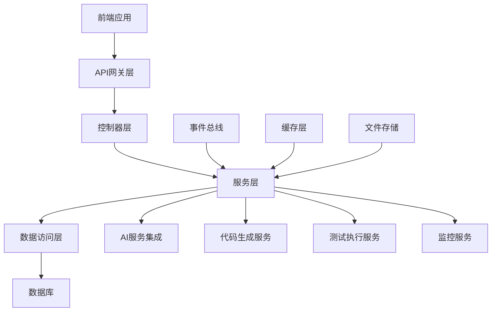

# API接口管理后端服务设计

## 1. 后端架构概述

### 1.1 整体架构



### 1.2 技术栈

- **运行环境**: Node.js 18+
- **Web框架**: Express.js
- **ORM**: Prisma
- **数据库**: SQLite (开发) / PostgreSQL (生产)
- **缓存**: Redis
- **消息队列**: Bull Queue (基于Redis)
- **文件存储**: 本地文件系统 / AWS S3
- **AI集成**: OpenAI API / 本地Ollama
- **代码生成**: Handlebars模板引擎

### 1.3 目录结构

```
packages/backend/
├── src/
│   ├── controllers/          # 控制器层
│   │   ├── api/             # API接口控制器
│   │   ├── test/            # 测试管理控制器
│   │   ├── docs/            # 文档管理控制器
│   │   └── monitor/         # 监控管理控制器
│   ├── services/            # 服务层
│   │   ├── api/             # API管理服务
│   │   ├── test/            # 测试服务
│   │   ├── generator/       # 代码生成服务
│   │   ├── ai/              # AI集成服务
│   │   └── sync/            # 同步服务
│   ├── models/              # 数据模型
│   ├── middleware/          # 中间件
│   ├── utils/               # 工具类
│   ├── config/              # 配置文件
│   ├── jobs/                # 后台任务
│   ├── templates/           # 代码模板
│   └── types/               # TypeScript类型定义
├── prisma/                  # Prisma配置
├── tests/                   # 测试文件
└── docs/                    # API文档
```

## 2. 核心服务设计

### 2.1 API端点管理服务

#### 2.1.1 APIEndpointService

```typescript
// src/services/api/APIEndpointService.ts
import { PrismaClient } from '@prisma/client'
import { CreateAPIEndpointData, UpdateAPIEndpointData, APIEndpoint } from '../../types/api'
import { EventEmitter } from 'events'
import { CodeGeneratorService } from '../generator/CodeGeneratorService'
import { ValidationService } from '../validation/ValidationService'

export class APIEndpointService extends EventEmitter {
  constructor(
    private prisma: PrismaClient,
    private codeGenerator: CodeGeneratorService,
    private validationService: ValidationService
  ) {
    super()
  }

  /**
   * 创建API端点
   */
  async createEndpoint(data: CreateAPIEndpointData): Promise<APIEndpoint> {
    // 验证数据
    await this.validationService.validateEndpointData(data)

    // 检查路径冲突
    await this.checkPathConflict(data.projectId, data.method, data.path)

    // 生成操作ID
    if (!data.operationId) {
      data.operationId = this.generateOperationId(data.method, data.path)
    }

    // 创建端点
    const endpoint = await this.prisma.apiEndpoint.create({
      data: {
        ...data,
        id: this.generateId(),
        status: data.status || 'DRAFT',
        version: data.version || '1.0.0',
        createdAt: new Date(),
        updatedAt: new Date()
      },
      include: {
        parameters: true,
        responses: true,
        primaryTable: true
      }
    })

    // 发布事件
    this.emit('endpoint:created', endpoint)

    return endpoint
  }

  /**
   * 更新API端点
   */
  async updateEndpoint(id: string, data: UpdateAPIEndpointData): Promise<APIEndpoint> {
    const existingEndpoint = await this.prisma.apiEndpoint.findUnique({
      where: { id },
      include: { parameters: true, responses: true }
    })

    if (!existingEndpoint) {
      throw new Error('API端点不存在')
    }

    // 检查是否有破坏性变更
    const breaking = await this.detectBreakingChanges(existingEndpoint, data)

    // 更新端点
    const updatedEndpoint = await this.prisma.apiEndpoint.update({
      where: { id },
      data: {
        ...data,
        updatedAt: new Date()
      },
      include: {
        parameters: true,
        responses: true,
        primaryTable: true
      }
    })

    // 记录变更日志
    await this.logEndpointChange(id, existingEndpoint, updatedEndpoint, breaking)

    // 发布事件
    this.emit('endpoint:updated', updatedEndpoint, breaking)

    return updatedEndpoint
  }

  /**
   * 删除API端点
   */
  async deleteEndpoint(id: string): Promise<void> {
    const endpoint = await this.prisma.apiEndpoint.findUnique({
      where: { id }
    })

    if (!endpoint) {
      throw new Error('API端点不存在')
    }

    // 软删除
    await this.prisma.apiEndpoint.update({
      where: { id },
      data: {
        status: 'DELETED',
        updatedAt: new Date()
      }
    })

    // 发布事件
    this.emit('endpoint:deleted', endpoint)
  }

  /**
   * 获取项目的API端点列表
   */
  async getProjectEndpoints(
    projectId: string,
    options: {
      status?: string[]
      category?: string
      method?: string[]
      search?: string
      page?: number
      limit?: number
    } = {}
  ): Promise<{
    endpoints: APIEndpoint[]
    total: number
    page: number
    limit: number
  }> {
    const {
      status = ['DRAFT', 'ACTIVE'],
      category,
      method,
      search,
      page = 1,
      limit = 20
    } = options

    const where: any = {
      projectId,
      status: { in: status }
    }

    if (category) {
      where.category = category
    }

    if (method && method.length > 0) {
      where.method = { in: method }
    }

    if (search) {
      where.OR = [
        { name: { contains: search, mode: 'insensitive' } },
        { displayName: { contains: search, mode: 'insensitive' } },
        { description: { contains: search, mode: 'insensitive' } },
        { path: { contains: search, mode: 'insensitive' } }
      ]
    }

    const [endpoints, total] = await Promise.all([
      this.prisma.apiEndpoint.findMany({
        where,
        include: {
          parameters: true,
          responses: true,
          primaryTable: {
            select: { name: true, displayName: true }
          },
          _count: {
            select: {
              parameters: true,
              responses: true
            }
          }
        },
        orderBy: [
          { category: 'asc' },
          { path: 'asc' },
          { method: 'asc' }
        ],
        skip: (page - 1) * limit,
        take: limit
      }),
      this.prisma.apiEndpoint.count({ where })
    ])

    return {
      endpoints,
      total,
      page,
      limit
    }
  }

  /**
   * 基于数据表生成CRUD端点
   */
  async generateCRUDEndpoints(
    tableId: string,
    options: {
      operations: ('CREATE' | 'READ' | 'UPDATE' | 'DELETE')[]
      baseUrl?: string
      authRequired?: boolean
      includeSearch?: boolean
      includeBatch?: boolean
    }
  ): Promise<APIEndpoint[]> {
    const table = await this.prisma.databaseTable.findUnique({
      where: { id: tableId },
      include: {
        fields: {
          where: { apiVisible: true },
          orderBy: { sortOrder: 'asc' }
        },
        indexes: true,
        project: true
      }
    })

    if (!table) {
      throw new Error('数据表不存在')
    }

    const endpoints: APIEndpoint[] = []
    const baseUrl = options.baseUrl || `/api/v1/${table.name.toLowerCase()}`

    // 生成CREATE端点
    if (options.operations.includes('CREATE')) {
      const createEndpoint = await this.generateCreateEndpoint(table, baseUrl, options)
      endpoints.push(createEndpoint)
    }

    // 生成READ端点
    if (options.operations.includes('READ')) {
      const readEndpoints = await this.generateReadEndpoints(table, baseUrl, options)
      endpoints.push(...readEndpoints)
    }

    // 生成UPDATE端点
    if (options.operations.includes('UPDATE')) {
      const updateEndpoint = await this.generateUpdateEndpoint(table, baseUrl, options)
      endpoints.push(updateEndpoint)
    }

    // 生成DELETE端点
    if (options.operations.includes('DELETE')) {
      const deleteEndpoint = await this.generateDeleteEndpoint(table, baseUrl, options)
      endpoints.push(deleteEndpoint)
    }

    // 生成搜索端点
    if (options.includeSearch) {
      const searchEndpoint = await this.generateSearchEndpoint(table, baseUrl, options)
      endpoints.push(searchEndpoint)
    }

    // 生成批量操作端点
    if (options.includeBatch) {
      const batchEndpoints = await this.generateBatchEndpoints(table, baseUrl, options)
      endpoints.push(...batchEndpoints)
    }

    return endpoints
  }

  /**
   * 检测破坏性变更
   */
  private async detectBreakingChanges(
    existing: APIEndpoint,
    updates: UpdateAPIEndpointData
  ): Promise<string[]> {
    const breakingChanges: string[] = []

    // 检查HTTP方法变更
    if (updates.method && updates.method !== existing.method) {
      breakingChanges.push(`HTTP方法从 ${existing.method} 变更为 ${updates.method}`)
    }

    // 检查路径变更
    if (updates.path && updates.path !== existing.path) {
      breakingChanges.push(`请求路径从 ${existing.path} 变更为 ${updates.path}`)
    }

    // 检查认证要求变更
    if (updates.authRequired !== undefined && updates.authRequired !== existing.authRequired) {
      const change = updates.authRequired ? '需要认证' : '不需要认证'
      breakingChanges.push(`认证要求变更为 ${change}`)
    }

    return breakingChanges
  }

  /**
   * 记录变更日志
   */
  private async logEndpointChange(
    endpointId: string,
    before: APIEndpoint,
    after: APIEndpoint,
    breakingChanges: string[]
  ): Promise<void> {
    const changeType = breakingChanges.length > 0 ? 'BREAKING' : 'NON_BREAKING'

    await this.prisma.apiChangeLog.create({
      data: {
        projectId: after.projectId,
        endpointId,
        changeType: 'UPDATE',
        changeCategory: changeType,
        changeDescription: `API端点 ${after.displayName} 已更新`,
        oldValue: JSON.stringify(before),
        newValue: JSON.stringify(after),
        impactLevel: breakingChanges.length > 0 ? 'HIGH' : 'LOW',
        changedBy: 'system', // TODO: 获取当前用户
        changeReason: '用户更新'
      }
    })
  }

  /**
   * 生成操作ID
   */
  private generateOperationId(method: string, path: string): string {
    const pathSegments = path.split('/').filter(Boolean)
    const lastSegment = pathSegments[pathSegments.length - 1]
    const resource = lastSegment?.replace(/[{}]/g, '') || 'resource'
    
    const operationMap: Record<string, string> = {
      GET: pathSegments.includes('{id}') ? 'get' : 'list',
      POST: 'create',
      PUT: 'update',
      DELETE: 'delete',
      PATCH: 'patch'
    }

    const operation = operationMap[method] || method.toLowerCase()
    return `${operation}${this.toPascalCase(resource)}`
  }

  /**
   * 转换为帕斯卡命名
   */
  private toPascalCase(str: string): string {
    return str.charAt(0).toUpperCase() + str.slice(1).toLowerCase()
  }

  /**
   * 检查路径冲突
   */
  private async checkPathConflict(
    projectId: string,
    method: string,
    path: string,
    excludeId?: string
  ): Promise<void> {
    const where: any = {
      projectId,
      method,
      path,
      status: { not: 'DELETED' }
    }

    if (excludeId) {
      where.id = { not: excludeId }
    }

    const existing = await this.prisma.apiEndpoint.findFirst({ where })

    if (existing) {
      throw new Error(`路径冲突: ${method} ${path} 已存在`)
    }
  }

  /**
   * 生成ID
   */
  private generateId(): string {
    return `api_${Date.now()}_${Math.random().toString(36).substr(2, 9)}`
  }
}
```

#### 2.1.2 API参数管理服务

```typescript
// src/services/api/APIParameterService.ts
export class APIParameterService {
  constructor(private prisma: PrismaClient) {}

  /**
   * 创建API参数
   */
  async createParameter(data: CreateAPIParameterData): Promise<APIParameter> {
    // 验证参数数据
    await this.validateParameterData(data)

    // 检查参数名冲突
    await this.checkParameterNameConflict(data.endpointId, data.name, data.paramType)

    const parameter = await this.prisma.apiParameter.create({
      data: {
        ...data,
        id: this.generateId(),
        createdAt: new Date(),
        updatedAt: new Date()
      },
      include: {
        relatedField: true
      }
    })

    return parameter
  }

  /**
   * 批量创建参数（基于数据表字段）
   */
  async createParametersFromFields(
    endpointId: string,
    fieldIds: string[],
    paramType: string = 'body'
  ): Promise<APIParameter[]> {
    const fields = await this.prisma.databaseField.findMany({
      where: { id: { in: fieldIds } },
      include: { table: true }
    })

    const parameters = await Promise.all(
      fields.map(field => this.createParameter({
        endpointId,
        name: field.apiFieldName || field.name,
        displayName: field.comment || field.name,
        description: field.apiDescription || field.comment,
        paramType,
        dataType: this.mapFieldTypeToAPIType(field.type),
        required: field.apiRequired !== undefined ? field.apiRequired : !field.nullable,
        relatedFieldId: field.id,
        maxLength: field.length,
        defaultValue: field.defaultValue,
        sortOrder: field.sortOrder
      }))
    )

    return parameters
  }

  /**
   * 同步参数与字段
   */
  async syncParameterWithField(parameterId: string): Promise<void> {
    const parameter = await this.prisma.apiParameter.findUnique({
      where: { id: parameterId },
      include: { relatedField: true }
    })

    if (!parameter?.relatedField) {
      return
    }

    const field = parameter.relatedField
    const updates: any = {}

    // 同步数据类型
    const apiType = this.mapFieldTypeToAPIType(field.type)
    if (apiType !== parameter.dataType) {
      updates.dataType = apiType
    }

    // 同步必填状态
    const required = field.apiRequired !== undefined ? field.apiRequired : !field.nullable
    if (required !== parameter.required) {
      updates.required = required
    }

    // 同步长度限制
    if (field.length && field.length !== parameter.maxLength) {
      updates.maxLength = field.length
    }

    // 同步默认值
    if (field.defaultValue !== parameter.defaultValue) {
      updates.defaultValue = field.defaultValue
    }

    // 同步描述
    const description = field.apiDescription || field.comment
    if (description !== parameter.description) {
      updates.description = description
    }

    if (Object.keys(updates).length > 0) {
      await this.prisma.apiParameter.update({
        where: { id: parameterId },
        data: {
          ...updates,
          updatedAt: new Date()
        }
      })
    }
  }

  /**
   * 字段类型到API类型的映射
   */
  private mapFieldTypeToAPIType(fieldType: string): string {
    const typeMap: Record<string, string> = {
      'VARCHAR': 'string',
      'TEXT': 'string',
      'LONGTEXT': 'string',
      'CHAR': 'string',
      'INT': 'integer',
      'BIGINT': 'integer',
      'SMALLINT': 'integer',
      'TINYINT': 'integer',
      'DECIMAL': 'number',
      'FLOAT': 'number',
      'DOUBLE': 'number',
      'BOOLEAN': 'boolean',
      'BIT': 'boolean',
      'TIMESTAMP': 'string',
      'DATETIME': 'string',
      'DATE': 'string',
      'TIME': 'string',
      'JSON': 'object',
      'ENUM': 'string',
      'BLOB': 'string',
      'LONGBLOB': 'string'
    }

    return typeMap[fieldType.toUpperCase()] || 'string'
  }

  /**
   * 验证参数数据
   */
  private async validateParameterData(data: CreateAPIParameterData): Promise<void> {
    // 验证参数类型
    const validParamTypes = ['path', 'query', 'header', 'body', 'form']
    if (!validParamTypes.includes(data.paramType)) {
      throw new Error(`无效的参数类型: ${data.paramType}`)
    }

    // 验证数据类型
    const validDataTypes = ['string', 'integer', 'number', 'boolean', 'array', 'object', 'file']
    if (!validDataTypes.includes(data.dataType)) {
      throw new Error(`无效的数据类型: ${data.dataType}`)
    }

    // 验证路径参数必须是必填的
    if (data.paramType === 'path' && !data.required) {
      throw new Error('路径参数必须是必填的')
    }

    // 验证数值范围
    if (data.minValue !== undefined && data.maxValue !== undefined) {
      if (data.minValue > data.maxValue) {
        throw new Error('最小值不能大于最大值')
      }
    }

    // 验证长度范围
    if (data.minLength !== undefined && data.maxLength !== undefined) {
      if (data.minLength > data.maxLength) {
        throw new Error('最小长度不能大于最大长度')
      }
    }
  }

  /**
   * 检查参数名冲突
   */
  private async checkParameterNameConflict(
    endpointId: string,
    name: string,
    paramType: string
  ): Promise<void> {
    const existing = await this.prisma.apiParameter.findFirst({
      where: {
        endpointId,
        name,
        paramType
      }
    })

    if (existing) {
      throw new Error(`参数名冲突: ${paramType}.${name} 已存在`)
    }
  }

  private generateId(): string {
    return `param_${Date.now()}_${Math.random().toString(36).substr(2, 9)}`
  }
}
```

### 2.2 测试管理服务

#### 2.2.1 TestManagementService

```typescript
// src/services/test/TestManagementService.ts
import { TestCollection, TestCase, TestExecution } from '../../types/test'
import { HttpClient } from '../../utils/HttpClient'
import { AssertionEngine } from './AssertionEngine'

export class TestManagementService {
  constructor(
    private prisma: PrismaClient,
    private httpClient: HttpClient,
    private assertionEngine: AssertionEngine
  ) {}

  /**
   * 创建测试集合
   */
  async createTestCollection(data: CreateTestCollectionData): Promise<TestCollection> {
    const collection = await this.prisma.testCollection.create({
      data: {
        ...data,
        id: this.generateId(),
        createdAt: new Date(),
        updatedAt: new Date()
      }
    })

    return collection
  }

  /**
   * 基于API端点生成测试用例
   */
  async generateTestCasesForEndpoint(
    endpointId: string,
    collectionId: string,
    options: {
      includeHappyPath?: boolean
      includeBoundaryTests?: boolean
      includeErrorTests?: boolean
      includeSecurityTests?: boolean
    } = {}
  ): Promise<TestCase[]> {
    const {
      includeHappyPath = true,
      includeBoundaryTests = true,
      includeErrorTests = true,
      includeSecurityTests = false
    } = options

    const endpoint = await this.prisma.apiEndpoint.findUnique({
      where: { id: endpointId },
      include: {
        parameters: true,
        responses: true,
        primaryTable: { include: { fields: true } }
      }
    })

    if (!endpoint) {
      throw new Error('API端点不存在')
    }

    const testCases: TestCase[] = []

    // 生成正常流程测试
    if (includeHappyPath) {
      const happyPathTest = await this.generateHappyPathTest(endpoint, collectionId)
      testCases.push(happyPathTest)
    }

    // 生成边界值测试
    if (includeBoundaryTests) {
      const boundaryTests = await this.generateBoundaryTests(endpoint, collectionId)
      testCases.push(...boundaryTests)
    }

    // 生成错误情况测试
    if (includeErrorTests) {
      const errorTests = await this.generateErrorTests(endpoint, collectionId)
      testCases.push(...errorTests)
    }

    // 生成安全测试
    if (includeSecurityTests && endpoint.authRequired) {
      const securityTests = await this.generateSecurityTests(endpoint, collectionId)
      testCases.push(...securityTests)
    }

    return testCases
  }

  /**
   * 执行测试集合
   */
  async executeTestCollection(
    collectionId: string,
    environment: string,
    options: {
      parallel?: boolean
      maxConcurrency?: number
      stopOnFailure?: boolean
      timeout?: number
    } = {}
  ): Promise<TestExecution> {
    const {
      parallel = false,
      maxConcurrency = 5,
      stopOnFailure = false,
      timeout = 300000 // 5分钟
    } = options

    const collection = await this.prisma.testCollection.findUnique({
      where: { id: collectionId },
      include: {
        testCases: {
          where: { isEnabled: true },
          orderBy: { sortOrder: 'asc' }
        }
      }
    })

    if (!collection) {
      throw new Error('测试集合不存在')
    }

    // 创建执行记录
    const execution = await this.prisma.testExecution.create({
      data: {
        id: this.generateId(),
        collectionId,
        environment,
        status: 'RUNNING',
        startTime: new Date(),
        totalTests: collection.testCases.length,
        executionConfig: options
      }
    })

    let passedTests = 0
    let failedTests = 0
    let skippedTests = 0
    let errorTests = 0

    try {
      if (parallel) {
        // 并行执行
        const results = await this.executeTestCasesParallel(
          collection.testCases,
          execution.id,
          environment,
          maxConcurrency
        )
        
        results.forEach(result => {
          switch (result.status) {
            case 'PASSED': passedTests++; break
            case 'FAILED': failedTests++; break
            case 'SKIPPED': skippedTests++; break
            case 'ERROR': errorTests++; break
          }
        })
      } else {
        // 串行执行
        for (const testCase of collection.testCases) {
          if (stopOnFailure && failedTests > 0) {
            skippedTests += collection.testCases.length - (passedTests + failedTests + errorTests)
            break
          }

          try {
            const result = await this.executeTestCase(testCase, execution.id, environment)
            
            switch (result.status) {
              case 'PASSED': passedTests++; break
              case 'FAILED': failedTests++; break
              case 'SKIPPED': skippedTests++; break
              case 'ERROR': errorTests++; break
            }
          } catch (error) {
            errorTests++
            console.error(`Test case ${testCase.id} execution failed:`, error)
          }
        }
      }

      // 更新执行结果
      const finalStatus = errorTests > 0 ? 'FAILED' : (failedTests > 0 ? 'FAILED' : 'COMPLETED')
      const updatedExecution = await this.prisma.testExecution.update({
        where: { id: execution.id },
        data: {
          status: finalStatus,
          endTime: new Date(),
          passedTests,
          failedTests,
          skippedTests,
          errorTests
        }
      })

      return updatedExecution
    } catch (error) {
      // 更新为失败状态
      await this.prisma.testExecution.update({
        where: { id: execution.id },
        data: {
          status: 'FAILED',
          endTime: new Date(),
          passedTests,
          failedTests,
          skippedTests,
          errorTests
        }
      })
      
      throw error
    }
  }

  /**
   * 执行单个测试用例
   */
  async executeTestCase(
    testCase: TestCase,
    executionId: string,
    environment: string
  ): Promise<TestCaseResult> {
    const startTime = new Date()
    
    try {
      // 执行前置脚本
      if (testCase.setupScript) {
        await this.executeScript(testCase.setupScript, environment)
      }

      // 构建请求
      const request = await this.buildTestRequest(testCase, environment)
      
      // 发送请求
      const response = await this.httpClient.request({
        ...request,
        timeout: testCase.timeoutMs || 10000
      })
      
      const endTime = new Date()
      const durationMs = endTime.getTime() - startTime.getTime()

      // 执行断言
      const assertionResults = await this.assertionEngine.executeAssertions(
        testCase.assertions || [],
        response
      )

      const allPassed = assertionResults.every(result => result.passed)
      const status = allPassed ? 'PASSED' : 'FAILED'

      // 保存测试结果
      const result = await this.prisma.testCaseResult.create({
        data: {
          id: this.generateId(),
          executionId,
          testCaseId: testCase.id,
          status,
          startTime,
          endTime,
          durationMs,
          requestData: request,
          responseData: response,
          assertionResults,
          performanceMetrics: {
            responseTime: durationMs,
            requestSize: this.calculateRequestSize(request),
            responseSize: this.calculateResponseSize(response)
          }
        }
      })

      // 执行后置脚本
      if (testCase.teardownScript) {
        await this.executeScript(testCase.teardownScript, environment)
      }

      return result
    } catch (error) {
      const endTime = new Date()
      const durationMs = endTime.getTime() - startTime.getTime()

      // 保存错误结果
      const result = await this.prisma.testCaseResult.create({
        data: {
          id: this.generateId(),
          executionId,
          testCaseId: testCase.id,
          status: 'ERROR',
          startTime,
          endTime,
          durationMs,
          errorMessage: error.message,
          errorStack: error.stack,
          errorType: this.classifyError(error)
        }
      })

      return result
    }
  }

  /**
   * 并行执行测试用例
   */
  private async executeTestCasesParallel(
    testCases: TestCase[],
    executionId: string,
    environment: string,
    maxConcurrency: number
  ): Promise<TestCaseResult[]> {
    const results: TestCaseResult[] = []
    const executing: Promise<TestCaseResult>[] = []

    for (let i = 0; i < testCases.length; i++) {
      const testCase = testCases[i]
      
      // 如果达到最大并发数，等待一个完成
      if (executing.length >= maxConcurrency) {
        const result = await Promise.race(executing)
        results.push(result)
        
        // 从执行队列中移除已完成的
        const index = executing.findIndex(p => p === Promise.resolve(result))
        if (index > -1) {
          executing.splice(index, 1)
        }
      }

      // 添加新的测试用例到执行队列
      const promise = this.executeTestCase(testCase, executionId, environment)
      executing.push(promise)
    }

    // 等待所有剩余的测试用例完成
    const remainingResults = await Promise.all(executing)
    results.push(...remainingResults)

    return results
  }

  /**
   * 生成正常流程测试
   */
  private async generateHappyPathTest(
    endpoint: APIEndpoint,
    collectionId: string
  ): Promise<TestCase> {
    const testData = this.generateValidTestData(endpoint)
    
    return await this.prisma.testCase.create({
      data: {
        id: this.generateId(),
        collectionId,
        endpointId: endpoint.id,
        name: `${endpoint.displayName} - 正常流程测试`,
        description: '验证API在正常输入下的行为',
        testType: 'FUNCTIONAL',
        method: endpoint.method,
        url: this.buildTestUrl(endpoint.path, testData.pathParams),
        queryParams: testData.queryParams,
        headers: testData.headers,
        bodyData: testData.bodyData,
        assertions: this.generateSuccessAssertions(endpoint),
        testData: testData,
        sortOrder: 1
      }
    })
  }

  /**
   * 生成边界值测试
   */
  private async generateBoundaryTests(
    endpoint: APIEndpoint,
    collectionId: string
  ): Promise<TestCase[]> {
    const boundaryTests: TestCase[] = []

    // 为每个有长度或数值限制的参数生成边界值测试
    const parametersWithLimits = endpoint.parameters.filter(p => 
      p.minLength !== null || p.maxLength !== null || 
      p.minValue !== null || p.maxValue !== null
    )

    for (const param of parametersWithLimits) {
      // 最小值测试
      if (param.minLength !== null || param.minValue !== null) {
        const testData = this.generateBoundaryTestData(endpoint, param, 'min')
        const testCase = await this.prisma.testCase.create({
          data: {
            id: this.generateId(),
            collectionId,
            endpointId: endpoint.id,
            name: `${endpoint.displayName} - ${param.name} 最小值测试`,
            description: `测试参数 ${param.name} 的最小值边界`,
            testType: 'FUNCTIONAL',
            method: endpoint.method,
            url: this.buildTestUrl(endpoint.path, testData.pathParams),
            queryParams: testData.queryParams,
            headers: testData.headers,
            bodyData: testData.bodyData,
            assertions: this.generateBoundaryAssertions(endpoint, param, 'min'),
            testData: testData,
            sortOrder: 10
          }
        })
        boundaryTests.push(testCase)
      }

      // 最大值测试
      if (param.maxLength !== null || param.maxValue !== null) {
        const testData = this.generateBoundaryTestData(endpoint, param, 'max')
        const testCase = await this.prisma.testCase.create({
          data: {
            id: this.generateId(),
            collectionId,
            endpointId: endpoint.id,
            name: `${endpoint.displayName} - ${param.name} 最大值测试`,
            description: `测试参数 ${param.name} 的最大值边界`,
            testType: 'FUNCTIONAL',
            method: endpoint.method,
            url: this.buildTestUrl(endpoint.path, testData.pathParams),
            queryParams: testData.queryParams,
            headers: testData.headers,
            bodyData: testData.bodyData,
            assertions: this.generateBoundaryAssertions(endpoint, param, 'max'),
            testData: testData,
            sortOrder: 11
          }
        })
        boundaryTests.push(testCase)
      }
    }

    return boundaryTests
  }

  /**
   * 生成错误情况测试
   */
  private async generateErrorTests(
    endpoint: APIEndpoint,
    collectionId: string
  ): Promise<TestCase[]> {
    const errorTests: TestCase[] = []

    // 必填参数缺失测试
    const requiredParams = endpoint.parameters.filter(p => p.required)
    for (const param of requiredParams) {
      const testData = this.generateMissingParamTestData(endpoint, param)
      const testCase = await this.prisma.testCase.create({
        data: {
          id: this.generateId(),
          collectionId,
          endpointId: endpoint.id,
          name: `${endpoint.displayName} - ${param.name} 缺失测试`,
          description: `测试必填参数 ${param.name} 缺失时的错误处理`,
          testType: 'FUNCTIONAL',
          method: endpoint.method,
          url: this.buildTestUrl(endpoint.path, testData.pathParams),
          queryParams: testData.queryParams,
          headers: testData.headers,
          bodyData: testData.bodyData,
          assertions: [
            {
              type: 'status_code',
              expected: 400,
              message: '缺少必填参数应返回400错误'
            },
            {
              type: 'json_path',
              path: '$.error',
              expected: 'not_null',
              message: '应返回错误信息'
            }
          ],
          testData: testData,
          sortOrder: 20
        }
      })
      errorTests.push(testCase)
    }

    // 无效数据类型测试
    const typeTestParams = endpoint.parameters.filter(p => 
      ['integer', 'number', 'boolean'].includes(p.dataType)
    )
    for (const param of typeTestParams) {
      const testData = this.generateInvalidTypeTestData(endpoint, param)
      const testCase = await this.prisma.testCase.create({
        data: {
          id: this.generateId(),
          collectionId,
          endpointId: endpoint.id,
          name: `${endpoint.displayName} - ${param.name} 类型错误测试`,
          description: `测试参数 ${param.name} 类型错误时的处理`,
          testType: 'FUNCTIONAL',
          method: endpoint.method,
          url: this.buildTestUrl(endpoint.path, testData.pathParams),
          queryParams: testData.queryParams,
          headers: testData.headers,
          bodyData: testData.bodyData,
          assertions: [
            {
              type: 'status_code',
              expected: 400,
              message: '无效数据类型应返回400错误'
            }
          ],
          testData: testData,
          sortOrder: 21
        }
      })
      errorTests.push(testCase)
    }

    return errorTests
  }

  /**
   * 分类错误类型
   */
  private classifyError(error: any): string {
    if (error.code === 'ECONNREFUSED') return 'NETWORK'
    if (error.code === 'ETIMEDOUT') return 'TIMEOUT'
    if (error.name === 'AssertionError') return 'ASSERTION'
    if (error.name === 'SyntaxError') return 'SCRIPT_ERROR'
    return 'UNKNOWN'
  }

  private generateId(): string {
    return `test_${Date.now()}_${Math.random().toString(36).substr(2, 9)}`
  }
}
```

### 2.3 代码生成服务

#### 2.3.1 CodeGeneratorService

```typescript
// src/services/generator/CodeGeneratorService.ts
import { TemplateEngine } from '../../utils/TemplateEngine'
import { FileSystemService } from '../filesystem/FileSystemService'

export class CodeGeneratorService {
  constructor(
    private templateEngine: TemplateEngine,
    private fileSystem: FileSystemService,
    private prisma: PrismaClient
  ) {}

  /**
   * 生成控制器代码
   */
  async generateController(
    endpointId: string,
    language: 'typescript' | 'javascript' | 'python' | 'java',
    framework: string = 'express'
  ): Promise<GeneratedCode> {
    const endpoint = await this.prisma.apiEndpoint.findUnique({
      where: { id: endpointId },
      include: {
        parameters: true,
        responses: true,
        primaryTable: { include: { fields: true } }
      }
    })

    if (!endpoint) {
      throw new Error('API端点不存在')
    }

    const templatePath = `controllers/${language}/${framework}.hbs`
    const template = await this.templateEngine.loadTemplate(templatePath)
    
    const templateData = {
      endpoint,
      className: this.generateClassName(endpoint.name),
      methods: this.generateMethodDefinitions(endpoint),
      imports: this.generateImports(endpoint, language),
      validation: this.generateValidationRules(endpoint),
      database: {
        tableName: endpoint.primaryTable?.name,
        fields: endpoint.primaryTable?.fields
      }
    }

    const code = await this.templateEngine.render(template, templateData)
    
    return {
      content: code,
      filename: `${templateData.className}Controller.${this.getFileExtension(language)}`,
      language,
      framework,
      metadata: {
        endpointId,
        generatedAt: new Date(),
        templateVersion: '1.0.0'
      }
    }
  }

  /**
   * 生成路由代码
   */
  async generateRoutes(
    projectId: string,
    language: 'typescript' | 'javascript',
    framework: 'express' | 'fastify' | 'koa' = 'express'
  ): Promise<GeneratedCode> {
    const endpoints = await this.prisma.apiEndpoint.findMany({
      where: { 
        projectId,
        status: { in: ['DRAFT', 'ACTIVE'] }
      },
      include: {
        parameters: true,
        responses: true
      },
      orderBy: [
        { category: 'asc' },
        { path: 'asc' }
      ]
    })

    const templatePath = `routes/${language}/${framework}.hbs`
    const template = await this.templateEngine.loadTemplate(templatePath)
    
    const groupedEndpoints = this.groupEndpointsByPath(endpoints)
    
    const templateData = {
      projectId,
      endpoints,
      groupedEndpoints,
      imports: this.generateRouteImports(endpoints, language, framework),
      middleware: this.generateMiddleware(endpoints),
      validation: this.generateRouteValidation(endpoints)
    }

    const code = await this.templateEngine.render(template, templateData)
    
    return {
      content: code,
      filename: `routes.${this.getFileExtension(language)}`,
      language,
      framework,
      metadata: {
        projectId,
        endpointCount: endpoints.length,
        generatedAt: new Date(),
        templateVersion: '1.0.0'
      }
    }
  }

  /**
   * 生成客户端SDK
   */
  async generateClientSDK(
    projectId: string,
    language: 'typescript' | 'python' | 'java' | 'javascript',
    options: {
      packageName?: string
      baseUrl?: string
      authType?: string
      includeExamples?: boolean
    } = {}
  ): Promise<GeneratedCode[]> {
    const endpoints = await this.prisma.apiEndpoint.findMany({
      where: { 
        projectId,
        status: 'ACTIVE'
      },
      include: {
        parameters: true,
        responses: true,
        groups: { include: { group: true } }
      }
    })

    const project = await this.prisma.project.findUnique({
      where: { id: projectId }
    })

    if (!project) {
      throw new Error('项目不存在')
    }

    const templatePath = `sdk/${language}/`
    const templates = await this.templateEngine.loadTemplateSet(templatePath)
    
    const clientData = {
      project,
      endpoints: endpoints.map(endpoint => ({
        ...endpoint,
        methodName: this.generateMethodName(endpoint),
        requestType: this.generateRequestType(endpoint),
        responseType: this.generateResponseType(endpoint)
      })),
      packageName: options.packageName || project.name.toLowerCase(),
      baseUrl: options.baseUrl || '${baseUrl}',
      authConfig: this.generateAuthConfig(endpoints, options.authType),
      version: '1.0.0',
      generatedAt: new Date()
    }

    const generatedFiles: GeneratedCode[] = []

    for (const [templateName, template] of Object.entries(templates)) {
      const code = await this.templateEngine.render(template, clientData)
      const filename = this.resolveSDKFilename(templateName, language, clientData)
      
      generatedFiles.push({
        content: code,
        filename,
        language,
        framework: 'sdk',
        metadata: {
          projectId,
          templateName,
          generatedAt: new Date(),
          templateVersion: '1.0.0'
        }
      })
    }

    return generatedFiles
  }

  /**
   * 生成数据传输对象(DTO)
   */
  async generateDTOs(
    endpointId: string,
    language: 'typescript' | 'python' | 'java'
  ): Promise<GeneratedCode[]> {
    const endpoint = await this.prisma.apiEndpoint.findUnique({
      where: { id: endpointId },
      include: {
        parameters: true,
        responses: true,
        primaryTable: { include: { fields: true } }
      }
    })

    if (!endpoint) {
      throw new Error('API端点不存在')
    }

    const templatePath = `dto/${language}/`
    const templates = await this.templateEngine.loadTemplateSet(templatePath)
    
    const dtoData = {
      endpoint,
      requestDTO: this.generateRequestDTO(endpoint),
      responseDTO: this.generateResponseDTO(endpoint),
      validationRules: this.generateValidationRules(endpoint),
      imports: this.generateDTOImports(endpoint, language)
    }

    const generatedFiles: GeneratedCode[] = []

    for (const [templateName, template] of Object.entries(templates)) {
      const code = await this.templateEngine.render(template, dtoData)
      const filename = this.resolveDTOFilename(templateName, endpoint, language)
      
      generatedFiles.push({
        content: code,
        filename,
        language,
        framework: 'dto',
        metadata: {
          endpointId,
          templateName,
          generatedAt: new Date(),
          templateVersion: '1.0.0'
        }
      })
    }

    return generatedFiles
  }

  /**
   * 生成OpenAPI规范
   */
  async generateOpenAPISpec(projectId: string): Promise<object> {
    const project = await this.prisma.project.findUnique({
      where: { id: projectId }
    })

    const endpoints = await this.prisma.apiEndpoint.findMany({
      where: { 
        projectId,
        status: { in: ['ACTIVE', 'DEPRECATED'] }
      },
      include: {
        parameters: true,
        responses: true
      }
    })

    const spec = {
      openapi: '3.0.3',
      info: {
        title: project?.name || 'API Documentation',
        description: project?.description || 'Generated API documentation',
        version: '1.0.0'
      },
      servers: [
        {
          url: project?.apiBaseUrl || 'https://api.example.com',
          description: 'Production server'
        }
      ],
      paths: {},
      components: {
        schemas: {},
        securitySchemes: this.generateSecuritySchemes(project)
      }
    }

    // 生成路径定义
    for (const endpoint of endpoints) {
      const path = endpoint.path
      const method = endpoint.method.toLowerCase()

      if (!spec.paths[path]) {
        spec.paths[path] = {}
      }

      spec.paths[path][method] = {
        operationId: endpoint.operationId,
        summary: endpoint.summary || endpoint.displayName,
        description: endpoint.description,
        tags: endpoint.tags || [endpoint.category].filter(Boolean),
        parameters: this.generateOpenAPIParameters(endpoint.parameters),
        requestBody: this.generateOpenAPIRequestBody(endpoint),
        responses: this.generateOpenAPIResponses(endpoint.responses),
        security: endpoint.authRequired ? this.generateSecurityRequirement(endpoint) : []
      }
    }

    return spec
  }

  /**
   * 保存生成的代码
   */
  async saveGeneratedCode(
    projectId: string,
    generatedCode: GeneratedCode,
    options: {
      outputDir?: string
      overwrite?: boolean
    } = {}
  ): Promise<string> {
    const { outputDir = 'generated', overwrite = false } = options
    
    const outputPath = `${outputDir}/${projectId}/${generatedCode.framework}/${generatedCode.filename}`
    
    // 检查文件是否已存在
    if (!overwrite && await this.fileSystem.exists(outputPath)) {
      throw new Error(`文件已存在: ${outputPath}`)
    }

    // 确保目录存在
    await this.fileSystem.ensureDir(outputPath)
    
    // 写入文件
    await this.fileSystem.writeFile(outputPath, generatedCode.content)
    
    // 记录生成历史
    await this.prisma.codeGenerationHistory.create({
      data: {
        id: this.generateId(),
        projectId,
        filename: generatedCode.filename,
        language: generatedCode.language,
        framework: generatedCode.framework,
        outputPath,
        metadata: generatedCode.metadata,
        generatedAt: new Date()
      }
    })

    return outputPath
  }

  /**
   * 生成类名
   */
  private generateClassName(name: string): string {
    return name
      .split(/[_-]/)
      .map(word => word.charAt(0).toUpperCase() + word.slice(1).toLowerCase())
      .join('')
  }

  /**
   * 生成方法名
   */
  private generateMethodName(endpoint: APIEndpoint): string {
    const pathSegments = endpoint.path.split('/').filter(Boolean)
    const resource = pathSegments[pathSegments.length - 1]?.replace(/[{}]/g, '') || 'resource'
    
    const operationMap: Record<string, string> = {
      GET: pathSegments.includes('{id}') ? 'get' : 'list',
      POST: 'create',
      PUT: 'update',
      DELETE: 'delete',
      PATCH: 'patch'
    }

    const operation = operationMap[endpoint.method] || endpoint.method.toLowerCase()
    return `${operation}${this.toCamelCase(resource)}`
  }

  /**
   * 转换为驼峰命名
   */
  private toCamelCase(str: string): string {
    return str.charAt(0).toUpperCase() + str.slice(1).toLowerCase()
  }

  /**
   * 获取文件扩展名
   */
  private getFileExtension(language: string): string {
    const extensions: Record<string, string> = {
      typescript: 'ts',
      javascript: 'js',
      python: 'py',
      java: 'java'
    }
    return extensions[language] || 'txt'
  }

  private generateId(): string {
    return `gen_${Date.now()}_${Math.random().toString(36).substr(2, 9)}`
  }
}
```

### 2.4 AI集成服务

#### 2.4.1 AIServiceManager

```typescript
// src/services/ai/AIServiceManager.ts
export class AIServiceManager {
  private providers: Map<string, AIProvider> = new Map()

  constructor() {
    this.initializeProviders()
  }

  /**
   * 智能API设计建议
   */
  async generateAPIDesign(requirements: string, context: APIDesignContext): Promise<APIDesignSuggestion> {
    const provider = await this.selectBestProvider('design')
    
    const prompt = this.buildAPIDesignPrompt(requirements, context)
    
    const response = await provider.generateCompletion({
      prompt,
      maxTokens: 2000,
      temperature: 0.3
    })

    const suggestion = this.parseAPIDesignResponse(response)
    
    // 验证生成的设计
    const validation = await this.validateAPIDesign(suggestion)
    
    return {
      ...suggestion,
      validation,
      confidence: this.calculateConfidence(suggestion, validation),
      provider: provider.name
    }
  }

  /**
   * 生成API文档
   */
  async generateAPIDocumentation(endpoint: APIEndpoint): Promise<string> {
    const provider = await this.selectBestProvider('documentation')
    
    const prompt = `
基于以下API接口定义，生成详细的API文档：

接口名称: ${endpoint.displayName}
HTTP方法: ${endpoint.method}
路径: ${endpoint.path}
描述: ${endpoint.description}
参数: ${JSON.stringify(endpoint.parameters, null, 2)}
响应: ${JSON.stringify(endpoint.responses, null, 2)}

请生成包含以下内容的Markdown文档：
1. 接口概述
2. 请求参数说明
3. 响应数据结构
4. 错误码说明
5. 请求示例
6. 响应示例
7. 注意事项

要求：
- 使用中文
- 格式清晰易读
- 包含完整的代码示例
- 考虑各种边界情况
    `

    const response = await provider.generateCompletion({
      prompt,
      maxTokens: 1500,
      temperature: 0.2
    })

    return response.trim()
  }

  /**
   * 生成测试用例
   */
  async generateTestCases(endpoint: APIEndpoint): Promise<TestCaseTemplate[]> {
    const provider = await this.selectBestProvider('testing')
    
    const prompt = this.buildTestGenerationPrompt(endpoint)
    
    const response = await provider.generateCompletion({
      prompt,
      maxTokens: 1000,
      temperature: 0.4
    })

    const testCases = this.parseTestCasesResponse(response)
    
    return testCases.map(testCase => ({
      ...testCase,
      assertions: this.generateAssertions(endpoint, testCase)
    }))
  }

  /**
   * 智能参数建议
   */
  async suggestParameters(
    endpoint: APIEndpoint,
    relatedTable?: DatabaseTable
  ): Promise<APIParameterSuggestion[]> {
    const provider = await this.selectBestProvider('analysis')
    
    const context = {
      endpoint,
      table: relatedTable,
      existingParams: endpoint.parameters
    }
    
    const prompt = this.buildParameterSuggestionPrompt(context)
    
    const response = await provider.generateCompletion({
      prompt,
      maxTokens: 800,
      temperature: 0.3
    })

    return this.parseParameterSuggestions(response)
  }

  /**
   * API性能优化建议
   */
  async analyzePerformanceOptimization(
    endpoint: APIEndpoint,
    usageStats: APIUsageStats
  ): Promise<OptimizationSuggestion[]> {
    const provider = await this.selectBestProvider('analysis')
    
    const analysisData = {
      endpoint,
      avgResponseTime: usageStats.avgResponseTime,
      requestCount: usageStats.requestCount,
      errorRate: (usageStats.errorCount / usageStats.requestCount) * 100,
      parameters: endpoint.parameters.length,
      responseSize: this.estimateResponseSize(endpoint)
    }

    const prompt = this.buildPerformanceAnalysisPrompt(analysisData)
    
    const response = await provider.generateCompletion({
      prompt,
      maxTokens: 800,
      temperature: 0.1
    })

    return this.parseOptimizationSuggestions(response)
  }

  /**
   * 代码生成优化
   */
  async optimizeGeneratedCode(
    code: string,
    language: string,
    framework: string
  ): Promise<string> {
    const provider = await this.selectBestProvider('code_generation')
    
    const prompt = `
请优化以下${language}代码，使用${framework}框架：

${code}

优化要求：
1. 提高代码可读性
2. 优化性能
3. 遵循最佳实践
4. 添加必要的错误处理
5. 添加适当的注释

请返回优化后的完整代码，保持原有功能不变。
    `

    const response = await provider.generateCompletion({
      prompt,
      maxTokens: 2000,
      temperature: 0.2
    })

    return response.trim()
  }

  /**
   * 选择最佳AI提供商
   */
  private async selectBestProvider(taskType: string): Promise<AIProvider> {
    // 根据任务类型和提供商特点选择最佳提供商
    const providerScores = new Map<string, number>()
    
    for (const [name, provider] of this.providers) {
      if (!provider.isAvailable()) continue
      
      let score = 0
      
      // 基础可用性分数
      score += provider.getHealthScore() * 0.3
      
      // 任务适配分数
      score += this.getTaskFitScore(provider, taskType) * 0.4
      
      // 性能分数
      score += provider.getPerformanceScore() * 0.2
      
      // 成本分数（成本越低分数越高）
      score += (1 - provider.getCostScore()) * 0.1
      
      providerScores.set(name, score)
    }

    // 选择分数最高的提供商
    const bestProvider = Array.from(providerScores.entries())
      .sort(([,a], [,b]) => b - a)[0]

    if (!bestProvider) {
      throw new Error('没有可用的AI提供商')
    }

    return this.providers.get(bestProvider[0])!
  }

  /**
   * 获取任务适配分数
   */
  private getTaskFitScore(provider: AIProvider, taskType: string): number {
    const taskScores: Record<string, Record<string, number>> = {
      'design': {
        'openai': 0.9,
        'deepseek': 0.8,
        'ollama': 0.6
      },
      'documentation': {
        'openai': 0.9,
        'deepseek': 0.8,
        'ollama': 0.7
      },
      'testing': {
        'openai': 0.8,
        'deepseek': 0.9,
        'ollama': 0.6
      },
      'code_generation': {
        'openai': 0.8,
        'deepseek': 0.9,
        'ollama': 0.7
      },
      'analysis': {
        'openai': 0.9,
        'deepseek': 0.8,
        'ollama': 0.6
      }
    }

    return taskScores[taskType]?.[provider.name.toLowerCase()] || 0.5
  }

  /**
   * 构建API设计提示词
   */
  private buildAPIDesignPrompt(requirements: string, context: APIDesignContext): string {
    return `
作为一个API设计专家，请基于以下需求设计RESTful API接口：

需求描述：
${requirements}

项目上下文：
- 项目类型: ${context.projectType}
- 现有数据表: ${context.existingTables.map(t => t.name).join(', ')}
- 技术栈: ${context.techStack}

请设计合适的API接口，包括：
1. HTTP方法和路径
2. 请求参数（路径参数、查询参数、请求体）
3. 响应数据结构
4. 错误处理
5. 认证授权要求

请以JSON格式返回，遵循OpenAPI 3.0规范。同时说明设计理由和最佳实践建议。
    `
  }

  /**
   * 初始化AI提供商
   */
  private initializeProviders(): void {
    // 这里会根据配置初始化各种AI提供商
    // 实际实现中会从配置文件读取API密钥等信息
  }
}
```

## 3. 控制器层设计

### 3.1 API端点控制器

```typescript
// src/controllers/api/APIEndpointController.ts
import { Request, Response } from 'express'
import { APIEndpointService } from '../../services/api/APIEndpointService'
import { validateRequest } from '../../middleware/validation'
import { authenticate } from '../../middleware/auth'

export class APIEndpointController {
  constructor(private apiEndpointService: APIEndpointService) {}

  /**
   * 获取项目的API端点列表
   */
  @authenticate
  @validateRequest
  async getProjectEndpoints(req: Request, res: Response): Promise<void> {
    try {
      const { projectId } = req.params
      const {
        status,
        category,
        method,
        search,
        page = 1,
        limit = 20
      } = req.query

      const result = await this.apiEndpointService.getProjectEndpoints(projectId, {
        status: status ? (status as string).split(',') : undefined,
        category: category as string,
        method: method ? (method as string).split(',') : undefined,
        search: search as string,
        page: parseInt(page as string),
        limit: parseInt(limit as string)
      })

      res.json({
        success: true,
        data: result
      })
    } catch (error) {
      res.status(500).json({
        success: false,
        error: error.message
      })
    }
  }

  /**
   * 创建API端点
   */
  @authenticate
  @validateRequest
  async createEndpoint(req: Request, res: Response): Promise<void> {
    try {
      const { projectId } = req.params
      const endpointData = {
        ...req.body,
        projectId,
        createdBy: req.user?.id
      }

      const endpoint = await this.apiEndpointService.createEndpoint(endpointData)

      res.status(201).json({
        success: true,
        data: endpoint
      })
    } catch (error) {
      res.status(400).json({
        success: false,
        error: error.message
      })
    }
  }

  /**
   * 更新API端点
   */
  @authenticate
  @validateRequest
  async updateEndpoint(req: Request, res: Response): Promise<void> {
    try {
      const { endpointId } = req.params
      const updateData = {
        ...req.body,
        lastModifiedBy: req.user?.id
      }

      const endpoint = await this.apiEndpointService.updateEndpoint(endpointId, updateData)

      res.json({
        success: true,
        data: endpoint
      })
    } catch (error) {
      res.status(400).json({
        success: false,
        error: error.message
      })
    }
  }

  /**
   * 删除API端点
   */
  @authenticate
  @validateRequest
  async deleteEndpoint(req: Request, res: Response): Promise<void> {
    try {
      const { endpointId } = req.params

      await this.apiEndpointService.deleteEndpoint(endpointId)

      res.json({
        success: true,
        message: 'API端点已删除'
      })
    } catch (error) {
      res.status(400).json({
        success: false,
        error: error.message
      })
    }
  }

  /**
   * 基于数据表生成CRUD端点
   */
  @authenticate
  @validateRequest
  async generateCRUDEndpoints(req: Request, res: Response): Promise<void> {
    try {
      const { tableId } = req.params
      const options = req.body

      const endpoints = await this.apiEndpointService.generateCRUDEndpoints(tableId, options)

      res.status(201).json({
        success: true,
        data: {
          endpoints,
          summary: {
            total: endpoints.length,
            created: endpoints.length,
            operations: options.operations
          }
        }
      })
    } catch (error) {
      res.status(400).json({
        success: false,
        error: error.message
      })
    }
  }
}
```

## 4. 中间件设计

### 4.1 验证中间件

```typescript
// src/middleware/validation.ts
import { Request, Response, NextFunction } from 'express'
import { validationResult, body, param, query } from 'express-validator'

export const validateRequest = (req: Request, res: Response, next: NextFunction) => {
  const errors = validationResult(req)
  if (!errors.isEmpty()) {
    return res.status(400).json({
      success: false,
      error: 'Validation failed',
      details: errors.array()
    })
  }
  next()
}

// API端点验证规则
export const validateCreateEndpoint = [
  body('name').notEmpty().withMessage('API名称不能为空'),
  body('method').isIn(['GET', 'POST', 'PUT', 'DELETE', 'PATCH']).withMessage('无效的HTTP方法'),
  body('path').notEmpty().withMessage('API路径不能为空'),
  body('displayName').optional().isString(),
  body('description').optional().isString(),
  validateRequest
]

export const validateUpdateEndpoint = [
  param('endpointId').isUUID().withMessage('无效的端点ID'),
  body('name').optional().notEmpty().withMessage('API名称不能为空'),
  body('method').optional().isIn(['GET', 'POST', 'PUT', 'DELETE', 'PATCH']).withMessage('无效的HTTP方法'),
  body('path').optional().notEmpty().withMessage('API路径不能为空'),
  validateRequest
]
```

### 4.2 错误处理中间件

```typescript
// src/middleware/errorHandler.ts
import { Request, Response, NextFunction } from 'express'
import { AppError } from '../utils/AppError'

export const errorHandler = (
  error: Error,
  req: Request,
  res: Response,
  next: NextFunction
) => {
  let statusCode = 500
  let message = '服务器内部错误'

  if (error instanceof AppError) {
    statusCode = error.statusCode
    message = error.message
  } else if (error.name === 'ValidationError') {
    statusCode = 400
    message = '数据验证失败'
  } else if (error.name === 'UnauthorizedError') {
    statusCode = 401
    message = '未授权访问'
  }

  // 记录错误日志
  console.error(`[${new Date().toISOString()}] ${req.method} ${req.path}:`, error)

  res.status(statusCode).json({
    success: false,
    error: message,
    ...(process.env.NODE_ENV === 'development' && { stack: error.stack })
  })
}
```

## 5. 事件系统设计

### 5.1 事件定义

```typescript
// src/events/APIEvents.ts
export interface APIEventMap {
  'endpoint:created': (endpoint: APIEndpoint) => void
  'endpoint:updated': (endpoint: APIEndpoint, breaking: boolean) => void
  'endpoint:deleted': (endpoint: APIEndpoint) => void
  'test:executed': (result: TestExecution) => void
  'model:synced': (syncResult: SyncResult) => void
}
```

### 5.2 事件处理器

```typescript
// src/events/handlers/APIEventHandler.ts
export class APIEventHandler {
  constructor(
    private syncService: SyncService,
    private notificationService: NotificationService
  ) {}

  @EventHandler('endpoint:created')
  async handleEndpointCreated(endpoint: APIEndpoint): Promise<void> {
    // 自动生成基础测试用例
    await this.generateBasicTestCases(endpoint)
    
    // 更新API文档
    await this.updateAPIDocumentation(endpoint.projectId)
    
    // 发送通知
    await this.notificationService.notify({
      type: 'api_created',
      projectId: endpoint.projectId,
      message: `新API接口 ${endpoint.displayName} 已创建`
    })
  }

  @EventHandler('endpoint:updated')
  async handleEndpointUpdated(endpoint: APIEndpoint, breaking: boolean): Promise<void> {
    if (breaking) {
      // 标记相关测试用例需要更新
      await this.markTestCasesForReview(endpoint.id)
      
      // 发送破坏性变更警告
      await this.notificationService.notify({
        type: 'breaking_change',
        projectId: endpoint.projectId,
        message: `API接口 ${endpoint.displayName} 发生破坏性变更`
      })
    }
    
    // 更新API文档
    await this.updateAPIDocumentation(endpoint.projectId)
  }
}
```

## 6. 配置管理

### 6.1 应用配置

```typescript
// src/config/app.ts
export const appConfig = {
  port: process.env.PORT || 3001,
  nodeEnv: process.env.NODE_ENV || 'development',
  
  database: {
    url: process.env.DATABASE_URL || 'file:./dev.db',
    logQueries: process.env.NODE_ENV === 'development'
  },
  
  ai: {
    providers: {
      openai: {
        apiKey: process.env.OPENAI_API_KEY,
        baseUrl: process.env.OPENAI_BASE_URL,
        enabled: !!process.env.OPENAI_API_KEY
      },
      deepseek: {
        apiKey: process.env.DEEPSEEK_API_KEY,
        baseUrl: process.env.DEEPSEEK_BASE_URL,
        enabled: !!process.env.DEEPSEEK_API_KEY
      },
      ollama: {
        baseUrl: process.env.OLLAMA_BASE_URL || 'http://localhost:11434',
        enabled: process.env.OLLAMA_ENABLED === 'true'
      }
    }
  },
  
  codeGeneration: {
    outputDir: process.env.CODE_OUTPUT_DIR || './generated',
    templatesDir: process.env.TEMPLATES_DIR || './src/templates'
  },
  
  testing: {
    maxConcurrency: parseInt(process.env.TEST_MAX_CONCURRENCY || '5'),
    defaultTimeout: parseInt(process.env.TEST_DEFAULT_TIMEOUT || '10000')
  }
}
```

---

**文档版本**: v1.0  
**创建时间**: 2025-08-16  
**最后更新**: 2025-08-16  
**维护人员**: DevAPI团队