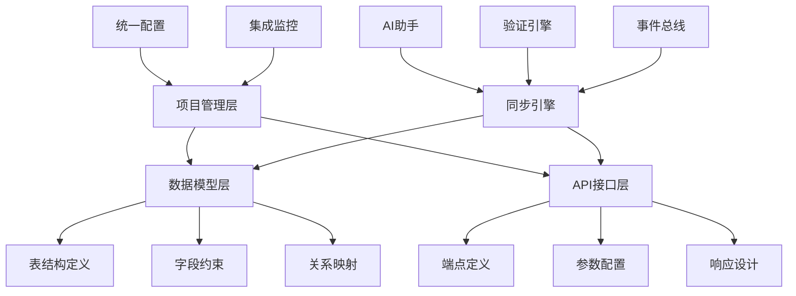

# API接口管理与数据模型集成方案设计

## 1. 集成概述

### 1.1 集成目标

API接口管理功能与现有数据模型管理功能的深度集成，实现以下核心目标：

- **模型驱动开发**：基于数据模型自动生成API接口
- **双向同步机制**：数据模型变更自动同步到API，API变更反向验证模型一致性
- **统一项目视图**：在项目层面统一管理数据模型和API接口
- **智能化助手**：AI辅助API设计和数据模型优化
- **一致性保障**：确保API接口与数据模型始终保持一致

### 1.2 集成架构



### 1.3 技术原则

- **事件驱动架构**：基于事件的松耦合集成
- **最终一致性**：确保数据最终一致，允许短期不一致
- **渐进式同步**：支持手动确认的破坏性变更
- **智能化决策**：AI辅助冲突解决和优化建议
- **可观测性**：完整的同步日志和状态监控

## 2. 数据模型到API的自动生成

### 2.1 生成策略

#### 2.1.1 CRUD操作生成规则

```typescript
interface CRUDGenerationRules {
  // 表级配置
  tableConfig: {
    apiEnabled: boolean           // 是否启用API生成
    baseUrl: string              // API基础路径
    authRequired: boolean        // 是否需要认证
    operations: CRUDOperation[]  // 启用的操作
    namingStyle: 'camelCase' | 'snake_case' | 'kebab-case'
  }
  
  // 字段级配置
  fieldRules: {
    [fieldName: string]: {
      apiVisible: boolean        // API中是否可见
      apiRequired: boolean       // API中是否必填
      apiReadonly: boolean       // 是否只读
      apiName?: string          // API中的字段名
      validation?: ValidationRule[] // 验证规则
    }
  }
  
  // 生成选项
  generationOptions: {
    includePagination: boolean   // 是否包含分页
    includeSearch: boolean       // 是否包含搜索
    includeBatch: boolean        // 是否包含批量操作
    includeExport: boolean       // 是否包含导出
    responseFormat: 'full' | 'minimal' // 响应格式
  }
}
```

#### 2.1.2 URL模式生成

```typescript
class URLPatternGenerator {
  generateCRUDEndpoints(table: DatabaseTable, config: CRUDGenerationRules): APIEndpoint[] {
    const basePath = config.tableConfig.baseUrl || `/${table.name.toLowerCase()}`
    const endpoints: APIEndpoint[] = []

    // CREATE - POST /users
    if (config.tableConfig.operations.includes('CREATE')) {
      endpoints.push({
        method: 'POST',
        path: basePath,
        name: `create${this.pascalCase(table.name)}`,
        displayName: `创建${table.displayName}`,
        operationId: `create${this.pascalCase(table.name)}`,
        parameters: this.generateCreateParameters(table, config),
        responses: this.generateCreateResponses(table, config)
      })
    }

    // READ - GET /users (list) & GET /users/{id} (detail)
    if (config.tableConfig.operations.includes('READ')) {
      // 列表接口
      endpoints.push({
        method: 'GET',
        path: basePath,
        name: `list${this.pascalCase(table.name)}`,
        displayName: `获取${table.displayName}列表`,
        operationId: `list${this.pascalCase(table.name)}`,
        parameters: this.generateListParameters(table, config),
        responses: this.generateListResponses(table, config)
      })

      // 详情接口
      const primaryKey = table.fields.find(f => f.isPrimaryKey)
      if (primaryKey) {
        endpoints.push({
          method: 'GET',
          path: `${basePath}/{${primaryKey.name}}`,
          name: `get${this.pascalCase(table.name)}`,
          displayName: `获取${table.displayName}详情`,
          operationId: `get${this.pascalCase(table.name)}`,
          parameters: this.generateDetailParameters(table, config),
          responses: this.generateDetailResponses(table, config)
        })
      }
    }

    // UPDATE - PUT /users/{id}
    if (config.tableConfig.operations.includes('UPDATE')) {
      const primaryKey = table.fields.find(f => f.isPrimaryKey)
      if (primaryKey) {
        endpoints.push({
          method: 'PUT',
          path: `${basePath}/{${primaryKey.name}}`,
          name: `update${this.pascalCase(table.name)}`,
          displayName: `更新${table.displayName}`,
          operationId: `update${this.pascalCase(table.name)}`,
          parameters: this.generateUpdateParameters(table, config),
          responses: this.generateUpdateResponses(table, config)
        })
      }
    }

    // DELETE - DELETE /users/{id}
    if (config.tableConfig.operations.includes('DELETE')) {
      const primaryKey = table.fields.find(f => f.isPrimaryKey)
      if (primaryKey) {
        endpoints.push({
          method: 'DELETE',
          path: `${basePath}/{${primaryKey.name}}`,
          name: `delete${this.pascalCase(table.name)}`,
          displayName: `删除${table.displayName}`,
          operationId: `delete${this.pascalCase(table.name)}`,
          parameters: this.generateDeleteParameters(table, config),
          responses: this.generateDeleteResponses(table, config)
        })
      }
    }

    return endpoints
  }

  private generateCreateParameters(table: DatabaseTable, config: CRUDGenerationRules): APIParameter[] {
    return table.fields
      .filter(field => {
        // 排除自增主键、创建时间、更新时间等系统字段
        if (field.isAutoIncrement) return false
        if (['created_at', 'updated_at', 'createdAt', 'updatedAt'].includes(field.name)) return false
        
        // 检查字段级配置
        const fieldRule = config.fieldRules[field.name]
        if (fieldRule && !fieldRule.apiVisible) return false
        
        return true
      })
      .map(field => {
        const fieldRule = config.fieldRules[field.name] || {}
        
        return {
          name: fieldRule.apiName || this.transformFieldName(field.name, config.tableConfig.namingStyle),
          displayName: field.comment || field.name,
          description: field.comment,
          paramType: 'body',
          dataType: this.mapDatabaseTypeToAPIType(field.type),
          required: fieldRule.apiRequired !== undefined ? fieldRule.apiRequired : !field.nullable,
          relatedFieldId: field.id,
          validation: this.generateFieldValidation(field, fieldRule),
          example: this.generateExampleValue(field)
        }
      })
  }

  private generateListParameters(table: DatabaseTable, config: CRUDGenerationRules): APIParameter[] {
    const parameters: APIParameter[] = []

    // 分页参数
    if (config.generationOptions.includePagination) {
      parameters.push(
        {
          name: 'page',
          displayName: '页码',
          description: '页码，从1开始',
          paramType: 'query',
          dataType: 'integer',
          required: false,
          defaultValue: '1',
          minValue: 1
        },
        {
          name: 'limit',
          displayName: '每页数量',
          description: '每页返回的记录数',
          paramType: 'query',
          dataType: 'integer',
          required: false,
          defaultValue: '20',
          minValue: 1,
          maxValue: 100
        }
      )
    }

    // 搜索参数
    if (config.generationOptions.includeSearch) {
      // 全文搜索
      parameters.push({
        name: 'search',
        displayName: '搜索关键词',
        description: '在可搜索字段中进行模糊搜索',
        paramType: 'query',
        dataType: 'string',
        required: false
      })

      // 字段级筛选
      table.fields
        .filter(field => {
          const fieldRule = config.fieldRules[field.name]
          return (!fieldRule || fieldRule.apiVisible !== false) && 
                 this.isFilterableField(field)
        })
        .forEach(field => {
          const fieldRule = config.fieldRules[field.name] || {}
          const apiName = fieldRule.apiName || this.transformFieldName(field.name, config.tableConfig.namingStyle)
          
          parameters.push({
            name: `filter_${apiName}`,
            displayName: `筛选${field.comment || field.name}`,
            description: `按${field.comment || field.name}筛选`,
            paramType: 'query',
            dataType: this.mapDatabaseTypeToAPIType(field.type),
            required: false
          })
        })
    }

    // 排序参数
    parameters.push(
      {
        name: 'sort_by',
        displayName: '排序字段',
        description: '排序的字段名',
        paramType: 'query',
        dataType: 'string',
        required: false,
        enumValues: table.fields
          .filter(f => !config.fieldRules[f.name]?.apiVisible === false)
          .map(f => config.fieldRules[f.name]?.apiName || f.name)
      },
      {
        name: 'sort_order',
        displayName: '排序顺序',
        description: '排序顺序',
        paramType: 'query',
        dataType: 'string',
        required: false,
        enumValues: ['asc', 'desc'],
        defaultValue: 'asc'
      }
    )

    return parameters
  }
}
```

### 2.2 智能映射引擎

#### 2.2.1 类型映射规则

```typescript
class TypeMappingEngine {
  private typeMapping: Record<string, APITypeMapping> = {
    // 字符串类型
    'VARCHAR': { apiType: 'string', format: undefined },
    'CHAR': { apiType: 'string', format: undefined },
    'TEXT': { apiType: 'string', format: undefined },
    'LONGTEXT': { apiType: 'string', format: undefined },
    
    // 数值类型
    'INT': { apiType: 'integer', format: 'int32' },
    'BIGINT': { apiType: 'integer', format: 'int64' },
    'SMALLINT': { apiType: 'integer', format: 'int16' },
    'TINYINT': { apiType: 'integer', format: 'int8' },
    'DECIMAL': { apiType: 'number', format: 'decimal' },
    'FLOAT': { apiType: 'number', format: 'float' },
    'DOUBLE': { apiType: 'number', format: 'double' },
    
    // 布尔类型
    'BOOLEAN': { apiType: 'boolean', format: undefined },
    'BIT': { apiType: 'boolean', format: undefined },
    
    // 日期时间类型
    'TIMESTAMP': { apiType: 'string', format: 'date-time' },
    'DATETIME': { apiType: 'string', format: 'date-time' },
    'DATE': { apiType: 'string', format: 'date' },
    'TIME': { apiType: 'string', format: 'time' },
    
    // JSON类型
    'JSON': { apiType: 'object', format: undefined },
    
    // 枚举类型
    'ENUM': { apiType: 'string', format: 'enum' },
    
    // 二进制类型
    'BLOB': { apiType: 'string', format: 'binary' },
    'LONGBLOB': { apiType: 'string', format: 'binary' }
  }

  mapDatabaseTypeToAPIType(dbType: string, field: DatabaseField): APITypeDefinition {
    const baseMapping = this.typeMapping[dbType.toUpperCase()]
    if (!baseMapping) {
      throw new Error(`不支持的数据库类型: ${dbType}`)
    }

    const apiType: APITypeDefinition = {
      type: baseMapping.apiType,
      format: baseMapping.format
    }

    // 根据字段名和注释进行智能推断
    this.enhanceTypeWithSemantics(field, apiType)
    
    // 应用字段约束
    this.applyFieldConstraints(field, apiType)
    
    return apiType
  }

  private enhanceTypeWithSemantics(field: DatabaseField, apiType: APITypeDefinition): void {
    const fieldName = field.name.toLowerCase()
    const comment = field.comment?.toLowerCase() || ''

    // 邮箱字段
    if (fieldName.includes('email') || comment.includes('邮箱') || comment.includes('邮件')) {
      if (apiType.type === 'string') {
        apiType.format = 'email'
        apiType.pattern = '^[a-zA-Z0-9._%+-]+@[a-zA-Z0-9.-]+\\.[a-zA-Z]{2,}$'
      }
    }

    // 电话号码字段
    if (fieldName.includes('phone') || fieldName.includes('mobile') || comment.includes('电话') || comment.includes('手机')) {
      if (apiType.type === 'string') {
        apiType.format = 'phone'
        apiType.pattern = '^1[3-9]\\d{9}$' // 中国手机号格式
      }
    }

    // URL字段
    if (fieldName.includes('url') || fieldName.includes('link') || comment.includes('链接') || comment.includes('地址')) {
      if (apiType.type === 'string') {
        apiType.format = 'uri'
      }
    }

    // UUID字段
    if (fieldName.includes('uuid') || fieldName.includes('guid') || comment.includes('uuid')) {
      if (apiType.type === 'string') {
        apiType.format = 'uuid'
        apiType.pattern = '^[0-9a-f]{8}-[0-9a-f]{4}-[0-9a-f]{4}-[0-9a-f]{4}-[0-9a-f]{12}$'
      }
    }

    // 密码字段
    if (fieldName.includes('password') || fieldName.includes('pwd') || comment.includes('密码')) {
      if (apiType.type === 'string') {
        apiType.format = 'password'
        apiType.writeOnly = true // 只写不读
      }
    }

    // 状态枚举字段
    if (fieldName === 'status' || comment.includes('状态')) {
      if (field.enumValues && field.enumValues.length > 0) {
        apiType.enum = field.enumValues.map(ev => ev.value)
        apiType.enumDescriptions = field.enumValues.reduce((acc, ev) => {
          acc[ev.value] = ev.label || ev.description
          return acc
        }, {} as Record<string, string>)
      }
    }
  }

  private applyFieldConstraints(field: DatabaseField, apiType: APITypeDefinition): void {
    // 长度约束
    if (field.length && apiType.type === 'string') {
      apiType.maxLength = field.length
    }

    // 数值范围约束
    if (apiType.type === 'integer' || apiType.type === 'number') {
      if (field.minValue !== undefined) apiType.minimum = field.minValue
      if (field.maxValue !== undefined) apiType.maximum = field.maxValue
      if (field.isUnsigned) apiType.minimum = Math.max(apiType.minimum || 0, 0)
    }

    // 枚举值约束
    if (field.enumValues && field.enumValues.length > 0) {
      apiType.enum = field.enumValues.map(ev => ev.value)
    }

    // 默认值
    if (field.defaultValue !== undefined) {
      apiType.default = this.convertDefaultValue(field.defaultValue, apiType.type)
    }

    // 示例值
    apiType.example = this.generateExampleValue(field, apiType)
  }
}
```

### 2.3 关系映射处理

#### 2.3.1 外键关系API生成

```typescript
class RelationshipAPIGenerator {
  generateRelationshipEndpoints(
    relationships: TableRelationship[],
    tables: DatabaseTable[],
    config: CRUDGenerationRules
  ): APIEndpoint[] {
    const endpoints: APIEndpoint[] = []

    relationships.forEach(relationship => {
      const fromTable = tables.find(t => t.id === relationship.fromTableId)
      const toTable = tables.find(t => t.id === relationship.toTableId)
      
      if (!fromTable || !toTable) return

      // 生成关联查询接口
      if (relationship.type === 'ONE_TO_MANY') {
        // 一对多：GET /users/{id}/orders
        endpoints.push(this.generateOneToManyEndpoint(fromTable, toTable, relationship, config))
      } else if (relationship.type === 'MANY_TO_MANY') {
        // 多对多：GET /users/{id}/roles, POST /users/{id}/roles, DELETE /users/{id}/roles/{roleId}
        endpoints.push(...this.generateManyToManyEndpoints(fromTable, toTable, relationship, config))
      }
    })

    return endpoints
  }

  private generateOneToManyEndpoint(
    fromTable: DatabaseTable,
    toTable: DatabaseTable,
    relationship: TableRelationship,
    config: CRUDGenerationRules
  ): APIEndpoint {
    const fromPrimaryKey = fromTable.fields.find(f => f.isPrimaryKey)
    const fromBasePath = config.tableConfig.baseUrl || `/${fromTable.name.toLowerCase()}`
    const toResourceName = toTable.name.toLowerCase()

    return {
      method: 'GET',
      path: `${fromBasePath}/{${fromPrimaryKey?.name}}/${toResourceName}`,
      name: `get${this.pascalCase(fromTable.name)}${this.pascalCase(toTable.name)}`,
      displayName: `获取${fromTable.displayName}的${toTable.displayName}列表`,
      operationId: `get${this.pascalCase(fromTable.name)}${this.pascalCase(toTable.name)}`,
      description: `获取指定${fromTable.displayName}关联的所有${toTable.displayName}`,
      parameters: [
        {
          name: fromPrimaryKey?.name || 'id',
          displayName: `${fromTable.displayName}ID`,
          description: `${fromTable.displayName}的唯一标识`,
          paramType: 'path',
          dataType: this.mapDatabaseTypeToAPIType(fromPrimaryKey?.type || 'VARCHAR'),
          required: true
        },
        // 添加分页、搜索等参数
        ...this.generateListParameters(toTable, config)
      ],
      responses: this.generateRelationshipResponses(toTable, config, true),
      tags: [fromTable.category, toTable.category].filter(Boolean),
      relationshipId: relationship.id
    }
  }

  private generateManyToManyEndpoints(
    fromTable: DatabaseTable,
    toTable: DatabaseTable,
    relationship: TableRelationship,
    config: CRUDGenerationRules
  ): APIEndpoint[] {
    const endpoints: APIEndpoint[] = []
    const fromPrimaryKey = fromTable.fields.find(f => f.isPrimaryKey)
    const toPrimaryKey = toTable.fields.find(f => f.isPrimaryKey)
    const fromBasePath = config.tableConfig.baseUrl || `/${fromTable.name.toLowerCase()}`
    const toResourceName = toTable.name.toLowerCase()

    // GET /users/{id}/roles - 获取关联列表
    endpoints.push({
      method: 'GET',
      path: `${fromBasePath}/{${fromPrimaryKey?.name}}/${toResourceName}`,
      name: `get${this.pascalCase(fromTable.name)}${this.pascalCase(toTable.name)}`,
      displayName: `获取${fromTable.displayName}的${toTable.displayName}`,
      operationId: `get${this.pascalCase(fromTable.name)}${this.pascalCase(toTable.name)}`,
      parameters: [
        {
          name: fromPrimaryKey?.name || 'id',
          paramType: 'path',
          dataType: this.mapDatabaseTypeToAPIType(fromPrimaryKey?.type || 'VARCHAR'),
          required: true
        }
      ],
      responses: this.generateRelationshipResponses(toTable, config, true)
    })

    // POST /users/{id}/roles - 添加关联
    endpoints.push({
      method: 'POST',
      path: `${fromBasePath}/{${fromPrimaryKey?.name}}/${toResourceName}`,
      name: `add${this.pascalCase(fromTable.name)}${this.pascalCase(toTable.name)}`,
      displayName: `为${fromTable.displayName}添加${toTable.displayName}`,
      operationId: `add${this.pascalCase(fromTable.name)}${this.pascalCase(toTable.name)}`,
      parameters: [
        {
          name: fromPrimaryKey?.name || 'id',
          paramType: 'path',
          dataType: this.mapDatabaseTypeToAPIType(fromPrimaryKey?.type || 'VARCHAR'),
          required: true
        },
        {
          name: `${toResourceName}Ids`,
          displayName: `${toTable.displayName}ID列表`,
          paramType: 'body',
          dataType: 'array',
          required: true,
          items: {
            type: this.mapDatabaseTypeToAPIType(toPrimaryKey?.type || 'VARCHAR')
          }
        }
      ],
      responses: this.generateStandardResponses(['201', '400', '404'])
    })

    // DELETE /users/{id}/roles/{roleId} - 删除关联
    endpoints.push({
      method: 'DELETE',
      path: `${fromBasePath}/{${fromPrimaryKey?.name}}/${toResourceName}/{${toPrimaryKey?.name}}`,
      name: `remove${this.pascalCase(fromTable.name)}${this.pascalCase(toTable.name)}`,
      displayName: `移除${fromTable.displayName}的${toTable.displayName}`,
      operationId: `remove${this.pascalCase(fromTable.name)}${this.pascalCase(toTable.name)}`,
      parameters: [
        {
          name: fromPrimaryKey?.name || 'id',
          paramType: 'path',
          dataType: this.mapDatabaseTypeToAPIType(fromPrimaryKey?.type || 'VARCHAR'),
          required: true
        },
        {
          name: toPrimaryKey?.name || 'id',
          paramType: 'path',
          dataType: this.mapDatabaseTypeToAPIType(toPrimaryKey?.type || 'VARCHAR'),
          required: true
        }
      ],
      responses: this.generateStandardResponses(['204', '404'])
    })

    return endpoints
  }
}
```

## 3. 双向同步机制

### 3.1 变更检测引擎

#### 3.1.1 数据模型变更检测

```typescript
class ModelChangeDetector {
  async detectTableChanges(
    oldTable: DatabaseTable,
    newTable: DatabaseTable
  ): Promise<TableChangeSet> {
    const changes: TableChangeSet = {
      tableId: newTable.id,
      changeType: 'TABLE_UPDATED',
      timestamp: new Date(),
      changes: []
    }

    // 检测表级变更
    if (oldTable.name !== newTable.name) {
      changes.changes.push({
        type: 'TABLE_RENAMED',
        field: 'name',
        oldValue: oldTable.name,
        newValue: newTable.name,
        impactLevel: 'HIGH',
        description: `表名从 ${oldTable.name} 变更为 ${newTable.name}`
      })
    }

    if (oldTable.displayName !== newTable.displayName) {
      changes.changes.push({
        type: 'TABLE_DISPLAY_NAME_CHANGED',
        field: 'displayName',
        oldValue: oldTable.displayName,
        newValue: newTable.displayName,
        impactLevel: 'LOW',
        description: `表显示名变更`
      })
    }

    // 检测字段变更
    const fieldChanges = await this.detectFieldChanges(oldTable.fields, newTable.fields)
    changes.changes.push(...fieldChanges)

    // 检测索引变更
    const indexChanges = await this.detectIndexChanges(oldTable.indexes, newTable.indexes)
    changes.changes.push(...indexChanges)

    return changes
  }

  private async detectFieldChanges(
    oldFields: DatabaseField[],
    newFields: DatabaseField[]
  ): Promise<FieldChange[]> {
    const changes: FieldChange[] = []
    const oldFieldMap = new Map(oldFields.map(f => [f.name, f]))
    const newFieldMap = new Map(newFields.map(f => [f.name, f]))

    // 检测新增字段
    for (const [fieldName, field] of newFieldMap) {
      if (!oldFieldMap.has(fieldName)) {
        changes.push({
          type: 'FIELD_ADDED',
          fieldName,
          newField: field,
          impactLevel: field.nullable || field.defaultValue ? 'MEDIUM' : 'HIGH',
          description: `新增字段 ${fieldName}`
        })
      }
    }

    // 检测删除字段
    for (const [fieldName, field] of oldFieldMap) {
      if (!newFieldMap.has(fieldName)) {
        changes.push({
          type: 'FIELD_DELETED',
          fieldName,
          oldField: field,
          impactLevel: 'HIGH',
          description: `删除字段 ${fieldName}`
        })
      }
    }

    // 检测字段修改
    for (const [fieldName, newField] of newFieldMap) {
      const oldField = oldFieldMap.get(fieldName)
      if (oldField) {
        const fieldChanges = this.compareFields(oldField, newField)
        changes.push(...fieldChanges)
      }
    }

    return changes
  }

  private compareFields(oldField: DatabaseField, newField: DatabaseField): FieldChange[] {
    const changes: FieldChange[] = []

    // 类型变更
    if (oldField.type !== newField.type) {
      const isBreaking = this.isBreakingTypeChange(oldField.type, newField.type)
      changes.push({
        type: 'FIELD_TYPE_CHANGED',
        fieldName: newField.name,
        oldField,
        newField,
        impactLevel: isBreaking ? 'HIGH' : 'MEDIUM',
        description: `字段 ${newField.name} 类型从 ${oldField.type} 变更为 ${newField.type}`
      })
    }

    // 可空性变更
    if (oldField.nullable !== newField.nullable) {
      const impactLevel = !oldField.nullable && newField.nullable ? 'LOW' : 'HIGH'
      changes.push({
        type: 'FIELD_NULLABLE_CHANGED',
        fieldName: newField.name,
        oldField,
        newField,
        impactLevel,
        description: `字段 ${newField.name} 可空性变更`
      })
    }

    // 长度变更
    if (oldField.length !== newField.length) {
      const impactLevel = newField.length && oldField.length && newField.length < oldField.length ? 'HIGH' : 'LOW'
      changes.push({
        type: 'FIELD_LENGTH_CHANGED',
        fieldName: newField.name,
        oldField,
        newField,
        impactLevel,
        description: `字段 ${newField.name} 长度变更`
      })
    }

    // 默认值变更
    if (oldField.defaultValue !== newField.defaultValue) {
      changes.push({
        type: 'FIELD_DEFAULT_VALUE_CHANGED',
        fieldName: newField.name,
        oldField,
        newField,
        impactLevel: 'LOW',
        description: `字段 ${newField.name} 默认值变更`
      })
    }

    return changes
  }

  private isBreakingTypeChange(oldType: string, newType: string): boolean {
    // 定义破坏性类型变更规则
    const breakingChanges = [
      ['VARCHAR', 'INT'],
      ['TEXT', 'INT'],
      ['INT', 'VARCHAR'],
      ['BIGINT', 'INT'],
      ['DECIMAL', 'INT'],
      ['TIMESTAMP', 'DATE'],
      ['JSON', 'VARCHAR']
    ]

    return breakingChanges.some(([from, to]) => 
      oldType.toUpperCase().includes(from) && newType.toUpperCase().includes(to)
    )
  }
}
```

#### 3.1.2 API变更检测

```typescript
class APIChangeDetector {
  async detectEndpointChanges(
    oldEndpoint: APIEndpoint,
    newEndpoint: APIEndpoint
  ): Promise<APIChangeSet> {
    const changes: APIChangeSet = {
      endpointId: newEndpoint.id,
      changeType: 'ENDPOINT_UPDATED',
      timestamp: new Date(),
      changes: []
    }

    // 检测HTTP方法变更
    if (oldEndpoint.method !== newEndpoint.method) {
      changes.changes.push({
        type: 'METHOD_CHANGED',
        field: 'method',
        oldValue: oldEndpoint.method,
        newValue: newEndpoint.method,
        impactLevel: 'HIGH',
        description: `HTTP方法从 ${oldEndpoint.method} 变更为 ${newEndpoint.method}`
      })
    }

    // 检测路径变更
    if (oldEndpoint.path !== newEndpoint.path) {
      changes.changes.push({
        type: 'PATH_CHANGED',
        field: 'path',
        oldValue: oldEndpoint.path,
        newValue: newEndpoint.path,
        impactLevel: 'HIGH',
        description: `API路径从 ${oldEndpoint.path} 变更为 ${newEndpoint.path}`
      })
    }

    // 检测认证要求变更
    if (oldEndpoint.authRequired !== newEndpoint.authRequired) {
      changes.changes.push({
        type: 'AUTH_REQUIREMENT_CHANGED',
        field: 'authRequired',
        oldValue: oldEndpoint.authRequired,
        newValue: newEndpoint.authRequired,
        impactLevel: 'HIGH',
        description: `认证要求变更`
      })
    }

    // 检测参数变更
    const parameterChanges = await this.detectParameterChanges(
      oldEndpoint.parameters || [],
      newEndpoint.parameters || []
    )
    changes.changes.push(...parameterChanges)

    // 检测响应变更
    const responseChanges = await this.detectResponseChanges(
      oldEndpoint.responses || [],
      newEndpoint.responses || []
    )
    changes.changes.push(...responseChanges)

    return changes
  }

  private async detectParameterChanges(
    oldParameters: APIParameter[],
    newParameters: APIParameter[]
  ): Promise<ParameterChange[]> {
    const changes: ParameterChange[] = []
    const oldParamMap = new Map(oldParameters.map(p => [`${p.paramType}.${p.name}`, p]))
    const newParamMap = new Map(newParameters.map(p => [`${p.paramType}.${p.name}`, p]))

    // 检测新增参数
    for (const [key, param] of newParamMap) {
      if (!oldParamMap.has(key)) {
        changes.push({
          type: 'PARAMETER_ADDED',
          parameterName: param.name,
          parameterType: param.paramType,
          newParameter: param,
          impactLevel: param.required ? 'HIGH' : 'LOW',
          description: `新增${param.required ? '必填' : '可选'}参数 ${param.name}`
        })
      }
    }

    // 检测删除参数
    for (const [key, param] of oldParamMap) {
      if (!newParamMap.has(key)) {
        changes.push({
          type: 'PARAMETER_DELETED',
          parameterName: param.name,
          parameterType: param.paramType,
          oldParameter: param,
          impactLevel: 'HIGH',
          description: `删除参数 ${param.name}`
        })
      }
    }

    // 检测参数修改
    for (const [key, newParam] of newParamMap) {
      const oldParam = oldParamMap.get(key)
      if (oldParam) {
        const paramChanges = this.compareParameters(oldParam, newParam)
        changes.push(...paramChanges)
      }
    }

    return changes
  }
}
```

### 3.2 同步策略引擎

#### 3.2.1 同步决策算法

```typescript
class SyncDecisionEngine {
  async determineSyncStrategy(
    changes: TableChangeSet | APIChangeSet,
    relatedItems: RelatedItem[]
  ): Promise<SyncStrategy> {
    const strategy: SyncStrategy = {
      action: 'PENDING',
      reason: '',
      autoExecute: false,
      requiresConfirmation: false,
      recommendedActions: [],
      rollbackPlan: null
    }

    // 分析变更影响级别
    const impactLevel = this.calculateImpactLevel(changes)
    
    // 分析受影响的项目
    const affectedItems = this.analyzeAffectedItems(changes, relatedItems)
    
    // 根据影响级别决定策略
    switch (impactLevel) {
      case 'LOW':
        strategy.action = 'AUTO_SYNC'
        strategy.autoExecute = true
        strategy.reason = '低影响变更，自动同步'
        break
        
      case 'MEDIUM':
        strategy.action = 'CONFIRM_SYNC'
        strategy.requiresConfirmation = true
        strategy.reason = '中等影响变更，需要确认'
        strategy.recommendedActions = this.generateRecommendations(changes, affectedItems)
        break
        
      case 'HIGH':
        strategy.action = 'MANUAL_REVIEW'
        strategy.requiresConfirmation = true
        strategy.reason = '高影响变更，需要手动审查'
        strategy.recommendedActions = this.generateRecommendations(changes, affectedItems)
        strategy.rollbackPlan = this.generateRollbackPlan(changes)
        break
    }

    return strategy
  }

  private calculateImpactLevel(changes: TableChangeSet | APIChangeSet): 'LOW' | 'MEDIUM' | 'HIGH' {
    const changeImpacts = changes.changes.map(change => change.impactLevel)
    
    if (changeImpacts.includes('HIGH')) {
      return 'HIGH'
    } else if (changeImpacts.includes('MEDIUM')) {
      return 'MEDIUM'
    } else {
      return 'LOW'
    }
  }

  private analyzeAffectedItems(
    changes: TableChangeSet | APIChangeSet,
    relatedItems: RelatedItem[]
  ): AffectedItem[] {
    const affected: AffectedItem[] = []

    if ('tableId' in changes) {
      // 表变更影响分析
      const tableId = changes.tableId
      
      // 找到关联的API端点
      const relatedEndpoints = relatedItems.filter(item => 
        item.type === 'API_ENDPOINT' && item.relatedTableId === tableId
      )
      
      affected.push(...relatedEndpoints.map(endpoint => ({
        id: endpoint.id,
        type: 'API_ENDPOINT',
        name: endpoint.name,
        impactDescription: this.generateAPIImpactDescription(changes, endpoint)
      })))
      
      // 找到关联的表关系
      const relatedRelationships = relatedItems.filter(item =>
        item.type === 'TABLE_RELATIONSHIP' && 
        (item.fromTableId === tableId || item.toTableId === tableId)
      )
      
      affected.push(...relatedRelationships.map(rel => ({
        id: rel.id,
        type: 'TABLE_RELATIONSHIP',
        name: rel.name,
        impactDescription: '可能需要更新外键约束'
      })))
    }

    return affected
  }

  private generateRecommendations(
    changes: TableChangeSet | APIChangeSet,
    affectedItems: AffectedItem[]
  ): SyncRecommendation[] {
    const recommendations: SyncRecommendation[] = []

    changes.changes.forEach(change => {
      switch (change.type) {
        case 'FIELD_DELETED':
          recommendations.push({
            type: 'UPDATE_API_PARAMETERS',
            priority: 'HIGH',
            description: `删除相关API参数: ${change.fieldName}`,
            action: 'REMOVE_PARAMETER',
            target: change.fieldName
          })
          break
          
        case 'FIELD_ADDED':
          if (!change.newField?.nullable && !change.newField?.defaultValue) {
            recommendations.push({
              type: 'UPDATE_API_PARAMETERS',
              priority: 'HIGH',
              description: `新增必填API参数: ${change.fieldName}`,
              action: 'ADD_REQUIRED_PARAMETER',
              target: change.fieldName
            })
          }
          break
          
        case 'FIELD_TYPE_CHANGED':
          recommendations.push({
            type: 'UPDATE_API_VALIDATION',
            priority: 'MEDIUM',
            description: `更新参数验证规则: ${change.fieldName}`,
            action: 'UPDATE_VALIDATION',
            target: change.fieldName
          })
          break
      }
    })

    return recommendations
  }
}
```

#### 3.2.2 同步执行引擎

```typescript
class SyncExecutionEngine {
  async executeSyncPlan(
    syncPlan: SyncPlan,
    options: SyncExecutionOptions = {}
  ): Promise<SyncExecutionResult> {
    const result: SyncExecutionResult = {
      planId: syncPlan.id,
      status: 'RUNNING',
      startTime: new Date(),
      steps: [],
      errors: []
    }

    try {
      // 创建事务
      await this.prisma.$transaction(async (tx) => {
        for (const step of syncPlan.steps) {
          const stepResult = await this.executeStep(step, tx, options)
          result.steps.push(stepResult)
          
          if (stepResult.status === 'FAILED') {
            throw new Error(`步骤执行失败: ${stepResult.error}`)
          }
        }
      })

      result.status = 'COMPLETED'
      result.endTime = new Date()

      // 发布同步完成事件
      this.eventBus.emit('sync:completed', {
        syncPlan,
        result
      })

    } catch (error) {
      result.status = 'FAILED'
      result.endTime = new Date()
      result.errors.push({
        message: error.message,
        timestamp: new Date(),
        step: result.steps.length
      })

      // 发布同步失败事件
      this.eventBus.emit('sync:failed', {
        syncPlan,
        result,
        error
      })
    }

    // 记录同步日志
    await this.recordSyncLog(syncPlan, result)

    return result
  }

  private async executeStep(
    step: SyncStep,
    tx: PrismaTransaction,
    options: SyncExecutionOptions
  ): Promise<SyncStepResult> {
    const stepResult: SyncStepResult = {
      stepId: step.id,
      status: 'RUNNING',
      startTime: new Date()
    }

    try {
      switch (step.type) {
        case 'UPDATE_API_PARAMETER':
          await this.updateAPIParameter(step, tx)
          break
          
        case 'ADD_API_PARAMETER':
          await this.addAPIParameter(step, tx)
          break
          
        case 'REMOVE_API_PARAMETER':
          await this.removeAPIParameter(step, tx)
          break
          
        case 'UPDATE_API_RESPONSE':
          await this.updateAPIResponse(step, tx)
          break
          
        case 'UPDATE_FIELD_MAPPING':
          await this.updateFieldMapping(step, tx)
          break
          
        case 'REGENERATE_ENDPOINT':
          await this.regenerateEndpoint(step, tx)
          break
          
        default:
          throw new Error(`未知的同步步骤类型: ${step.type}`)
      }

      stepResult.status = 'COMPLETED'
      stepResult.endTime = new Date()

    } catch (error) {
      stepResult.status = 'FAILED'
      stepResult.endTime = new Date()
      stepResult.error = error.message
    }

    return stepResult
  }

  private async updateAPIParameter(step: SyncStep, tx: PrismaTransaction): Promise<void> {
    const { parameterId, updates } = step.data

    await tx.apiParameter.update({
      where: { id: parameterId },
      data: {
        ...updates,
        updatedAt: new Date()
      }
    })

    // 记录变更日志
    await tx.apiChangeLog.create({
      data: {
        projectId: step.projectId,
        endpointId: step.targetId,
        changeType: 'UPDATE',
        changeCategory: 'NON_BREAKING',
        changeScope: 'PARAMETER',
        fieldName: updates.name,
        oldValue: JSON.stringify(step.oldValue),
        newValue: JSON.stringify(updates),
        changeDescription: `同步更新API参数: ${updates.name}`,
        changedBy: 'system_sync',
        changeReason: '数据模型同步'
      }
    })
  }

  private async regenerateEndpoint(step: SyncStep, tx: PrismaTransaction): Promise<void> {
    const { endpointId, tableId } = step.data

    // 获取最新的表结构
    const table = await tx.databaseTable.findUnique({
      where: { id: tableId },
      include: {
        fields: { where: { apiVisible: true } },
        indexes: true
      }
    })

    if (!table) {
      throw new Error(`表 ${tableId} 不存在`)
    }

    // 重新生成参数
    const newParameters = this.generateParametersFromFields(table.fields)

    // 删除旧参数
    await tx.apiParameter.deleteMany({
      where: { endpointId }
    })

    // 创建新参数
    await tx.apiParameter.createMany({
      data: newParameters.map(param => ({
        ...param,
        endpointId,
        id: `param_${Date.now()}_${Math.random().toString(36).substr(2, 9)}`
      }))
    })

    // 更新端点更新时间
    await tx.apiEndpoint.update({
      where: { id: endpointId },
      data: {
        updatedAt: new Date(),
        lastSyncAt: new Date()
      }
    })
  }
}
```

## 4. 冲突解决机制

### 4.1 冲突检测算法

```typescript
class ConflictDetectionEngine {
  async detectConflicts(
    modelChanges: TableChangeSet,
    apiChanges: APIChangeSet[]
  ): Promise<SyncConflict[]> {
    const conflicts: SyncConflict[] = []

    // 检测字段与参数的冲突
    for (const modelChange of modelChanges.changes) {
      if (modelChange.type === 'FIELD_DELETED') {
        // 查找使用该字段的API参数
        const relatedParameters = await this.findRelatedParameters(
          modelChanges.tableId,
          modelChange.fieldName
        )

        for (const param of relatedParameters) {
          conflicts.push({
            type: 'FIELD_PARAMETER_CONFLICT',
            severity: 'HIGH',
            description: `字段 ${modelChange.fieldName} 被删除，但API参数 ${param.name} 仍在使用`,
            modelChange,
            apiChange: null,
            relatedItems: [param],
            resolutionOptions: [
              {
                id: 'remove_parameter',
                name: '删除API参数',
                description: '从API中删除对应的参数',
                impact: 'BREAKING_CHANGE',
                autoApplicable: false
              },
              {
                id: 'make_optional',
                name: '设为可选参数',
                description: '将参数设为可选，并添加默认值',
                impact: 'NON_BREAKING',
                autoApplicable: true
              }
            ]
          })
        }
      }

      if (modelChange.type === 'FIELD_TYPE_CHANGED') {
        // 检测类型不兼容的冲突
        const relatedParameters = await this.findRelatedParameters(
          modelChanges.tableId,
          modelChange.fieldName
        )

        for (const param of relatedParameters) {
          const newAPIType = this.mapDatabaseTypeToAPIType(modelChange.newField!.type)
          if (newAPIType !== param.dataType) {
            const isCompatible = this.isTypeCompatible(param.dataType, newAPIType)
            
            if (!isCompatible) {
              conflicts.push({
                type: 'TYPE_COMPATIBILITY_CONFLICT',
                severity: 'HIGH',
                description: `字段 ${modelChange.fieldName} 类型变更不兼容`,
                modelChange,
                apiChange: null,
                relatedItems: [param],
                resolutionOptions: [
                  {
                    id: 'update_parameter_type',
                    name: '更新参数类型',
                    description: `将参数类型从 ${param.dataType} 更新为 ${newAPIType}`,
                    impact: 'BREAKING_CHANGE',
                    autoApplicable: false
                  },
                  {
                    id: 'add_type_conversion',
                    name: '添加类型转换',
                    description: '在API层添加类型转换逻辑',
                    impact: 'NON_BREAKING',
                    autoApplicable: true
                  }
                ]
              })
            }
          }
        }
      }
    }

    // 检测API变更与模型的冲突
    for (const apiChange of apiChanges) {
      await this.detectAPIModelConflicts(apiChange, modelChanges, conflicts)
    }

    return conflicts
  }

  private async detectAPIModelConflicts(
    apiChange: APIChangeSet,
    modelChanges: TableChangeSet,
    conflicts: SyncConflict[]
  ): Promise<void> {
    for (const change of apiChange.changes) {
      if (change.type === 'PARAMETER_ADDED' && change.newParameter?.required) {
        // 检查新增必填参数是否有对应的字段
        const relatedField = await this.findRelatedField(
          change.newParameter.relatedFieldId
        )

        if (!relatedField) {
          conflicts.push({
            type: 'MISSING_FIELD_CONFLICT',
            severity: 'HIGH',
            description: `API新增必填参数 ${change.parameterName}，但没有对应的数据库字段`,
            modelChange: null,
            apiChange: change,
            relatedItems: [change.newParameter],
            resolutionOptions: [
              {
                id: 'create_field',
                name: '创建对应字段',
                description: '在数据表中创建对应的字段',
                impact: 'SCHEMA_CHANGE',
                autoApplicable: true
              },
              {
                id: 'make_parameter_optional',
                name: '设为可选参数',
                description: '将参数改为可选',
                impact: 'API_CHANGE',
                autoApplicable: false
              }
            ]
          })
        } else if (relatedField.nullable && change.newParameter.required) {
          conflicts.push({
            type: 'NULLABLE_REQUIRED_CONFLICT',
            severity: 'MEDIUM',
            description: `字段 ${relatedField.name} 允许为空，但API参数 ${change.parameterName} 是必填的`,
            modelChange: null,
            apiChange: change,
            relatedItems: [relatedField, change.newParameter],
            resolutionOptions: [
              {
                id: 'make_field_not_null',
                name: '字段设为非空',
                description: '将数据库字段设为NOT NULL',
                impact: 'SCHEMA_CHANGE',
                autoApplicable: false
              },
              {
                id: 'make_parameter_optional',
                name: '参数设为可选',
                description: '将API参数改为可选',
                impact: 'API_CHANGE',
                autoApplicable: true
              }
            ]
          })
        }
      }
    }
  }

  private isTypeCompatible(apiType: string, newAPIType: string): boolean {
    // 定义类型兼容性规则
    const compatibilityMatrix: Record<string, string[]> = {
      'string': ['string'],
      'integer': ['integer', 'number'],
      'number': ['number', 'integer'],
      'boolean': ['boolean'],
      'array': ['array'],
      'object': ['object']
    }

    return compatibilityMatrix[apiType]?.includes(newAPIType) || false
  }
}
```

### 4.2 智能冲突解决

```typescript
class IntelligentConflictResolver {
  constructor(
    private aiService: AIServiceManager,
    private ruleEngine: ConflictResolutionRuleEngine
  ) {}

  async resolveConflicts(conflicts: SyncConflict[]): Promise<ConflictResolution[]> {
    const resolutions: ConflictResolution[] = []

    for (const conflict of conflicts) {
      // 先尝试规则引擎自动解决
      const ruleResolution = await this.ruleEngine.resolveConflict(conflict)
      
      if (ruleResolution.confidence > 0.8) {
        resolutions.push(ruleResolution)
        continue
      }

      // 如果规则引擎无法高置信度解决，使用AI助手
      const aiResolution = await this.resolveConflictWithAI(conflict)
      
      // 合并规则引擎和AI的建议
      const mergedResolution = this.mergeResolutions(ruleResolution, aiResolution)
      resolutions.push(mergedResolution)
    }

    return resolutions
  }

  private async resolveConflictWithAI(conflict: SyncConflict): Promise<ConflictResolution> {
    const prompt = this.buildConflictResolutionPrompt(conflict)
    
    const response = await this.aiService.generateCompletion({
      prompt,
      maxTokens: 1000,
      temperature: 0.2
    })

    const aiSuggestion = this.parseAIResolution(response)

    return {
      conflictId: conflict.id,
      strategy: aiSuggestion.strategy,
      confidence: aiSuggestion.confidence,
      reasoning: aiSuggestion.reasoning,
      recommendedAction: aiSuggestion.recommendedAction,
      alternativeActions: aiSuggestion.alternatives || [],
      estimatedImpact: aiSuggestion.impact,
      requiresApproval: aiSuggestion.confidence < 0.9
    }
  }

  private buildConflictResolutionPrompt(conflict: SyncConflict): string {
    return `
作为一个API和数据库集成专家，请帮助解决以下同步冲突：

冲突类型: ${conflict.type}
严重程度: ${conflict.severity}
描述: ${conflict.description}

模型变更:
${conflict.modelChange ? JSON.stringify(conflict.modelChange, null, 2) : '无'}

API变更:
${conflict.apiChange ? JSON.stringify(conflict.apiChange, null, 2) : '无'}

可选解决方案:
${conflict.resolutionOptions.map((option, index) => 
  `${index + 1}. ${option.name}: ${option.description} (影响: ${option.impact})`
).join('\n')}

请分析这个冲突并提供解决建议，包括：
1. 推荐的解决策略
2. 选择该策略的理由
3. 预估的影响范围
4. 置信度评分 (0-1)
5. 是否需要人工确认

请以JSON格式返回，包含以下字段：
{
  "strategy": "推荐策略",
  "reasoning": "选择理由",
  "recommendedAction": "具体操作",
  "alternatives": ["备选方案"],
  "impact": "影响评估",
  "confidence": 0.95,
  "requiresApproval": false
}
    `
  }

  private parseAIResolution(response: string): AIConflictResolution {
    try {
      const parsed = JSON.parse(response)
      return {
        strategy: parsed.strategy || 'MANUAL_REVIEW',
        reasoning: parsed.reasoning || '需要人工分析',
        recommendedAction: parsed.recommendedAction || '手动处理',
        alternatives: parsed.alternatives || [],
        impact: parsed.impact || 'UNKNOWN',
        confidence: Math.min(Math.max(parsed.confidence || 0.5, 0), 1),
        requiresApproval: parsed.requiresApproval !== false
      }
    } catch (error) {
      return {
        strategy: 'MANUAL_REVIEW',
        reasoning: 'AI响应解析失败',
        recommendedAction: '需要人工处理',
        alternatives: [],
        impact: 'UNKNOWN',
        confidence: 0.0,
        requiresApproval: true
      }
    }
  }
}
```

## 5. 统一项目视图

### 5.1 项目总览集成

```typescript
// src/pages/ProjectOverviewPage.tsx
const ProjectOverviewPage: React.FC = () => {
  const { projectId } = useParams<{ projectId: string }>()
  const [activeView, setActiveView] = useState<'overview' | 'models' | 'apis' | 'sync'>('overview')

  const {
    data: projectOverview,
    isLoading,
    error
  } = useQuery({
    queryKey: ['project-overview', projectId],
    queryFn: () => projectService.getOverview(projectId!),
    enabled: !!projectId
  })

  if (isLoading) {
    return <ProjectOverviewSkeleton />
  }

  if (error || !projectOverview) {
    return <ErrorMessage message="加载项目概览失败" />
  }

  return (
    <div className="min-h-screen bg-gray-50">
      {/* 项目头部信息 */}
      <ProjectHeader project={projectOverview.project} />

      {/* 统计卡片组 */}
      <div className="max-w-7xl mx-auto px-4 sm:px-6 lg:px-8 py-8">
        <div className="grid grid-cols-1 md:grid-cols-2 lg:grid-cols-4 gap-6 mb-8">
          <StatCard
            title="数据表"
            value={projectOverview.stats.totalTables}
            trend={projectOverview.stats.tablesTrend}
            icon={Database}
            color="blue"
            onClick={() => setActiveView('models')}
          />
          <StatCard
            title="API接口"
            value={projectOverview.stats.totalEndpoints}
            trend={projectOverview.stats.endpointsTrend}
            icon={Code}
            color="green"
            onClick={() => setActiveView('apis')}
          />
          <StatCard
            title="字段总数"
            value={projectOverview.stats.totalFields}
            trend={projectOverview.stats.fieldsTrend}
            icon={Layers}
            color="purple"
          />
          <StatCard
            title="同步状态"
            value={projectOverview.stats.syncedItems}
            subtitle={`/ ${projectOverview.stats.totalSyncableItems}`}
            icon={RefreshCw}
            color={projectOverview.stats.syncHealth > 0.9 ? 'green' : 'yellow'}
            onClick={() => setActiveView('sync')}
          />
        </div>

        {/* 主要内容区域 */}
        <div className="grid grid-cols-1 lg:grid-cols-3 gap-6">
          {/* 数据模型概览 */}
          <div className="lg:col-span-1">
            <Card>
              <CardHeader>
                <CardTitle className="flex items-center justify-between">
                  <span>数据模型</span>
                  <Button 
                    variant="ghost" 
                    size="sm"
                    onClick={() => setActiveView('models')}
                  >
                    查看全部
                  </Button>
                </CardTitle>
              </CardHeader>
              <CardContent>
                <ModelOverview
                  tables={projectOverview.models.tables.slice(0, 5)}
                  relationships={projectOverview.models.relationships}
                  onTableClick={(tableId) => {
                    navigate(`/projects/${projectId}/models?table=${tableId}`)
                  }}
                />
              </CardContent>
            </Card>
          </div>

          {/* API接口概览 */}
          <div className="lg:col-span-1">
            <Card>
              <CardHeader>
                <CardTitle className="flex items-center justify-between">
                  <span>API接口</span>
                  <Button 
                    variant="ghost" 
                    size="sm"
                    onClick={() => setActiveView('apis')}
                  >
                    查看全部
                  </Button>
                </CardTitle>
              </CardHeader>
              <CardContent>
                <APIOverview
                  endpoints={projectOverview.apis.endpoints.slice(0, 5)}
                  groups={projectOverview.apis.groups}
                  onEndpointClick={(endpointId) => {
                    navigate(`/projects/${projectId}/apis?endpoint=${endpointId}`)
                  }}
                />
              </CardContent>
            </Card>
          </div>

          {/* 集成状态 */}
          <div className="lg:col-span-1">
            <Card>
              <CardHeader>
                <CardTitle className="flex items-center justify-between">
                  <span>集成状态</span>
                  <Button 
                    variant="ghost" 
                    size="sm"
                    onClick={() => setActiveView('sync')}
                  >
                    管理同步
                  </Button>
                </CardTitle>
              </CardHeader>
              <CardContent>
                <IntegrationStatus
                  syncHealth={projectOverview.integration.syncHealth}
                  lastSyncTime={projectOverview.integration.lastSyncTime}
                  pendingChanges={projectOverview.integration.pendingChanges}
                  conflicts={projectOverview.integration.conflicts}
                  onSyncNow={() => handleSyncNow()}
                />
              </CardContent>
            </Card>
          </div>
        </div>

        {/* 关联关系图表 */}
        <div className="mt-8 grid grid-cols-1 lg:grid-cols-2 gap-6">
          <Card>
            <CardHeader>
              <CardTitle>数据模型关联图</CardTitle>
            </CardHeader>
            <CardContent>
              <ModelRelationshipChart
                tables={projectOverview.models.tables}
                relationships={projectOverview.models.relationships}
                height={400}
              />
            </CardContent>
          </Card>

          <Card>
            <CardHeader>
              <CardTitle>API接口分布</CardTitle>
            </CardHeader>
            <CardContent>
              <APIDistributionChart
                endpoints={projectOverview.apis.endpoints}
                methodDistribution={projectOverview.apis.methodDistribution}
                statusDistribution={projectOverview.apis.statusDistribution}
                height={400}
              />
            </CardContent>
          </Card>
        </div>

        {/* 最近活动 */}
        <div className="mt-8">
          <Card>
            <CardHeader>
              <CardTitle>最近活动</CardTitle>
            </CardHeader>
            <CardContent>
              <RecentActivity
                activities={[
                  ...projectOverview.activities.modelChanges.map(activity => ({
                    ...activity,
                    type: 'model' as const
                  })),
                  ...projectOverview.activities.apiChanges.map(activity => ({
                    ...activity,
                    type: 'api' as const
                  })),
                  ...projectOverview.activities.syncEvents.map(activity => ({
                    ...activity,
                    type: 'sync' as const
                  }))
                ].sort((a, b) => new Date(b.timestamp).getTime() - new Date(a.timestamp).getTime())}
                maxItems={20}
              />
            </CardContent>
          </Card>
        </div>
      </div>
    </div>
  )
}
```

### 5.2 集成状态面板

```typescript
// src/components/integration/IntegrationStatusPanel.tsx
const IntegrationStatusPanel: React.FC<IntegrationStatusPanelProps> = ({
  syncHealth,
  lastSyncTime,
  pendingChanges,
  conflicts,
  onSyncNow,
  onResolveConflict
}) => {
  const [showConflicts, setShowConflicts] = useState(false)
  const [showPendingChanges, setShowPendingChanges] = useState(false)

  const getHealthColor = (health: number) => {
    if (health >= 0.9) return 'text-green-600'
    if (health >= 0.7) return 'text-yellow-600'
    return 'text-red-600'
  }

  const getHealthDescription = (health: number) => {
    if (health >= 0.9) return '同步状态良好'
    if (health >= 0.7) return '部分项目需要同步'
    return '存在同步问题'
  }

  return (
    <div className="space-y-6">
      {/* 同步状态概览 */}
      <div className="bg-white rounded-lg border p-6">
        <div className="flex items-center justify-between mb-4">
          <h3 className="text-lg font-medium text-gray-900">同步状态</h3>
          <Button
            onClick={onSyncNow}
            size="sm"
            disabled={conflicts.length > 0}
          >
            <RefreshCw className="w-4 h-4 mr-2" />
            立即同步
          </Button>
        </div>

        <div className="grid grid-cols-1 md:grid-cols-3 gap-4">
          <div className="text-center">
            <div className={`text-3xl font-bold ${getHealthColor(syncHealth)}`}>
              {Math.round(syncHealth * 100)}%
            </div>
            <div className="text-sm text-gray-500">
              {getHealthDescription(syncHealth)}
            </div>
          </div>

          <div className="text-center">
            <div className="text-3xl font-bold text-blue-600">
              {pendingChanges.length}
            </div>
            <div className="text-sm text-gray-500">待同步变更</div>
          </div>

          <div className="text-center">
            <div className="text-3xl font-bold text-red-600">
              {conflicts.length}
            </div>
            <div className="text-sm text-gray-500">冲突需解决</div>
          </div>
        </div>

        {lastSyncTime && (
          <div className="mt-4 text-sm text-gray-500 text-center">
            最后同步时间: {formatDistanceToNow(new Date(lastSyncTime), { 
              addSuffix: true, 
              locale: zhCN 
            })}
          </div>
        )}
      </div>

      {/* 冲突列表 */}
      {conflicts.length > 0 && (
        <div className="bg-white rounded-lg border">
          <div className="p-6 border-b">
            <div className="flex items-center justify-between">
              <h3 className="text-lg font-medium text-gray-900 flex items-center">
                <AlertTriangle className="w-5 h-5 mr-2 text-red-500" />
                同步冲突 ({conflicts.length})
              </h3>
              <Button
                variant="ghost"
                size="sm"
                onClick={() => setShowConflicts(!showConflicts)}
              >
                {showConflicts ? '收起' : '展开'}
              </Button>
            </div>
          </div>

          {showConflicts && (
            <div className="p-6">
              <div className="space-y-4">
                {conflicts.map(conflict => (
                  <ConflictCard
                    key={conflict.id}
                    conflict={conflict}
                    onResolve={() => onResolveConflict(conflict.id)}
                  />
                ))}
              </div>
            </div>
          )}
        </div>
      )}

      {/* 待同步变更 */}
      {pendingChanges.length > 0 && (
        <div className="bg-white rounded-lg border">
          <div className="p-6 border-b">
            <div className="flex items-center justify-between">
              <h3 className="text-lg font-medium text-gray-900 flex items-center">
                <Clock className="w-5 h-5 mr-2 text-yellow-500" />
                待同步变更 ({pendingChanges.length})
              </h3>
              <Button
                variant="ghost"
                size="sm"
                onClick={() => setShowPendingChanges(!showPendingChanges)}
              >
                {showPendingChanges ? '收起' : '展开'}
              </Button>
            </div>
          </div>

          {showPendingChanges && (
            <div className="p-6">
              <div className="space-y-4">
                {pendingChanges.map(change => (
                  <PendingChangeCard
                    key={change.id}
                    change={change}
                  />
                ))}
              </div>
            </div>
          )}
        </div>
      )}

      {/* 同步历史 */}
      <div className="bg-white rounded-lg border">
        <div className="p-6 border-b">
          <h3 className="text-lg font-medium text-gray-900">同步历史</h3>
        </div>
        <div className="p-6">
          <SyncHistoryTimeline projectId={projectId} />
        </div>
      </div>
    </div>
  )
}
```

## 6. 事件驱动架构

### 6.1 事件定义和发布

```typescript
// src/events/IntegrationEvents.ts
export interface IntegrationEventMap {
  // 模型变更事件
  'model:table:created': (event: TableCreatedEvent) => void
  'model:table:updated': (event: TableUpdatedEvent) => void
  'model:table:deleted': (event: TableDeletedEvent) => void
  'model:field:created': (event: FieldCreatedEvent) => void
  'model:field:updated': (event: FieldUpdatedEvent) => void
  'model:field:deleted': (event: FieldDeletedEvent) => void

  // API变更事件
  'api:endpoint:created': (event: EndpointCreatedEvent) => void
  'api:endpoint:updated': (event: EndpointUpdatedEvent) => void
  'api:endpoint:deleted': (event: EndpointDeletedEvent) => void
  'api:parameter:updated': (event: ParameterUpdatedEvent) => void

  // 同步事件
  'sync:started': (event: SyncStartedEvent) => void
  'sync:completed': (event: SyncCompletedEvent) => void
  'sync:failed': (event: SyncFailedEvent) => void
  'sync:conflict:detected': (event: ConflictDetectedEvent) => void
  'sync:conflict:resolved': (event: ConflictResolvedEvent) => void

  // 集成事件
  'integration:health:changed': (event: HealthChangedEvent) => void
  'integration:recommendation': (event: RecommendationEvent) => void
}

class IntegrationEventBus extends EventEmitter {
  private static instance: IntegrationEventBus

  static getInstance(): IntegrationEventBus {
    if (!IntegrationEventBus.instance) {
      IntegrationEventBus.instance = new IntegrationEventBus()
    }
    return IntegrationEventBus.instance
  }

  // 类型安全的事件发布
  emit<K extends keyof IntegrationEventMap>(
    event: K,
    ...args: Parameters<IntegrationEventMap[K]>
  ): boolean {
    return super.emit(event, ...args)
  }

  // 类型安全的事件订阅
  on<K extends keyof IntegrationEventMap>(
    event: K,
    listener: IntegrationEventMap[K]
  ): this {
    return super.on(event, listener)
  }
}
```

### 6.2 事件处理器

```typescript
// src/events/handlers/ModelEventHandler.ts
@EventHandler
export class ModelEventHandler {
  constructor(
    private syncEngine: SyncExecutionEngine,
    private conflictDetector: ConflictDetectionEngine,
    private notificationService: NotificationService
  ) {}

  @Subscribe('model:table:updated')
  async handleTableUpdated(event: TableUpdatedEvent): Promise<void> {
    // 检测变更影响
    const changes = await this.detectTableChanges(event.oldTable, event.newTable)
    
    if (changes.changes.length === 0) {
      return // 没有实质性变更
    }

    // 查找相关的API端点
    const relatedEndpoints = await this.findRelatedEndpoints(event.newTable.id)
    
    if (relatedEndpoints.length === 0) {
      return // 没有相关API
    }

    // 检测冲突
    const conflicts = await this.conflictDetector.detectConflicts(
      changes,
      relatedEndpoints.map(ep => ({ endpointId: ep.id, changes: [] }))
    )

    if (conflicts.length > 0) {
      // 发布冲突检测事件
      IntegrationEventBus.getInstance().emit('sync:conflict:detected', {
        projectId: event.newTable.projectId,
        conflicts,
        source: 'model_change',
        timestamp: new Date()
      })
      return
    }

    // 创建同步计划
    const syncPlan = await this.createSyncPlan(changes, relatedEndpoints)
    
    // 根据影响级别决定是否自动执行
    const impactLevel = this.calculateImpactLevel(changes)
    
    if (impactLevel === 'LOW') {
      // 自动同步
      await this.syncEngine.executeSyncPlan(syncPlan, { autoExecute: true })
    } else {
      // 需要用户确认
      await this.notificationService.notifyPendingSync({
        projectId: event.newTable.projectId,
        syncPlan,
        impactLevel
      })
    }
  }

  @Subscribe('model:field:deleted')
  async handleFieldDeleted(event: FieldDeletedEvent): Promise<void> {
    // 查找使用该字段的API参数
    const relatedParameters = await this.findParametersByField(event.field.id)
    
    if (relatedParameters.length === 0) {
      return
    }

    // 这是一个高影响变更，需要用户决策
    const conflicts = relatedParameters.map(param => ({
      type: 'FIELD_PARAMETER_CONFLICT' as const,
      severity: 'HIGH' as const,
      description: `字段 ${event.field.name} 被删除，但API参数 ${param.name} 仍在使用`,
      fieldId: event.field.id,
      parameterId: param.id,
      resolutionOptions: [
        {
          id: 'remove_parameter',
          name: '删除API参数',
          description: '从API中删除对应的参数',
          impact: 'BREAKING_CHANGE'
        },
        {
          id: 'restore_field',
          name: '恢复字段',
          description: '撤销字段删除操作',
          impact: 'MODEL_CHANGE'
        }
      ]
    }))

    IntegrationEventBus.getInstance().emit('sync:conflict:detected', {
      projectId: event.field.projectId,
      conflicts,
      source: 'field_deletion',
      timestamp: new Date()
    })
  }
}
```

---

**文档版本**: v1.0  
**创建时间**: 2025-08-16  
**最后更新**: 2025-08-16  
**维护人员**: DevAPI团队