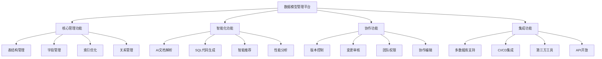

# DevAPI Manager 数据模型功能开发方案

## 1. 项目概述

### 1.1 项目背景
基于对现有DevAPI Manager系统和数据模型功能设计文档的深入分析，制定本开发方案以系统性地增强平台的数据库管理能力。

### 1.2 目标与愿景
- **目标**：构建业界领先的数据模型管理平台
- **愿景**：通过AI驱动的智能化功能，大幅提升数据库设计效率和质量
- **价值**：为开发团队提供完整的数据库生命周期管理解决方案

## 2. 现状分析

### 2.1 当前系统能力
✅ **已具备功能**：
- 基础数据表CRUD操作
- 简单字段和索引管理
- 项目级别的数据组织
- Swagger文档导入
- 基础的MCP搜索集成

⚠️ **功能缺口**：
- **缺乏完整的数据模型设计工具**
  - 无可视化ER图设计器
  - 缺少拖拽式表结构设计
  - 无交互式字段编辑器
  - 缺乏表关系可视化管理
  - 无数据类型智能推荐
  - 缺少批量操作和模板功能

- **无AI文档解析能力**
  - 不支持Markdown文档自动解析
  - 无法处理SQL建表语句导入
  - 缺乏Excel数据字典解析
  - 无Word/PDF文档智能识别
  - 没有AI服务集成框架
  - 缺少多语言文档支持

- **关系管理功能不完善**
  - 无外键约束可视化管理
  - 缺乏关系图自动布局
  - 无级联操作配置界面
  - 缺少关系依赖分析
  - 无多对多关系中间表自动生成
  - 缺乏关系完整性检查

- **无SQL代码生成功能**
  - 不支持CREATE TABLE语句生成
  - 缺乏ALTER TABLE迁移脚本
  - 无多数据库方言支持（MySQL/PostgreSQL/SQLite）
  - 没有索引优化建议生成
  - 缺少数据初始化脚本生成
  - 无批量导出和部署功能

- **缺乏版本控制和变更管理**
  - 无数据模型版本历史记录
  - 缺乏变更差异对比功能
  - 没有回滚和恢复机制
  - 无团队协作变更审核流程
  - 缺少变更影响分析
  - 无自动化部署集成

### 2.2 技术架构现状
- **前端**：React 18 + TypeScript + Tailwind CSS ✅
- **后端**：Node.js + Express + Prisma ORM ✅
- **数据库**：SQLite（开发）/PostgreSQL（生产）✅
- **AI集成**：MCP协议基础 ⚠️（需要增强）

## 3. 系统增强设计

### 3.1 功能架构设计



### 3.2 数据库架构增强

#### 3.2.1 新增数据表结构
```sql
-- 数据模型版本管理
CREATE TABLE model_versions (
  id VARCHAR(36) PRIMARY KEY,
  project_id VARCHAR(36) NOT NULL,
  version_number VARCHAR(20) NOT NULL,
  change_description TEXT,
  created_by VARCHAR(36),
  created_at TIMESTAMP DEFAULT CURRENT_TIMESTAMP,
  FOREIGN KEY (project_id) REFERENCES projects(id)
);

-- 字段枚举值管理
CREATE TABLE field_enum_values (
  id VARCHAR(36) PRIMARY KEY,
  field_id VARCHAR(36) NOT NULL,
  value VARCHAR(255) NOT NULL,
  label VARCHAR(255),
  sort_order INT DEFAULT 0,
  is_default BOOLEAN DEFAULT FALSE,
  FOREIGN KEY (field_id) REFERENCES database_fields(id)
);

-- 表关系定义
CREATE TABLE table_relationships (
  id VARCHAR(36) PRIMARY KEY,
  from_table_id VARCHAR(36) NOT NULL,
  to_table_id VARCHAR(36) NOT NULL,
  from_field_id VARCHAR(36) NOT NULL,
  to_field_id VARCHAR(36) NOT NULL,
  relationship_type ENUM('ONE_TO_ONE', 'ONE_TO_MANY', 'MANY_TO_MANY') NOT NULL,
  on_update ENUM('CASCADE', 'SET_NULL', 'RESTRICT', 'NO_ACTION') DEFAULT 'RESTRICT',
  on_delete ENUM('CASCADE', 'SET_NULL', 'RESTRICT', 'NO_ACTION') DEFAULT 'RESTRICT',
  created_at TIMESTAMP DEFAULT CURRENT_TIMESTAMP
);

-- AI解析历史记录
CREATE TABLE ai_parse_history (
  id VARCHAR(36) PRIMARY KEY,
  project_id VARCHAR(36) NOT NULL,
  file_name VARCHAR(255) NOT NULL,
  file_type VARCHAR(50) NOT NULL,
  ai_provider VARCHAR(50) NOT NULL,
  parse_result JSON,
  status ENUM('SUCCESS', 'FAILED', 'PARTIAL') NOT NULL,
  error_message TEXT,
  created_at TIMESTAMP DEFAULT CURRENT_TIMESTAMP
);
```

### 3.3 AI集成架构

#### 3.3.1 AI服务适配器设计
```typescript
interface AIServiceAdapter {
  parseDocument(content: string, type: DocumentType): Promise<ParsedModel>
  generateSQL(model: DataModel, dialect: SQLDialect): Promise<string>
  optimizeSchema(schema: TableSchema): Promise<OptimizationSuggestion[]>
  suggestIndexes(table: TableDefinition): Promise<IndexSuggestion[]>
}

class OllamaAdapter implements AIServiceAdapter {
  constructor(private config: OllamaConfig) {}
  
  async parseDocument(content: string, type: DocumentType): Promise<ParsedModel> {
    const prompt = this.buildPrompt(content, type)
    const response = await this.callOllama(prompt)
    return this.validateAndParse(response)
  }
}

class OpenAIAdapter implements AIServiceAdapter {
  constructor(private config: OpenAIConfig) {}
  // 类似实现...
}
```

#### 3.3.2 提示词工程体系
```typescript
const PROMPTS = {
  DOCUMENT_PARSE: {
    MARKDOWN: `分析以下Markdown数据库设计文档，提取表结构信息...`,
    SQL: `解析以下SQL建表语句，转换为标准化结构...`,
    EXCEL: `分析Excel数据字典，提取字段定义...`
  },
  
  SQL_GENERATION: {
    MYSQL: `基于数据模型生成MySQL建表语句...`,
    POSTGRESQL: `生成PostgreSQL兼容的DDL语句...`,
    SQLITE: `生成SQLite数据库脚本...`
  },
  
  OPTIMIZATION: {
    INDEX_SUGGESTION: `分析表结构，建议最优索引策略...`,
    PERFORMANCE_REVIEW: `评估数据库设计性能问题...`
  }
}
```

## 4. 实施计划

### 4.1 开发阶段规划

#### 阶段一：基础增强（第1-3周）
**目标**：完善核心数据模型管理功能

**主要任务**：
- [x] 数据库Schema扩展 ✅ **已完成 (2025-08-15)**
  - ✅ 新增版本管理表 (ModelVersion)
  - ✅ 扩展关系管理表 (TableRelationship增强)
  - ✅ 增加枚举值管理表 (FieldEnumValue)
  - ✅ 新增表统计表 (TableStatistics)
  - ✅ 新增AI解析历史表 (AIParseHistory)
  - ✅ 新增索引字段表 (IndexField)
- [x] 基础API接口开发 ✅ **已完成 (2025-08-15)**
  - ✅ 表关系CRUD接口 (32个端点)
  - ✅ 字段枚举值管理接口 (批量操作支持)
  - ✅ 版本控制接口 (Git风格分支管理)
  - ✅ 表统计信息接口 (项目级汇总分析)
- [x] 前端组件开发 ✅ **已完成 (2025-08-15)**
  - ✅ 关系编辑器组件 (RelationshipManager.tsx)
  - ✅ 枚举值管理组件 (EnumValueManager.tsx)
  - ✅ 版本对比组件 (VersionControl.tsx)
  - ✅ 统计仪表板组件 (StatsDashboard.tsx)

**技术重点**：
- Prisma Schema更新和迁移
- 数据完整性约束设计
- 前端状态管理优化

#### 阶段二：AI集成（第4-6周）
**目标**：实现AI驱动的文档解析和代码生成

**主要任务**：
- [x] AI服务集成框架 ✅ **已完成 (2025-08-15)**
  - ✅ 多AI服务适配器实现 (OpenAI, DeepSeek, Ollama等)
  - ✅ 统一的API抽象层 (AIServiceManager)
  - ✅ 配置管理和切换机制 (动态提供商切换)
  - ✅ 健康检查和监控系统
  - ✅ 使用统计和成本跟踪
- [x] 文档解析功能 ✅ **已完成 (2025-08-15)**
  - ✅ 支持Markdown、SQL、Excel、Word、PDF、JSON等格式
  - ✅ 结果验证和修正机制 (智能修正服务)
  - ✅ 批量导入工作流 (事件驱动的任务队列)
  - ✅ 解析历史和错误追踪
  - ✅ 文档类型自动识别
- [x] SQL代码生成 ✅ **已完成 (2025-08-15)**
  - ✅ 多数据库方言支持 (MySQL, PostgreSQL, SQLite, SQL Server, Oracle)
  - ✅ 迁移脚本生成 (包含回滚支持)
  - ✅ 代码模板管理 (内置和自定义模板)
  - ✅ SQL元数据和性能分析
  - ✅ 索引优化建议

**技术重点**：
- ✅ 提示词工程和优化
- ✅ 文件上传和处理
- ✅ 异步任务处理

#### 阶段三：前端集成（第7-8周）
**目标**：完善AI功能的前端集成和用户体验

**主要任务**：
- [x] AI文档解析前端组件 ✅ **已完成 (2025-08-15)**
  - ✅ AIDocumentParser组件 (智能文档解析器)
  - ✅ 实时AI服务健康状态显示
  - ✅ 多提供商选择和配置
  - ✅ 解析结果预览和确认
- [x] 批量导入管理器 ✅ **已完成 (2025-08-15)**  
  - ✅ BatchImportManager组件
  - ✅ 实时任务进度监控
  - ✅ 多文档批量处理
  - ✅ 任务历史和报告生成
- [x] SQL生成器增强 ✅ **已完成 (2025-08-15)**
  - ✅ AI增强的SQL生成功能
  - ✅ 模板选择和自定义
  - ✅ 迁移脚本可视化配置
  - ✅ SQL元数据和警告显示
- [ ] 代码模板管理界面 🚧 **进行中**
  - 模板创建和编辑界面
  - 模板预览和测试功能
  - 模板导入导出
  - 模板分类和搜索

**技术重点**：
- ✅ React组件设计和状态管理
- ✅ 实时数据同步和进度追踪
- ✅ 用户体验优化
- 🚧 模板引擎前端集成

#### 阶段三：可视化增强（第7-8周）
**目标**：提升用户体验和可视化能力

**主要任务**：
- [ ] 关系图可视化
  - ReactFlow集成优化
  - 交互式关系编辑
  - 自动布局算法
- [ ] 数据模型设计器
  - 拖拽式表设计
  - 实时预览功能
  - 协作编辑支持
- [ ] 仪表板和统计
  - 项目概览面板
  - 性能指标监控
  - 使用情况分析

**技术重点**：
- 复杂组件性能优化
- 实时数据同步
- 用户体验设计

#### 阶段四：高级功能（第9-10周）
**目标**：完善协作和集成功能

**主要任务**：
- [ ] 版本控制系统
  - Git风格的变更跟踪
  - 分支和合并支持
  - 冲突解决机制
- [ ] 团队协作功能
  - 权限管理体系
  - 评论和审核流程
  - 实时协作编辑
- [ ] 外部集成
  - CI/CD工具集成
  - 第三方数据库连接
  - API开放平台

**技术重点**：
- 权限模型设计
- 实时通信实现
- 集成接口标准化

### 4.2 资源配置计划

#### 4.2.1 人力资源
- **前端开发**：2人
- **后端开发**：2人
- **AI工程师**：1人
- **产品设计**：1人
- **测试工程师**：1人

#### 4.2.2 技术资源
- **开发环境**：本地开发 + 云端测试
- **AI服务**：Ollama本地部署 + OpenAI API
- **数据库**：PostgreSQL生产环境
- **部署平台**：Docker + Kubernetes

## 5. 技术实施方案

### 5.1 前端架构优化

#### 5.1.1 组件重构方案
```
src/components/data-model/
├── managers/
│   ├── TableManager.tsx          # 表管理主组件
│   ├── FieldManager.tsx          # 字段管理器
│   ├── RelationshipManager.tsx   # 关系管理器
│   └── IndexManager.tsx          # 索引管理器
├── editors/
│   ├── TableEditor.tsx           # 表编辑器
│   ├── FieldEditor.tsx           # 字段编辑器
│   ├── RelationshipEditor.tsx    # 关系编辑器
│   └── EnumValueEditor.tsx       # 枚举值编辑器
├── visualizers/
│   ├── ERDiagram.tsx             # ER图组件
│   ├── RelationshipGraph.tsx     # 关系图
│   └── SchemaViewer.tsx          # 模式查看器
├── generators/
│   ├── SQLGenerator.tsx          # SQL生成器
│   ├── MigrationGenerator.tsx    # 迁移脚本生成器
│   └── DocumentGenerator.tsx     # 文档生成器
└── ai/
    ├── DocumentParser.tsx        # 文档解析器
    ├── SchemaOptimizer.tsx       # 模式优化器
    └── AIAssistant.tsx           # AI助手
```

#### 5.1.2 状态管理增强
```typescript
interface DataModelStore {
  // 表管理状态
  tables: Map<string, DatabaseTable>
  selectedTable: string | null
  
  // 关系管理状态
  relationships: Map<string, TableRelationship>
  relationshipGraph: RelationshipGraph
  
  // AI功能状态
  aiProvider: AIProvider
  parseHistory: AIParseRecord[]
  isAIProcessing: boolean
  
  // 版本控制状态
  currentVersion: string
  versionHistory: ModelVersion[]
  pendingChanges: ChangeRecord[]
  
  // UI状态
  activeView: 'tables' | 'relationships' | 'sql' | 'docs'
  sidebarCollapsed: boolean
  
  // 操作方法
  loadProject: (projectId: string) => Promise<void>
  createTable: (data: CreateTableData) => Promise<void>
  updateRelationship: (data: RelationshipData) => Promise<void>
  parseDocument: (file: File, options: ParseOptions) => Promise<void>
  generateSQL: (options: GenerateOptions) => Promise<string>
  createVersion: (description: string) => Promise<void>
}
```

### 5.2 后端架构增强

#### 5.2.1 服务层重构
```typescript
// 核心服务类
class DataModelService {
  constructor(
    private prisma: PrismaClient,
    private aiService: AIServiceManager,
    private versionService: VersionControlService
  ) {}
  
  async createTableWithFields(data: CreateTableWithFieldsData): Promise<DatabaseTable> {
    return this.prisma.$transaction(async (tx) => {
      const table = await tx.databaseTable.create({ data: data.table })
      const fields = await Promise.all(
        data.fields.map(field => tx.databaseField.create({
          data: { ...field, tableId: table.id }
        }))
      )
      await this.versionService.recordChange('CREATE_TABLE', table.id)
      return { ...table, fields }
    })
  }
  
  async parseDocumentWithAI(
    projectId: string,
    file: Buffer,
    fileName: string,
    options: ParseOptions
  ): Promise<ParseResult> {
    const parseResult = await this.aiService.parseDocument(
      file.toString(),
      this.getDocumentType(fileName)
    )
    
    // 记录解析历史
    await this.prisma.aiParseHistory.create({
      data: {
        projectId,
        fileName,
        fileType: this.getDocumentType(fileName),
        aiProvider: options.provider,
        parseResult: parseResult as any,
        status: parseResult.success ? 'SUCCESS' : 'FAILED',
        errorMessage: parseResult.error
      }
    })
    
    return parseResult
  }
}
```

#### 5.2.2 AI服务管理器
```typescript
class AIServiceManager {
  private providers: Map<string, AIServiceAdapter> = new Map()
  
  constructor() {
    this.providers.set('ollama', new OllamaAdapter())
    this.providers.set('openai', new OpenAIAdapter())
    this.providers.set('deepseek', new DeepSeekAdapter())
  }
  
  async parseDocument(
    content: string,
    type: DocumentType,
    provider: string = 'ollama'
  ): Promise<ParseResult> {
    const adapter = this.providers.get(provider)
    if (!adapter) {
      throw new Error(`Unsupported AI provider: ${provider}`)
    }
    
    try {
      const result = await adapter.parseDocument(content, type)
      return {
        success: true,
        data: result,
        metadata: {
          provider,
          timestamp: new Date(),
          modelVersion: adapter.getModelVersion()
        }
      }
    } catch (error) {
      return {
        success: false,
        error: error.message,
        metadata: { provider, timestamp: new Date() }
      }
    }
  }
}
```

## 6. 质量保证

### 6.1 测试策略

#### 6.1.1 测试层次
```
测试金字塔:
├── E2E Tests (10%)           # Playwright/Cypress
│   ├── 完整业务流程测试
│   ├── AI功能集成测试
│   └── 跨浏览器兼容性测试
├── Integration Tests (20%)   # Jest + Supertest
│   ├── API接口集成测试
│   ├── 数据库操作测试
│   └── AI服务集成测试
└── Unit Tests (70%)          # Jest + React Testing Library
    ├── 组件单元测试
    ├── 工具函数测试
    ├── 业务逻辑测试
    └── AI提示词测试
```

#### 6.1.2 测试覆盖率要求
- **单元测试覆盖率**：≥ 85%
- **集成测试覆盖率**：≥ 70%
- **E2E测试覆盖率**：≥ 60%

### 6.2 性能要求

#### 6.2.1 性能指标
- **页面加载时间**：< 2秒
- **AI解析响应时间**：< 30秒
- **大表渲染性能**：支持1000+字段流畅操作
- **并发用户支持**：≥ 100用户同时在线

#### 6.2.2 优化策略
- 前端虚拟滚动和懒加载
- 后端查询优化和缓存策略
- AI请求队列管理和重试机制
- 数据库索引优化

## 7. 风险管控

### 7.1 技术风险
| 风险项 | 风险等级 | 缓解措施 |
|--------|----------|----------|
| AI服务稳定性 | 高 | 多AI服务商备份，本地模型部署 |
| 复杂关系图性能 | 中 | 渐进式加载，简化视图模式 |
| 数据迁移兼容性 | 中 | 完善的测试和回滚机制 |
| 大文件解析超时 | 低 | 文件分片处理，异步队列 |

### 7.2 项目风险
| 风险项 | 风险等级 | 缓解措施 |
|--------|----------|----------|
| 开发进度延期 | 中 | MVP优先，功能分期发布 |
| 团队协调成本 | 中 | 每日站会，明确接口规范 |
| 用户接受度 | 低 | 早期用户反馈，快速迭代 |

## 8. 成功标准

### 8.1 功能完成度指标
- [ ] 完整的数据模型管理功能（100%）
- [ ] AI文档解析准确率（≥ 90%）
- [ ] SQL代码生成正确率（≥ 95%）
- [ ] 关系图可视化完整性（100%）
- [ ] 版本控制功能完整性（100%）

### 8.2 用户体验指标
- [ ] 新用户上手时间（< 30分钟）
- [ ] 核心功能操作步骤（< 5步）
- [ ] 用户满意度评分（≥ 4.5/5.0）
- [ ] Bug反馈解决率（≥ 95%）

### 8.3 技术指标
- [ ] 系统可用性（≥ 99.5%）
- [ ] 平均响应时间（< 3秒）
- [ ] 数据一致性（100%）
- [ ] 安全漏洞数量（0个高危）

## 9. 后续规划

### 9.1 中期规划（6个月）
- **多数据库引擎支持**：MySQL、Oracle、SQL Server
- **高级AI功能**：智能索引推荐、性能优化建议
- **企业级功能**：SSO集成、审计日志、备份恢复
- **生态系统扩展**：插件机制、第三方工具集成

### 9.2 长期愿景（1年）
- **云原生架构**：微服务化、容器化部署
- **AI驱动设计**：全自动数据库设计助手
- **协作平台化**：开发者社区、模板市场
- **国际化拓展**：多语言支持、全球部署

## 10. 总结

本开发方案基于对现有系统的深入分析和用户需求的充分理解，设计了一套完整的数据模型管理功能增强方案。通过分阶段实施、渐进式增强的策略，既保证了系统的稳定性，又能快速响应用户需求。

**核心价值点**：
1. **智能化**：AI驱动的文档解析和代码生成
2. **可视化**：直观的关系图和交互式设计器
3. **协作化**：完整的团队协作和版本控制
4. **标准化**：多数据库支持和行业最佳实践

通过本方案的实施，DevAPI Manager将成为业界领先的数据库设计和管理平台，为开发团队提供强大而易用的数据建模解决方案。

---

**文档版本**: v1.0  
**创建时间**: 2025-08-15  
**预计完成**: 2025-10-15  
**维护团队**: DevAPI团队