# DevAPI Manager 数据模型功能思维导图

## 1. 总体架构思维导图

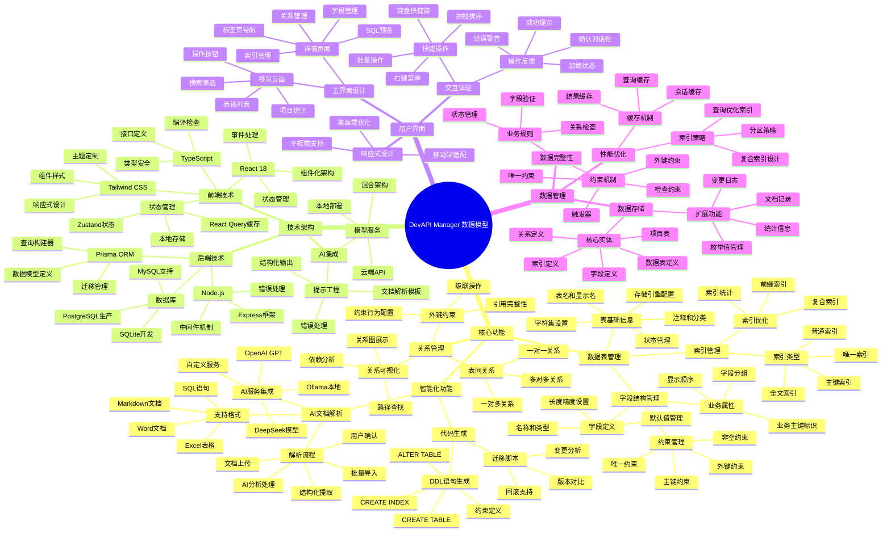

## 2. 功能模块详细思维导图

### 2.1 数据表管理功能

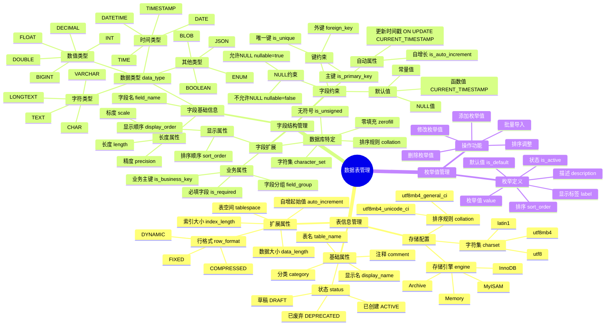

### 2.2 索引和关系管理

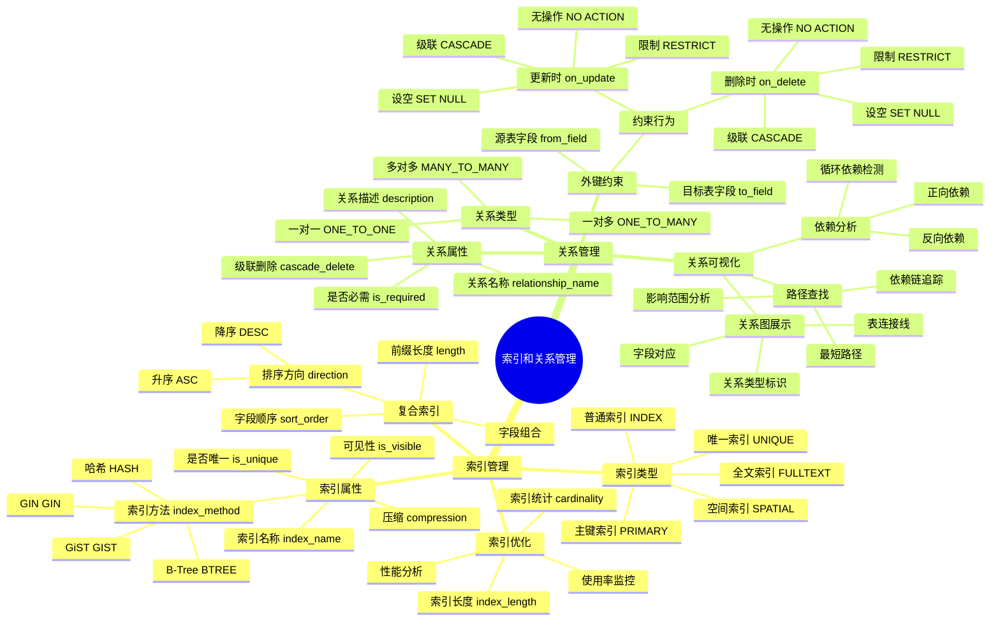

### 2.3 智能化功能

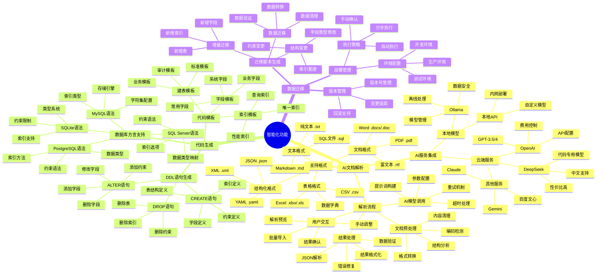

## 3. 技术架构思维导图

### 3.1 前端架构

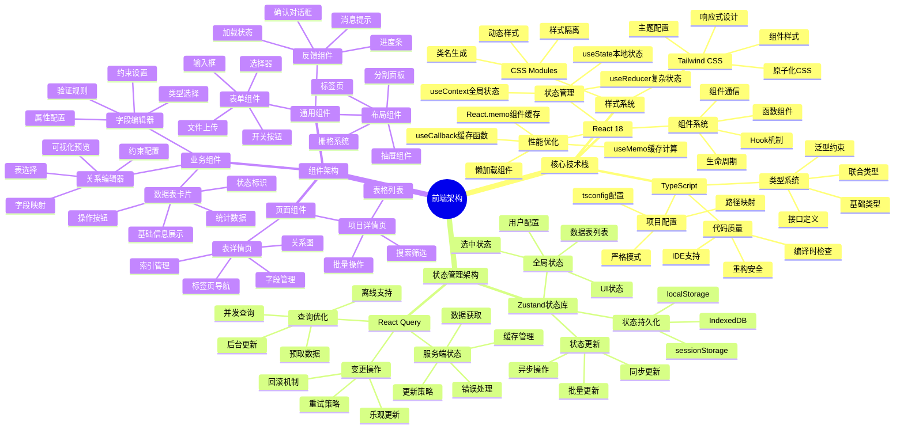

### 3.2 后端架构

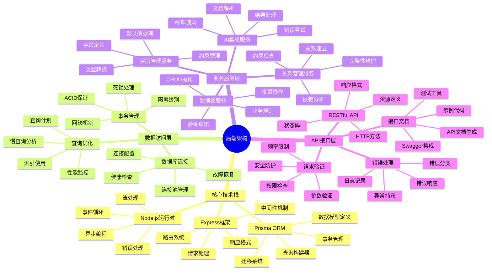

## 4. 数据流思维导图

### 4.1 数据创建流程

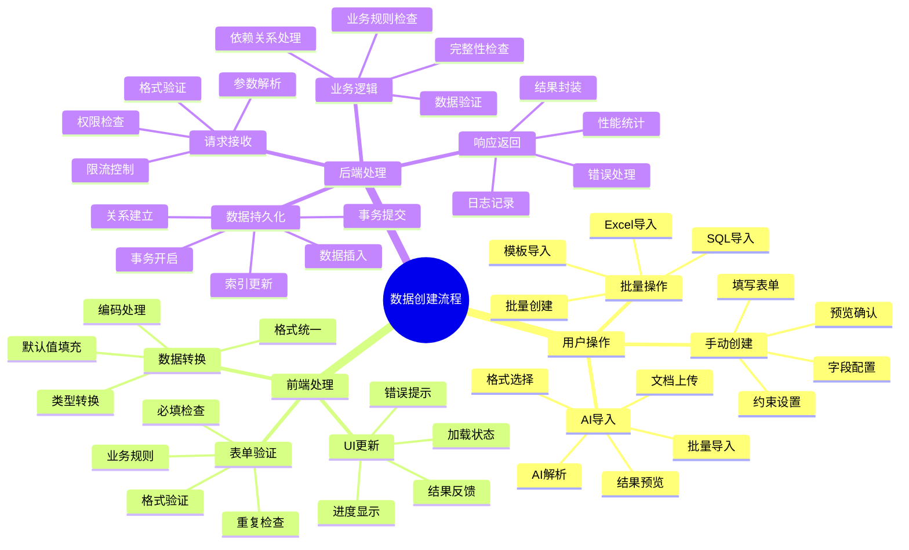

### 4.2 数据查询流程

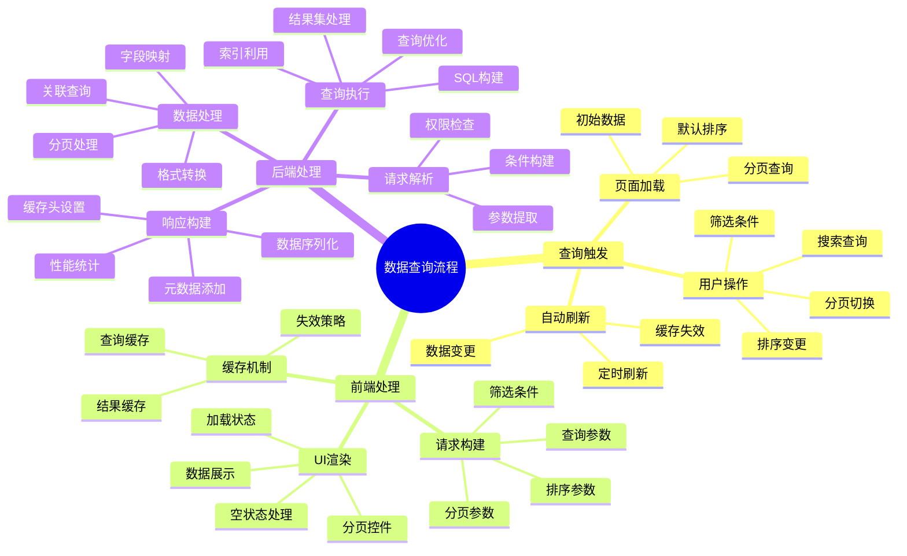

## 5. 用户体验思维导图

### 5.1 界面交互设计

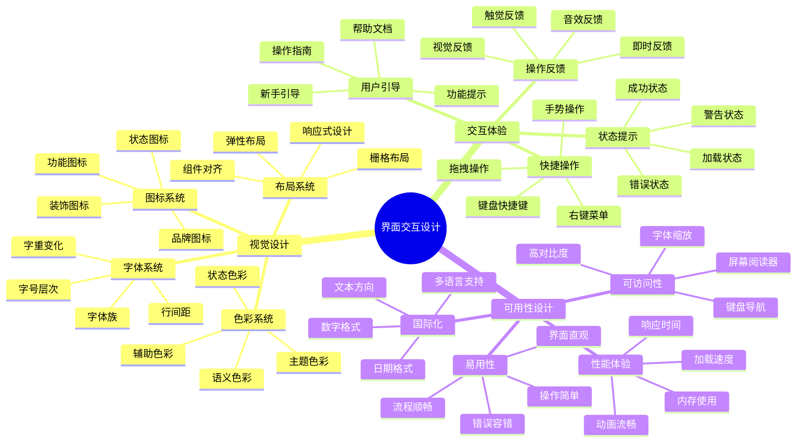

### 5.2 业务流程设计

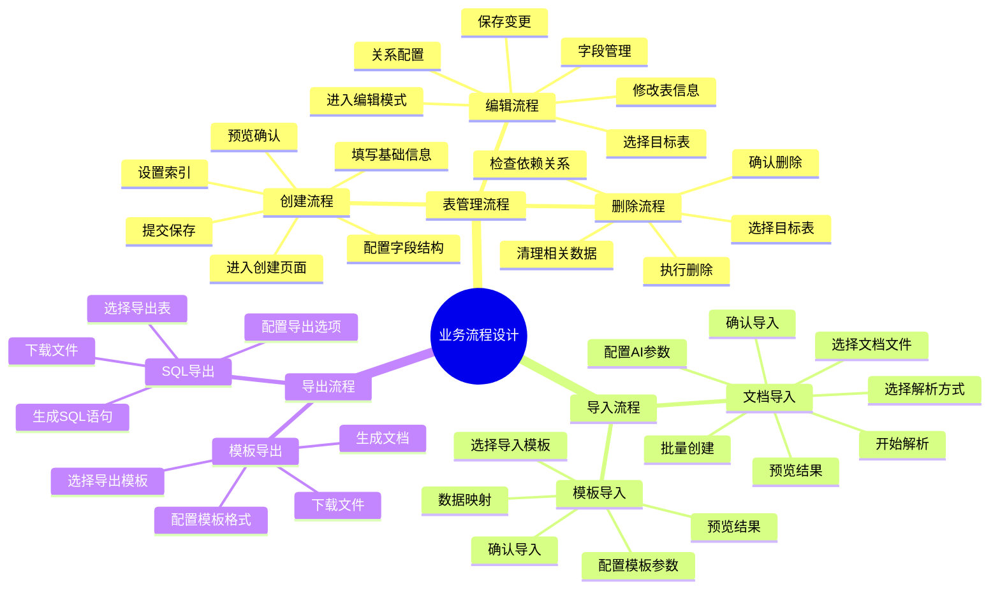

## 6. 性能优化思维导图

### 6.1 前端性能优化

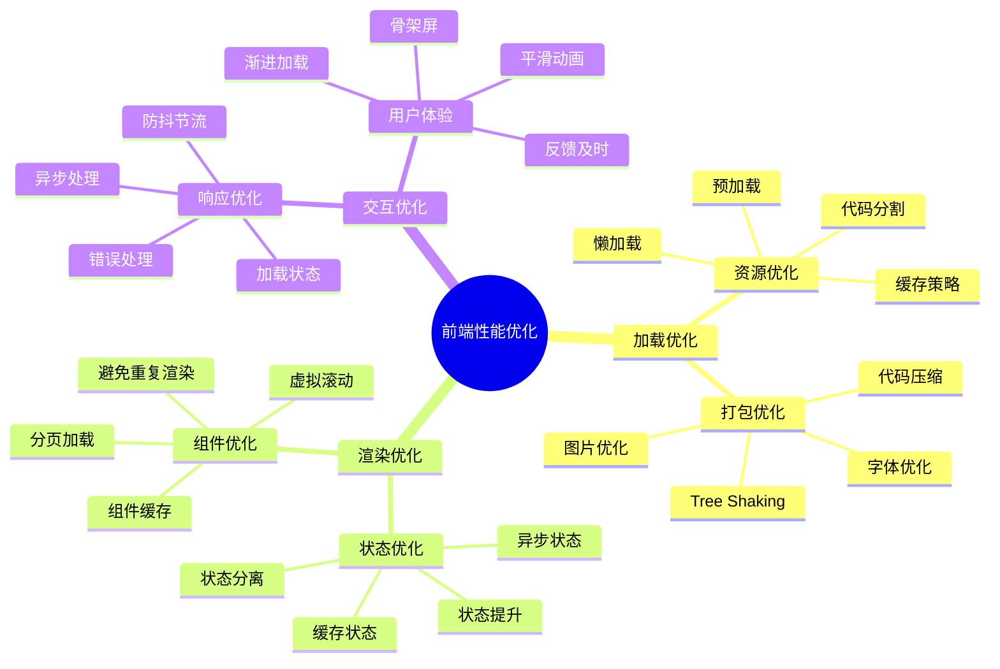

### 6.2 后端性能优化

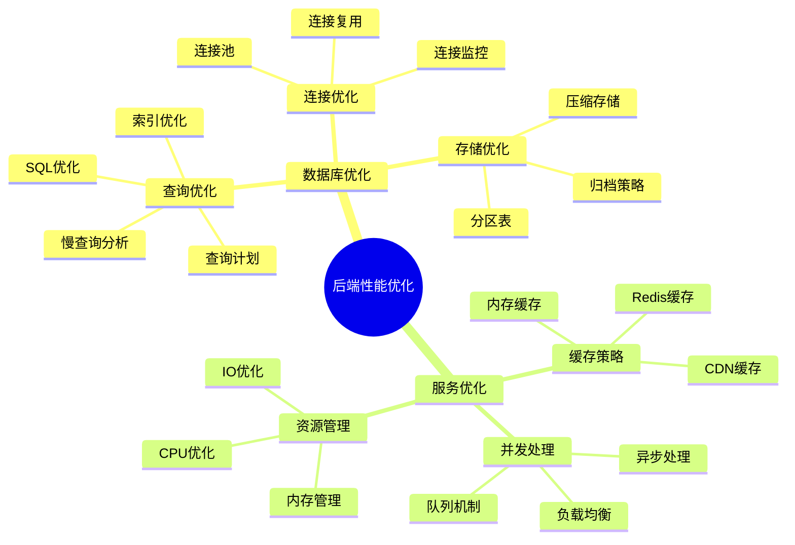

## 7. 部署和运维思维导图

### 7.1 部署架构

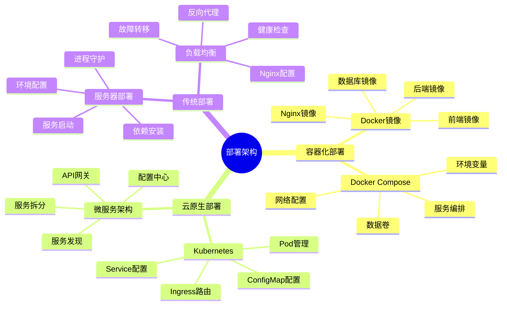

### 7.2 监控和运维

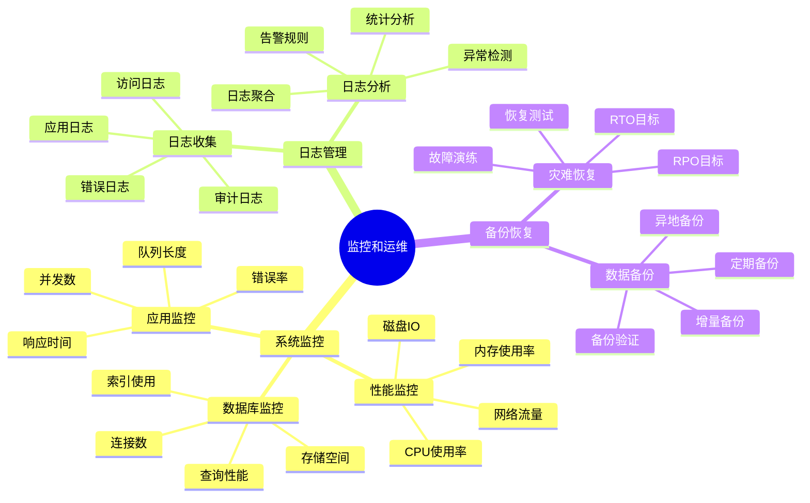

## 8. 安全架构思维导图

### 8.1 安全防护

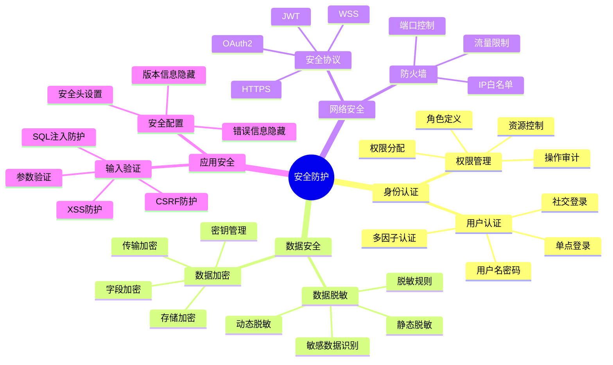

---

**思维导图说明**：
- 本文档使用Mermaid语法创建思维导图
- 可以在支持Mermaid的Markdown编辑器中查看图形化效果
- 建议使用Typora、GitBook、GitHub等支持Mermaid的平台查看
- 思维导图涵盖了DevAPI Manager数据模型功能的完整架构和实现细节

**文档版本**: v1.0  
**创建时间**: 2025-01-15  
**最后更新**: 2025-01-15  
**维护人员**: DevAPI团队