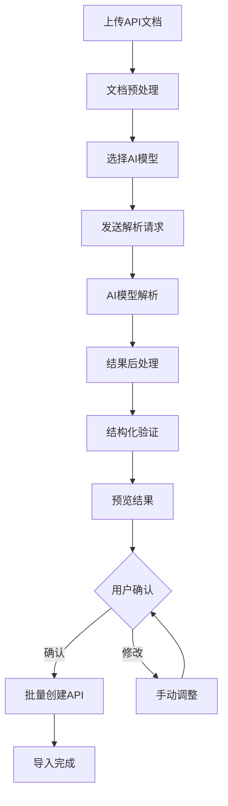
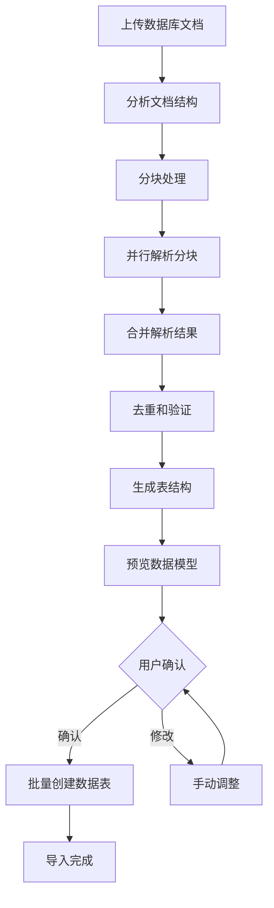

# AI模型解析文档功能

## 概述

AI模型解析文档功能是DevAPI Manager的核心创新特性，通过集成多种AI大语言模型，实现对API设计文档和数据库设计文档的智能解析。该功能大大降低了手动录入API和数据模型的工作量，提升了开发效率和准确性。

## 功能特性

### 1. 多格式文档解析
- **API文档解析**：支持Markdown格式的API设计文档
- **数据库文档解析**：支持数据库表结构设计文档
- **Swagger解析**：支持OpenAPI/Swagger标准格式
- **自然语言解析**：支持自然语言描述的API需求

### 2. 多AI模型支持
- **Ollama本地模型**：支持qwen2.5-coder等开源模型
- **DeepSeek在线服务**：支持deepseek-coder模型
- **OpenAI服务**：支持GPT系列模型
- **可扩展架构**：易于集成其他AI服务提供商

### 3. 智能解析能力
- **结构化提取**：从非结构化文档中提取结构化信息
- **上下文理解**：理解文档的业务上下文和意图
- **错误纠正**：自动纠正常见的格式错误
- **增量解析**：支持大文档的分块解析

### 4. 实时预览和验证
- **解析进度显示**：实时显示解析进度和状态
- **结果预览**：解析完成后提供结果预览
- **手动调整**：支持对解析结果进行手动调整
- **批量导入**：确认后一键批量导入到项目

## 技术架构

### 核心服务架构

```
AIParsingService
├── ConfigManager      # AI服务配置管理
├── DocumentParser     # 文档解析器
├── ModelAdapter       # 模型适配器
├── ResultValidator    # 结果验证器
└── ProgressTracker    # 进度跟踪器
```

### AI服务适配器

#### 1. 服务提供商配置

```typescript
interface AIParsingConfig {
  provider: 'ollama' | 'deepseek' | 'openai' | 'mock'
  model: string
  baseUrl: string
  apiKey?: string
  timeout?: number
  maxTokens?: number
}

export const AI_PARSING_PRESETS = {
  // 本地Ollama服务
  ollama_qwen: {
    provider: 'ollama' as const,
    model: 'qwen2.5-coder:7b',
    baseUrl: 'http://localhost:11434'
  },
  
  // DeepSeek在线服务  
  deepseek: {
    provider: 'deepseek' as const,
    model: 'deepseek-coder',
    baseUrl: 'https://api.deepseek.com',
    apiKey: process.env.VITE_DEEPSEEK_API_KEY
  },
  
  // OpenAI服务
  openai: {
    provider: 'openai' as const,
    model: 'gpt-3.5-turbo',
    baseUrl: 'https://api.openai.com',
    apiKey: process.env.VITE_OPENAI_API_KEY
  }
}
```

#### 2. 统一接口设计

```typescript
abstract class BaseAIProvider {
  abstract parseAPIDocument(content: string, projectId: string): Promise<ParsedAPIDocument>
  abstract parseDatabaseDocument(content: string): Promise<ParsedDatabaseDocument>
  abstract parseDatabaseDocumentWithProgress(
    content: string,
    onProgress?: (progress: ProgressInfo) => void
  ): Promise<ParsedDatabaseDocument>
}
```

### 文档解析流程

#### 1. API文档解析流程



#### 2. 数据库文档解析流程



### 解析器实现

#### 1. API文档解析器

```typescript
class APIDocumentParser {
  async parseAPIDocument(content: string, projectId: string): Promise<ParsedAPIDocument> {
    try {
      // 文档预处理
      const preprocessedContent = this.preprocessContent(content)
      
      // 构建解析提示词
      const prompt = this.buildAPIPrompt(preprocessedContent, projectId)
      
      // 调用AI模型
      const response = await this.callAIModel(prompt)
      
      // 解析AI响应
      const parsedData = this.parseAIResponse(response)
      
      // 验证和清理结果
      const validatedAPIs = this.validateAPIs(parsedData.apis)
      
      return {
        apis: validatedAPIs,
        success: true,
        errors: [],
        confidence: parsedData.confidence || 0.8
      }
    } catch (error) {
      return {
        apis: [],
        success: false,
        errors: [error.message],
        confidence: 0
      }
    }
  }

  private buildAPIPrompt(content: string, projectId: string): string {
    return `
你是一个专业的API文档解析助手。请仔细分析以下API文档内容，提取出所有的API接口信息。

文档内容：
${content}

请按照以下JSON格式返回解析结果：
{
  "apis": [
    {
      "name": "接口名称",
      "description": "接口描述", 
      "method": "HTTP方法(GET|POST|PUT|DELETE|PATCH)",
      "path": "接口路径",
      "parameters": "参数说明(可选)",
      "responses": "响应说明(可选)"
    }
  ],
  "confidence": 0.9
}

解析要求：
1. 仔细识别每个API的HTTP方法和路径
2. 提取接口的中文名称和描述
3. 如果有参数和响应说明，也要提取
4. 确保路径格式正确（以/开头）
5. 只返回JSON格式，不要其他说明文字

现在请开始解析用户提供的API文档内容。
`
  }
}
```

#### 2. 数据库文档解析器

```typescript
class DatabaseDocumentParser {
  async parseDatabaseDocument(content: string): Promise<ParsedDatabaseDocument> {
    // 检查是否需要分块处理
    const chunks = this.chunkDocument(content)
    
    if (chunks.length === 1) {
      return await this.parseSingleChunk(chunks[0])
    } else {
      return await this.parseMultipleChunks(chunks)
    }
  }

  async parseDatabaseDocumentWithProgress(
    content: string,
    onProgress?: (progress: ProgressInfo) => void
  ): Promise<ParsedDatabaseDocument> {
    const chunks = this.chunkDocument(content)
    const allTables = []
    
    for (let i = 0; i < chunks.length; i++) {
      // 更新进度
      onProgress?.({
        current: i,
        total: chunks.length,
        chunk: {
          title: `数据库文档分块 ${i + 1}/${chunks.length}`,
          content: chunks[i].substring(0, 100) + '...'
        }
      })
      
      // 解析当前分块
      const chunkResult = await this.parseSingleChunk(chunks[i])
      allTables.push(...chunkResult.tables)
    }
    
    // 去重和合并
    const uniqueTables = this.deduplicateTables(allTables)
    
    return {
      tables: uniqueTables,
      indexes: [],
      relationships: [],
      success: uniqueTables.length > 0,
      errors: [],
      confidence: 0.85
    }
  }

  private buildDatabasePrompt(content: string): string {
    return `
你是一个专业的数据库设计文档解析助手。请分析以下数据库文档内容，提取出数据表结构信息。

文档内容：
${content}

请按照以下JSON格式返回解析结果：
{
  "tables": [
    {
      "name": "表名(小写英文)",
      "displayName": "表的中文名称", 
      "comment": "表的描述",
      "fields": [
        {
          "name": "字段名",
          "type": "字段类型(如VARCHAR、INT、BIGINT等)",
          "length": 字段长度(数字,可选),
          "nullable": true/false,
          "primaryKey": true/false,
          "autoIncrement": true/false,
          "comment": "字段说明"
        }
      ]
    }
  ],
  "confidence": 0.9
}

解析要求：
1. 表名使用小写英文，如user_profiles
2. 字段类型使用标准SQL类型
3. 仔细识别主键、自增、非空等约束
4. 提取字段长度信息
5. 保留中文的描述和注释
6. 只返回JSON格式

现在请开始解析数据库文档。
`
  }
}
```

### 结果处理和验证

#### 1. API结果验证

```typescript
class APIValidator {
  validateAPIs(apis: any[]): API[] {
    return apis.map(api => this.validateSingleAPI(api)).filter(Boolean)
  }

  private validateSingleAPI(api: any): API | null {
    try {
      // 验证必填字段
      if (!api.name || !api.method || !api.path) {
        return null
      }
      
      // 验证HTTP方法
      const validMethods = ['GET', 'POST', 'PUT', 'DELETE', 'PATCH', 'HEAD', 'OPTIONS']
      if (!validMethods.includes(api.method.toUpperCase())) {
        return null
      }
      
      // 标准化路径
      let path = api.path.trim()
      if (!path.startsWith('/')) {
        path = '/' + path
      }
      
      return {
        name: api.name.trim(),
        description: api.description || '',
        method: api.method.toUpperCase() as HTTPMethod,
        path: path,
        parameters: api.parameters || null,
        responses: api.responses || null,
        status: APIStatus.NOT_STARTED
      }
    } catch (error) {
      console.error('API validation error:', error)
      return null
    }
  }
}
```

#### 2. 数据库结果验证

```typescript
class DatabaseValidator {
  validateTables(tables: any[]): DatabaseTable[] {
    return tables.map(table => this.validateSingleTable(table)).filter(Boolean)
  }

  private validateSingleTable(table: any): DatabaseTable | null {
    try {
      // 验证表名
      if (!table.name || typeof table.name !== 'string') {
        return null
      }
      
      // 标准化表名
      const tableName = table.name.toLowerCase().replace(/[^a-z0-9_]/g, '_')
      
      // 验证字段
      const validatedFields = this.validateFields(table.fields || [])
      
      return {
        id: `table-${Date.now()}-${Math.random()}`,
        name: tableName,
        displayName: table.displayName || table.name,
        comment: table.comment || '',
        engine: 'InnoDB',
        charset: 'utf8mb4',
        collation: 'utf8mb4_unicode_ci',
        status: DataModelStatus.DRAFT,
        fields: validatedFields,
        indexes: [],
        createdAt: new Date().toISOString(),
        updatedAt: new Date().toISOString()
      }
    } catch (error) {
      console.error('Table validation error:', error)
      return null
    }
  }

  private validateFields(fields: any[]): DatabaseField[] {
    return fields.map((field, index) => ({
      id: `field-${Date.now()}-${index}`,
      name: field.name || `field_${index}`,
      type: this.standardizeFieldType(field.type),
      length: field.length || null,
      nullable: field.nullable !== false,
      primaryKey: field.primaryKey === true,
      autoIncrement: field.autoIncrement === true,
      comment: field.comment || '',
      sortOrder: index,
      createdAt: new Date().toISOString(),
      updatedAt: new Date().toISOString()
    }))
  }
}
```

## 用户界面设计

### 1. 导入向导界面

```tsx
const UnifiedImportModal = ({ projectId, onSuccess, onClose }) => {
  const [activeTab, setActiveTab] = useState<'api-doc' | 'database'>('api-doc')
  const [currentStep, setCurrentStep] = useState<'upload' | 'parsing' | 'preview'>('upload')
  const [parseProgress, setParseProgress] = useState<ProgressInfo | null>(null)
  const [parsedResults, setParsedResults] = useState<any[]>([])

  return (
    <Modal isOpen onClose={onClose}>
      {/* Tab 导航 */}
      <TabNavigation activeTab={activeTab} onChange={setActiveTab} />
      
      {/* 步骤指示器 */}
      <StepIndicator currentStep={currentStep} />
      
      {/* 内容区域 */}
      {currentStep === 'upload' && (
        <UploadStep 
          onFileUpload={handleFileUpload}
          aiConfig={aiConfig}
          onConfigChange={setAiConfig}
        />
      )}
      
      {currentStep === 'parsing' && (
        <ParsingStep 
          progress={parseProgress}
          onCancel={handleCancel}
        />
      )}
      
      {currentStep === 'preview' && (
        <PreviewStep 
          results={parsedResults}
          onConfirm={handleConfirm}
          onEdit={handleEdit}
        />
      )}
    </Modal>
  )
}
```

### 2. 解析进度显示

```tsx
const ParsingProgressBar = ({ progress }: { progress: ProgressInfo }) => (
  <div className="space-y-4">
    {/* 总进度 */}
    <div>
      <div className="flex justify-between text-sm font-medium text-gray-700 mb-2">
        <span>解析进度</span>
        <span>{progress.current}/{progress.total}</span>
      </div>
      <div className="w-full bg-gray-200 rounded-full h-2">
        <div 
          className="bg-blue-500 h-2 rounded-full transition-all duration-300"
          style={{ width: `${(progress.current / progress.total) * 100}%` }}
        />
      </div>
    </div>
    
    {/* 当前处理的分块信息 */}
    {progress.chunk && (
      <div className="bg-gray-50 rounded-lg p-4">
        <h4 className="text-sm font-medium text-gray-800 mb-2">
          {progress.chunk.title}
        </h4>
        <p className="text-xs text-gray-600 font-mono">
          {progress.chunk.content}
        </p>
      </div>
    )}
  </div>
)
```

### 3. 结果预览界面

```tsx
const ResultPreview = ({ results, type }: { results: any[], type: 'api' | 'database' }) => (
  <div className="space-y-4">
    <div className="flex justify-between items-center">
      <h3 className="text-lg font-medium">
        解析结果预览 ({results.length} 项)
      </h3>
      <div className="flex space-x-2">
        <button onClick={handleSelectAll}>全选</button>
        <button onClick={handleDeselectAll}>取消全选</button>
      </div>
    </div>
    
    <div className="max-h-96 overflow-y-auto space-y-3">
      {results.map((item, index) => (
        <ResultItem 
          key={index} 
          item={item} 
          type={type}
          selected={selectedItems.includes(index)}
          onToggle={() => handleToggleItem(index)}
          onEdit={() => handleEditItem(index)}
        />
      ))}
    </div>
    
    <div className="flex justify-between pt-4 border-t">
      <span className="text-sm text-gray-600">
        已选择 {selectedItems.length} / {results.length} 项
      </span>
      <div className="space-x-2">
        <button className="btn-secondary" onClick={onCancel}>
          取消
        </button>
        <button 
          className="btn-primary" 
          onClick={onConfirm}
          disabled={selectedItems.length === 0}
        >
          确认导入 ({selectedItems.length} 项)
        </button>
      </div>
    </div>
  </div>
)
```

## 配置和优化

### 1. AI服务配置

```typescript
// 配置存储在localStorage
const AI_CONFIG_KEY = 'ai-parsing-config'

const getAIConfig = (): AIParsingConfig => {
  const saved = localStorage.getItem(AI_CONFIG_KEY)
  if (saved) {
    try {
      return JSON.parse(saved)
    } catch (e) {
      console.error('Failed to parse AI config:', e)
    }
  }
  return AI_PARSING_PRESETS.ollama_qwen
}

const saveAIConfig = (config: AIParsingConfig) => {
  localStorage.setItem(AI_CONFIG_KEY, JSON.stringify(config))
}
```

### 2. 性能优化

- **分块处理**：大文档自动分块，避免超出模型限制
- **并发控制**：控制并发请求数量，避免过载
- **缓存机制**：相同文档内容缓存解析结果
- **错误重试**：网络错误自动重试机制

### 3. 容错处理

```typescript
class ErrorHandler {
  static async withRetry<T>(
    operation: () => Promise<T>,
    maxRetries: number = 3,
    delay: number = 1000
  ): Promise<T> {
    for (let i = 0; i < maxRetries; i++) {
      try {
        return await operation()
      } catch (error) {
        if (i === maxRetries - 1) throw error
        await new Promise(resolve => setTimeout(resolve, delay * (i + 1)))
      }
    }
    throw new Error('Max retries exceeded')
  }
}
```

## 使用场景

### 1. API文档导入
- **需求文档转换**：将业务需求文档转换为API定义
- **现有API迁移**：从其他系统迁移API文档
- **团队协作**：团队成员快速导入API设计

### 2. 数据库设计导入
- **数据库重构**：现有数据库结构文档化
- **新项目启动**：快速建立数据模型
- **文档规范化**：统一数据库设计文档格式

### 3. 批量处理
- **大型项目迁移**：批量处理大量API文档
- **系统整合**：整合多个系统的API
- **标准化改造**：统一API设计规范

## 最佳实践

### 1. 文档准备
- **格式规范**：使用标准的Markdown格式
- **信息完整**：包含必要的API信息
- **结构清晰**：层次分明的文档结构
- **命名规范**：遵循命名规范

### 2. AI模型选择
- **本地部署**：推荐使用Ollama进行本地部署
- **在线服务**：网络条件好时使用在线服务
- **模型适配**：根据文档类型选择合适模型

### 3. 结果验证
- **人工检查**：AI解析结果需要人工验证
- **分批导入**：大量结果分批次导入
- **版本控制**：保留原始文档和解析结果

AI模型解析文档功能是DevAPI Manager的技术亮点，通过智能化的文档解析大大提升了开发效率，为项目管理工具的智能化发展奠定了基础。