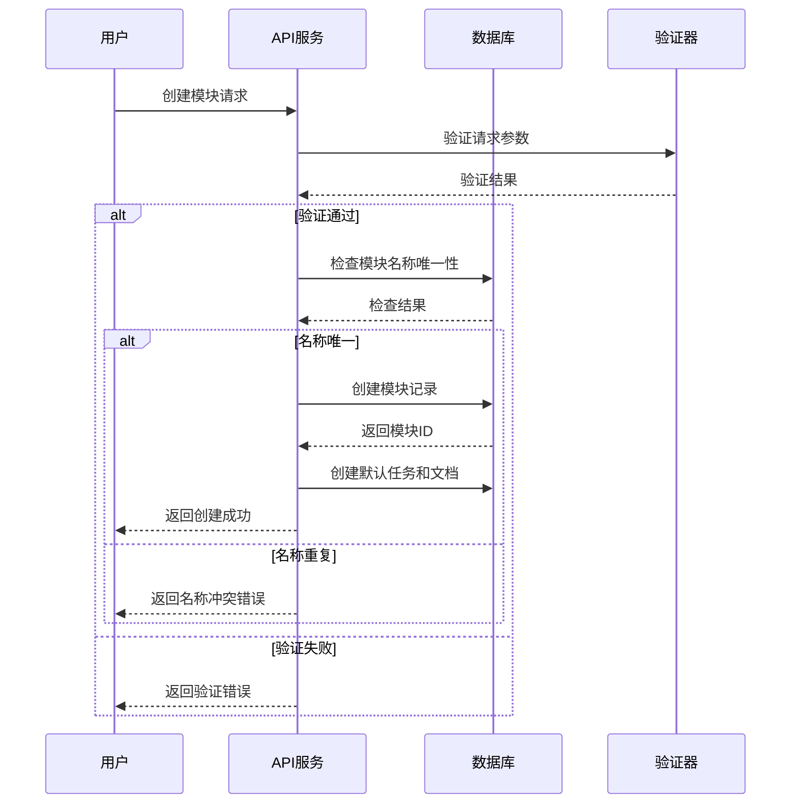
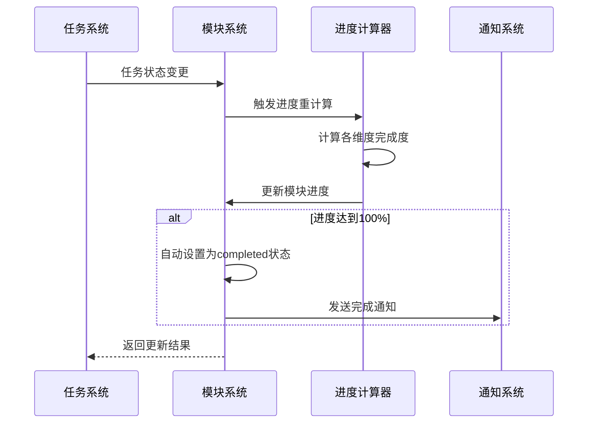
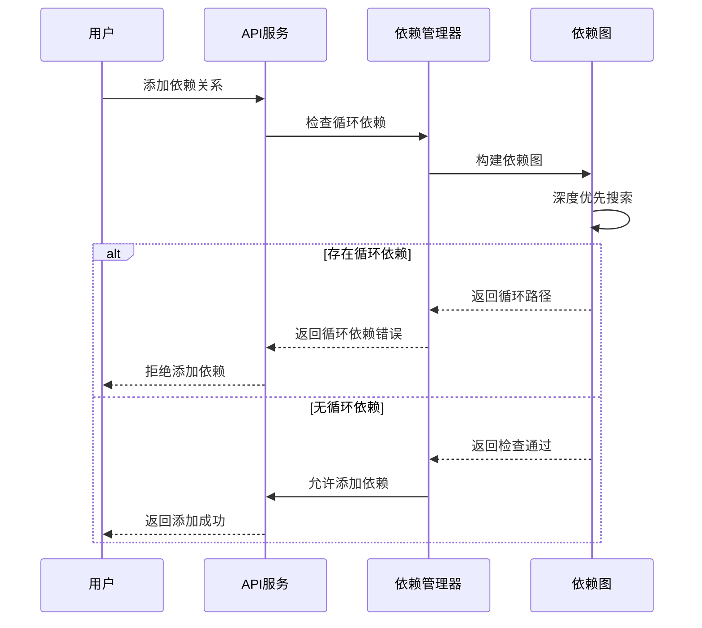

# DevAPI Manager - 功能模块文档

> **版本**: 2.0.0  
> **更新时间**: 2025-08-20  
> **模块**: 功能模块管理系统

## 目录

- [概述](#概述)
- [功能模块架构](#功能模块架构)
- [数据模型设计](#数据模型设计)
- [核心功能](#核心功能)
- [API接口详解](#api接口详解)
- [业务流程](#业务流程)
- [使用示例](#使用示例)
- [最佳实践](#最佳实践)
- [问题排查](#问题排查)

## 概述

功能模块管理系统是DevAPI Manager的核心组件之一，用于组织和管理项目中的各个功能模块。每个功能模块可以包含相关的API接口、开发任务、技术文档和依赖关系，为项目提供清晰的功能架构和开发进度跟踪。

### 主要特性

- **模块化管理**: 将项目功能拆分为独立的模块进行管理
- **进度跟踪**: 实时跟踪模块开发进度和完成状态
- **依赖管理**: 管理模块间的依赖关系和版本控制
- **团队协作**: 支持模块分配和团队成员协作
- **文档集成**: 模块文档的统一管理和版本控制
- **API关联**: 将API接口与功能模块关联管理

### 应用场景

- **项目架构设计**: 规划项目的功能模块结构
- **开发任务分配**: 将开发任务分配到具体的功能模块
- **进度监控**: 实时监控各模块的开发进度
- **依赖分析**: 分析模块间的依赖关系和影响范围
- **文档管理**: 统一管理各模块的技术文档

## 功能模块架构

### 系统架构图

```
┌─────────────────────────────────────────────────────────────┐
│                    DevAPI Manager                           │
├─────────────────────────────────────────────────────────────┤
│                   功能模块管理层                              │
│  ┌─────────────┐  ┌─────────────┐  ┌─────────────┐          │
│  │   模块管理   │  │   依赖管理   │  │   进度跟踪   │          │
│  └─────────────┘  └─────────────┘  └─────────────┘          │
├─────────────────────────────────────────────────────────────┤
│                    数据访问层                                │
│  ┌─────────────┐  ┌─────────────┐  ┌─────────────┐          │
│  │ 模块数据服务 │  │ 关联数据服务 │  │ 统计数据服务 │          │
│  └─────────────┘  └─────────────┘  └─────────────┘          │
├─────────────────────────────────────────────────────────────┤
│                    数据持久层                                │
│  ┌─────────────┐  ┌─────────────┐  ┌─────────────┐          │
│  │ FeatureModule│ │ModuleEndpoint│ │ ModuleTask  │          │
│  │ 功能模块表   │  │ 模块端点表   │  │ 模块任务表   │          │
│  └─────────────┘  └─────────────┘  └─────────────┘          │
│  ┌─────────────┐  ┌─────────────┐  ┌─────────────┐          │
│  │ModuleDocument│ │ModuleDependency│ │ ModuleTable│          │
│  │ 模块文档表   │  │ 模块依赖表   │  │ 模块表关联   │          │
│  └─────────────┘  └─────────────┘  └─────────────┘          │
└─────────────────────────────────────────────────────────────┘
```

### 模块组成

1. **核心模块 (FeatureModule)**
   - 模块基本信息管理
   - 状态和进度跟踪
   - 分类和优先级管理

2. **API端点模块 (ModuleEndpoint)**
   - 模块相关API接口管理
   - 接口实现状态跟踪
   - 接口文档和测试用例

3. **任务管理模块 (ModuleTask)**
   - 开发任务分解和管理
   - 任务状态和工时跟踪
   - 任务依赖关系管理

4. **文档管理模块 (ModuleDocument)**
   - 技术文档和规范管理
   - 版本控制和审核流程
   - 多格式文档支持

5. **依赖管理模块 (ModuleDependency)**
   - 模块间依赖关系定义
   - 版本兼容性管理
   - 循环依赖检测

## 数据模型设计

### 核心实体关系图

```
Project (项目)
    │
    ├─── FeatureModule (功能模块)
    │         │
    │         ├─── ModuleEndpoint (模块端点)
    │         │         │
    │         │         └─── APIEndpoint (关联API)
    │         │
    │         ├─── ModuleTask (模块任务)
    │         │
    │         ├─── ModuleDocument (模块文档)
    │         │
    │         ├─── ModuleTable (关联表)
    │         │         │
    │         │         └─── DatabaseTable (数据库表)
    │         │
    │         └─── ModuleDependency (模块依赖)
    │                   │
    │                   ├─── fromModule (依赖方)
    │                   └─── toModule (被依赖方)
    │
    └─── Other Entities...
```

### 主要数据表结构

#### FeatureModule (功能模块表)

| 字段名         | 类型     | 说明       | 约束                                     |
| -------------- | -------- | ---------- | ---------------------------------------- |
| id             | String   | 主键ID     | UUID                                     |
| projectId      | String   | 项目ID     | 外键                                     |
| name           | String   | 模块名称   | 必填, 唯一                               |
| displayName    | String   | 显示名称   | 可选                                     |
| description    | String   | 模块描述   | 可选                                     |
| status         | Enum     | 模块状态   | planned/in-progress/completed/deprecated |
| category       | String   | 模块分类   | 可选                                     |
| priority       | Enum     | 优先级     | HIGH/MEDIUM/LOW                          |
| progress       | Int      | 完成进度   | 0-100                                    |
| tags           | JSON     | 标签数组   | 可选                                     |
| techStack      | JSON     | 技术栈     | 可选                                     |
| estimatedHours | Float    | 预估工时   | 可选                                     |
| actualHours    | Float    | 实际工时   | 可选                                     |
| assigneeId     | String   | 负责人ID   | 可选                                     |
| assigneeName   | String   | 负责人姓名 | 可选                                     |
| ownerId        | String   | 所有者ID   | 可选                                     |
| ownerName      | String   | 所有者姓名 | 可选                                     |
| startDate      | DateTime | 开始日期   | 可选                                     |
| dueDate        | DateTime | 截止日期   | 可选                                     |
| completedAt    | DateTime | 完成时间   | 可选                                     |
| createdBy      | String   | 创建者     | 必填                                     |
| lastModifiedBy | String   | 最后修改者 | 可选                                     |
| sortOrder      | Int      | 排序序号   | 默认0                                    |

#### ModuleEndpoint (模块端点表)

| 字段名         | 类型   | 说明            | 约束                                               |
| -------------- | ------ | --------------- | -------------------------------------------------- |
| id             | String | 主键ID          | UUID                                               |
| moduleId       | String | 模块ID          | 外键                                               |
| endpointId     | String | 关联的API端点ID | 外键,可选                                          |
| name           | String | 端点名称        | 必填                                               |
| method         | String | HTTP方法        | GET/POST/PUT/DELETE                                |
| path           | String | 端点路径        | 必填                                               |
| description    | String | 端点描述        | 可选                                               |
| status         | Enum   | 实现状态        | planned/implementing/implemented/testing/completed |
| priority       | Enum   | 优先级          | HIGH/MEDIUM/LOW                                    |
| requestSchema  | JSON   | 请求参数结构    | 可选                                               |
| responseSchema | JSON   | 响应结构        | 可选                                               |
| testCases      | JSON   | 测试用例        | 可选                                               |

#### ModuleTask (模块任务表)

| 字段名         | 类型     | 说明           | 约束                                        |
| -------------- | -------- | -------------- | ------------------------------------------- |
| id             | String   | 主键ID         | UUID                                        |
| moduleId       | String   | 模块ID         | 外键                                        |
| title          | String   | 任务标题       | 必填                                        |
| description    | String   | 任务描述       | 可选                                        |
| type           | Enum     | 任务类型       | DEVELOPMENT/TESTING/DOCUMENTATION/REVIEW    |
| status         | Enum     | 任务状态       | TODO/IN_PROGRESS/REVIEW/COMPLETED/CANCELLED |
| priority       | Enum     | 优先级         | HIGH/MEDIUM/LOW                             |
| assigneeId     | String   | 负责人ID       | 可选                                        |
| assigneeName   | String   | 负责人姓名     | 可选                                        |
| estimatedHours | Float    | 预估工时       | 可选                                        |
| actualHours    | Float    | 实际工时       | 可选                                        |
| startDate      | DateTime | 开始时间       | 可选                                        |
| dueDate        | DateTime | 截止时间       | 可选                                        |
| completedAt    | DateTime | 完成时间       | 可选                                        |
| tags           | JSON     | 任务标签       | 可选                                        |
| labels         | JSON     | 任务标签       | 可选                                        |
| dependsOn      | JSON     | 依赖任务ID数组 | 可选                                        |
| blockedBy      | JSON     | 阻塞任务ID数组 | 可选                                        |
| sortOrder      | Int      | 排序序号       | 默认0                                       |

## 核心功能

### 1. 模块生命周期管理

#### 状态流转

```
planned (计划中) → in-progress (进行中) → completed (已完成)
     ↓                    ↓                    ↓
deprecated (已废弃) ←─────────────────────────┘
```

#### 状态描述

- **planned**: 模块已规划但尚未开始开发
- **in-progress**: 模块正在开发中
- **completed**: 模块开发完成并通过测试
- **deprecated**: 模块已废弃不再维护

### 2. 进度计算算法

```typescript
// 进度计算基于多个维度
function calculateModuleProgress(module: FeatureModule): number {
  const weights = {
    tasks: 0.4, // 任务完成度权重
    endpoints: 0.3, // API端点完成度权重
    documents: 0.2, // 文档完成度权重
    testing: 0.1, // 测试完成度权重
  }

  const taskProgress = calculateTaskProgress(module.tasks)
  const endpointProgress = calculateEndpointProgress(module.endpoints)
  const documentProgress = calculateDocumentProgress(module.documents)
  const testingProgress = calculateTestingProgress(module.testCases)

  return Math.round(
    taskProgress * weights.tasks +
      endpointProgress * weights.endpoints +
      documentProgress * weights.documents +
      testingProgress * weights.testing
  )
}
```

### 3. 依赖关系管理

#### 依赖类型

- **REQUIRES**: 强依赖，必须先完成被依赖模块
- **OPTIONAL**: 弱依赖，可选择性依赖
- **CONFLICTS**: 冲突关系，不能同时使用
- **ENHANCES**: 增强关系，提供额外功能

#### 循环依赖检测

```typescript
function detectCircularDependency(moduleId: string, visited: Set<string> = new Set()): boolean {
  if (visited.has(moduleId)) {
    return true // 发现循环依赖
  }

  visited.add(moduleId)
  const dependencies = getModuleDependencies(moduleId)

  for (const dep of dependencies) {
    if (detectCircularDependency(dep.toModuleId, new Set(visited))) {
      return true
    }
  }

  return false
}
```

### 4. 工时统计和预测

#### 工时统计维度

- **计划工时**: 模块预估的总开发时间
- **实际工时**: 已消耗的实际开发时间
- **剩余工时**: 预估还需要的开发时间
- **效率指标**: 实际工时与计划工时的比值

#### 工时预测算法

```typescript
function predictRemainingHours(module: FeatureModule): number {
  const completedRatio = module.progress / 100
  const actualHours = module.actualHours || 0
  const estimatedTotal = module.estimatedHours || 0

  if (completedRatio === 0) return estimatedTotal

  // 基于当前进度预测总工时
  const predictedTotal = actualHours / completedRatio
  return Math.max(0, predictedTotal - actualHours)
}
```

## API接口详解

### 模块CRUD操作

#### 1. 获取功能模块列表

**接口**: `GET /api/v1/features/{projectId}/modules`

**查询参数**:

- `status`: 状态过滤 (planned|in-progress|completed|deprecated)
- `search`: 关键词搜索 (模块名称、描述、分类)
- `category`: 分类过滤
- `priority`: 优先级过滤
- `assignee`: 负责人过滤
- `page`: 页码 (默认1)
- `pageSize`: 每页数量 (默认20)

**响应数据**:

```json
{
  "success": true,
  "data": {
    "modules": [
      {
        "id": "uuid",
        "name": "用户认证模块",
        "displayName": "用户认证和权限管理",
        "status": "completed",
        "progress": 100,
        "stats": {
          "totalEndpoints": 5,
          "totalTasks": 12,
          "completedTasks": 12,
          "totalDocuments": 3
        }
      }
    ],
    "total": 6,
    "summary": {
      "planned": 2,
      "inProgress": 2,
      "completed": 2,
      "total": 6
    }
  }
}
```

#### 2. 创建功能模块

**接口**: `POST /api/v1/features/{projectId}/modules`

**请求体**:

```json
{
  "name": "支付系统模块",
  "displayName": "在线支付和订单管理",
  "description": "支持多种支付方式的完整支付解决方案",
  "category": "支付系统",
  "priority": "HIGH",
  "tags": ["支付", "订单", "微信支付", "支付宝"],
  "techStack": ["Node.js", "Redis", "MySQL", "微信SDK"],
  "estimatedHours": 80,
  "assigneeName": "张支付",
  "startDate": "2024-03-01T00:00:00.000Z",
  "dueDate": "2024-04-15T00:00:00.000Z"
}
```

#### 3. 获取模块详细信息

**接口**: `GET /api/v1/features/{projectId}/modules/{moduleId}`

**响应包含**:

- 模块基本信息
- 关联的API端点列表
- 开发任务列表
- 技术文档列表
- 依赖关系信息
- 关联的数据库表

### 模块端点管理

#### 添加模块端点

**接口**: `POST /api/v1/features/{projectId}/modules/{moduleId}/endpoints`

**请求体**:

```json
{
  "name": "创建支付订单",
  "method": "POST",
  "path": "/api/v1/payments/orders",
  "description": "创建新的支付订单",
  "priority": "HIGH",
  "requestSchema": {
    "type": "object",
    "properties": {
      "amount": { "type": "number" },
      "currency": { "type": "string" },
      "paymentMethod": { "type": "string" }
    }
  },
  "responseSchema": {
    "type": "object",
    "properties": {
      "orderId": { "type": "string" },
      "paymentUrl": { "type": "string" },
      "status": { "type": "string" }
    }
  }
}
```

### 任务管理

#### 添加开发任务

**接口**: `POST /api/v1/features/{projectId}/modules/{moduleId}/tasks`

**请求体**:

```json
{
  "title": "实现微信支付接口",
  "description": "集成微信支付API，支持扫码支付和APP支付",
  "type": "DEVELOPMENT",
  "priority": "HIGH",
  "assigneeName": "李开发",
  "estimatedHours": 16,
  "startDate": "2024-03-05T00:00:00.000Z",
  "dueDate": "2024-03-08T00:00:00.000Z",
  "tags": ["微信支付", "API集成"],
  "dependsOn": ["task-uuid-1", "task-uuid-2"]
}
```

### 依赖管理

#### 添加模块依赖

**接口**: `POST /api/v1/features/{projectId}/modules/{moduleId}/dependencies`

**请求体**:

```json
{
  "toModuleId": "user-auth-module-uuid",
  "dependencyType": "REQUIRES",
  "description": "支付模块需要用户认证模块提供用户身份验证",
  "isRequired": true,
  "version": "1.0.0"
}
```

## 业务流程

### 1. 模块创建流程



### 2. 进度更新流程



### 3. 依赖检查流程



## 使用示例

### 示例1: 创建用户管理模块

```bash
# 1. 创建用户管理模块
curl -X POST "http://localhost:3000/api/v1/features/project-uuid/modules" \
  -H "Content-Type: application/json" \
  -d '{
    "name": "用户管理模块",
    "displayName": "用户认证和权限管理",
    "description": "提供用户注册、登录、权限验证等核心功能",
    "category": "用户系统",
    "priority": "HIGH",
    "tags": ["用户", "认证", "权限", "JWT"],
    "techStack": ["Node.js", "Express", "JWT", "bcrypt", "Prisma"],
    "estimatedHours": 40,
    "assigneeName": "张开发",
    "startDate": "2024-01-01T00:00:00.000Z",
    "dueDate": "2024-01-31T00:00:00.000Z"
  }'

# 2. 为模块添加API端点
curl -X POST "http://localhost:3000/api/v1/features/project-uuid/modules/module-uuid/endpoints" \
  -H "Content-Type: application/json" \
  -d '{
    "name": "用户注册",
    "method": "POST",
    "path": "/api/v1/auth/register",
    "description": "用户注册接口",
    "priority": "HIGH",
    "requestSchema": {
      "type": "object",
      "required": ["username", "email", "password"],
      "properties": {
        "username": {"type": "string", "minLength": 3},
        "email": {"type": "string", "format": "email"},
        "password": {"type": "string", "minLength": 6}
      }
    },
    "responseSchema": {
      "type": "object",
      "properties": {
        "id": {"type": "string"},
        "username": {"type": "string"},
        "email": {"type": "string"},
        "token": {"type": "string"}
      }
    }
  }'

# 3. 添加开发任务
curl -X POST "http://localhost:3000/api/v1/features/project-uuid/modules/module-uuid/tasks" \
  -H "Content-Type: application/json" \
  -d '{
    "title": "实现用户注册功能",
    "description": "实现用户注册API，包括数据验证、密码加密、邮箱验证",
    "type": "DEVELOPMENT",
    "status": "TODO",
    "priority": "HIGH",
    "assigneeName": "张开发",
    "estimatedHours": 8,
    "tags": ["注册", "验证", "加密"]
  }'
```

### 示例2: 查询模块进度和统计

```bash
# 1. 获取项目所有模块及进度
curl "http://localhost:3000/api/v1/features/project-uuid/modules" \
  -H "Content-Type: application/json"

# 2. 获取模块详细信息
curl "http://localhost:3000/api/v1/features/project-uuid/modules/module-uuid" \
  -H "Content-Type: application/json"

# 3. 获取项目模块统计信息
curl "http://localhost:3000/api/v1/features/project-uuid/modules/stats" \
  -H "Content-Type: application/json"

# 4. 按状态过滤模块
curl "http://localhost:3000/api/v1/features/project-uuid/modules?status=in-progress" \
  -H "Content-Type: application/json"

# 5. 搜索特定模块
curl "http://localhost:3000/api/v1/features/project-uuid/modules?search=用户" \
  -H "Content-Type: application/json"
```

### 示例3: 模块依赖管理

```bash
# 1. 添加模块依赖关系
curl -X POST "http://localhost:3000/api/v1/features/project-uuid/modules/payment-module/dependencies" \
  -H "Content-Type: application/json" \
  -d '{
    "toModuleId": "user-auth-module-uuid",
    "dependencyType": "REQUIRES",
    "description": "支付模块依赖用户认证模块进行身份验证",
    "isRequired": true,
    "version": "1.0.0"
  }'

# 2. 获取模块依赖关系
curl "http://localhost:3000/api/v1/features/project-uuid/modules/module-uuid/dependencies" \
  -H "Content-Type: application/json"

# 3. 检查依赖冲突
curl "http://localhost:3000/api/v1/features/project-uuid/modules/validate-dependencies" \
  -H "Content-Type: application/json"
```

## 最佳实践

### 1. 模块设计原则

#### 单一职责原则

每个功能模块应该只负责一个明确的业务领域，避免功能混杂。

```yaml
✅ 良好的模块设计:
  - 用户认证模块: 专注于用户登录、注册、权限验证
  - 支付系统模块: 专注于支付处理、订单管理
  - 消息通知模块: 专注于各种通知方式的管理

❌ 不良的模块设计:
  - 用户支付模块: 混合了用户管理和支付功能
  - 通用工具模块: 包含了多个不相关的工具函数
```

#### 高内聚低耦合

模块内部功能紧密相关，模块间依赖关系简单清晰。

```yaml
✅ 高内聚低耦合:
  - 模块内API接口围绕同一业务领域
  - 模块间通过明确的接口通信
  - 依赖关系单向且最小化

❌ 低内聚高耦合:
  - 模块内包含多个不相关的功能
  - 模块间存在复杂的双向依赖
  - 频繁的跨模块数据访问
```

### 2. 进度跟踪最佳实践

#### 任务分解策略

```yaml
原则:
  - 任务粒度适中(4-16小时)
  - 任务之间依赖关系明确
  - 任务可独立测试和验收

示例任务分解:
用户注册功能:
  - 设计用户数据模型 (4h)
  - 实现注册API接口 (8h)
  - 添加邮箱验证功能 (6h)
  - 编写单元测试 (4h)
  - 集成测试和调试 (4h)
```

#### 进度更新频率

```yaml
建议更新频率:
  - 日常开发: 每日更新任务状态
  - 里程碑检查: 每周评估模块进度
  - 项目汇报: 每月统计整体完成情况

自动化触发:
  - 任务状态变更时自动重算进度
  - API端点实现完成时更新状态
  - 测试用例通过时标记为已验证
```

### 3. 依赖管理策略

#### 依赖层次规划

```yaml
推荐依赖层次:
第1层 - 基础设施模块:
  - 用户认证模块
  - 权限管理模块
  - 配置管理模块

第2层 - 核心业务模块:
  - 产品管理模块
  - 订单管理模块
  - 库存管理模块

第3层 - 扩展功能模块:
  - 报表统计模块
  - 消息通知模块
  - 第三方集成模块
```

#### 版本兼容性管理

```yaml
版本命名规范:
  - 主版本号: 不兼容的API修改
  - 次版本号: 向后兼容的功能性新增
  - 修订号: 向后兼容的问题修正

依赖版本约束:
  - 强依赖: 精确版本号 (1.2.3)
  - 兼容依赖: 版本范围 (>=1.2.0 <2.0.0)
  - 可选依赖: 最低版本 (>=1.0.0)
```

### 4. 团队协作规范

#### 模块责任分配

```yaml
角色定义:
- 模块负责人: 技术决策、进度管控、质量保证
- 开发成员: 具体功能实现、单元测试
- 测试成员: 集成测试、验收测试
- 产品成员: 需求澄清、验收标准

协作流程:
1. 模块负责人分解任务
2. 开发成员认领具体任务
3. 每日同步进度和阻塞问题
4. 测试成员验证功能完成度
```

#### 文档维护规范

```yaml
文档类型和责任:
  - 架构设计文档: 模块负责人维护
  - API接口文档: 后端开发维护
  - 使用手册: 前端开发维护
  - 测试用例文档: 测试人员维护

更新时机:
  - 设计阶段: 创建架构设计文档
  - 开发阶段: 更新API接口文档
  - 测试阶段: 完善测试用例文档
  - 发布阶段: 更新使用手册
```

## 问题排查

### 常见问题和解决方案

#### 1. 模块进度不准确

**问题描述**: 模块显示进度与实际开发情况不符

**可能原因**:

- 任务状态更新不及时
- 进度计算权重配置不合理
- 子任务分解不够细致

**解决方案**:

```bash
# 1. 检查任务状态同步
curl "http://localhost:3000/api/v1/features/project-uuid/modules/module-uuid/tasks" \
  -H "Content-Type: application/json"

# 2. 手动触发进度重算
curl -X POST "http://localhost:3000/api/v1/features/project-uuid/modules/module-uuid/recalculate-progress" \
  -H "Content-Type: application/json"

# 3. 检查权重配置
curl "http://localhost:3000/api/v1/features/progress-config" \
  -H "Content-Type: application/json"
```

#### 2. 循环依赖错误

**问题描述**: 添加模块依赖时报循环依赖错误

**诊断步骤**:

```bash
# 1. 查看依赖关系图
curl "http://localhost:3000/api/v1/features/project-uuid/modules/dependency-graph" \
  -H "Content-Type: application/json"

# 2. 检查具体依赖路径
curl "http://localhost:3000/api/v1/features/project-uuid/modules/module-uuid/dependency-path" \
  -H "Content-Type: application/json"
```

**解决方案**:

- 重新设计模块边界，消除循环依赖
- 提取公共依赖为独立的基础模块
- 使用事件驱动架构减少直接依赖

#### 3. 性能问题

**问题描述**: 模块列表加载缓慢

**优化方案**:

```bash
# 1. 启用分页加载
curl "http://localhost:3000/api/v1/features/project-uuid/modules?page=1&pageSize=10" \
  -H "Content-Type: application/json"

# 2. 使用字段过滤
curl "http://localhost:3000/api/v1/features/project-uuid/modules?fields=id,name,status,progress" \
  -H "Content-Type: application/json"

# 3. 启用缓存
curl "http://localhost:3000/api/v1/features/project-uuid/modules" \
  -H "Content-Type: application/json" \
  -H "Cache-Control: max-age=300"
```

### 监控和指标

#### 关键性能指标 (KPI)

```yaml
模块管理指标:
  - 模块平均完成时间
  - 任务完成率和延期率
  - 依赖关系复杂度
  - 代码重用率

性能指标:
  - API响应时间 (<200ms)
  - 数据库查询效率
  - 内存使用情况
  - 并发处理能力

质量指标:
  - 测试覆盖率 (>80%)
  - 代码质量评分
  - 文档完整性
  - 缺陷密度
```

#### 监控配置

```bash
# 启用性能监控
export ENABLE_PERFORMANCE_MONITORING=true

# 配置日志级别
export LOG_LEVEL=info

# 启用数据库查询日志
export PRISMA_LOG_LEVEL=query
```

---

**文档维护**: DevAPI Manager Team  
**最后更新**: 2025-08-20  
**版本**: 2.0.0
