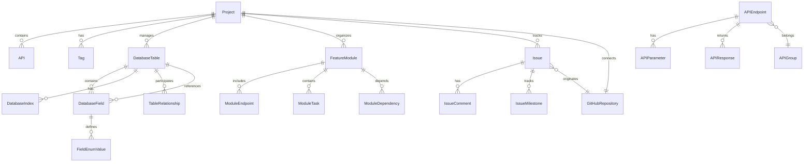
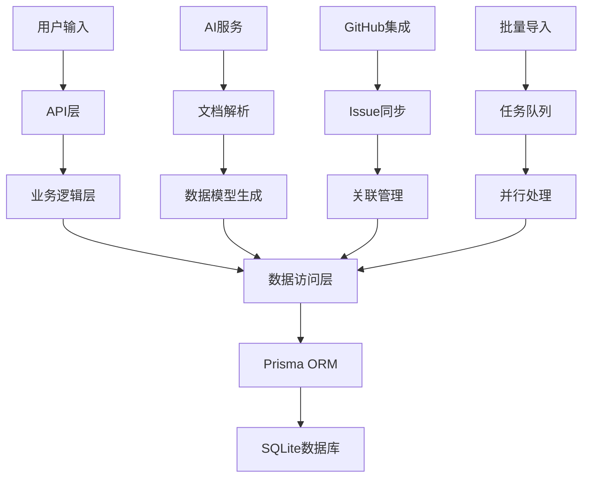

# DevAPI Manager - 数据模型文档

> **版本**: 2.0.0  
> **更新时间**: 2025-08-20  
> **数据库**: SQLite with Prisma ORM

## 目录

- [概述](#概述)
- [数据库架构](#数据库架构)
- [核心业务模型](#核心业务模型)
- [数据模型管理](#数据模型管理)
- [API管理模型](#api管理模型)
- [功能模块模型](#功能模块模型)
- [GitHub集成模型](#github集成模型)
- [AI服务模型](#ai服务模型)
- [关系图谱](#关系图谱)
- [数据约束与索引](#数据约束与索引)
- [数据迁移](#数据迁移)
- [性能优化](#性能优化)

## 概述

DevAPI Manager 使用 SQLite 数据库配合 Prisma ORM 构建了完整的数据模型体系。系统采用模块化设计，将不同业务领域的数据模型进行了清晰的分离，同时通过外键约束和关联关系保证数据的一致性和完整性。

### 技术栈

- **数据库**: SQLite 3.x
- **ORM**: Prisma 5.x
- **客户端**: Prisma Client
- **迁移**: Prisma Migrate
- **模式**: Database First + Schema First

### 设计原则

1. **模块化设计**: 按业务领域划分数据模型
2. **关系完整性**: 通过外键保证数据一致性
3. **可扩展性**: 支持字段扩展和模型演进
4. **性能优化**: 合理的索引设计和查询优化
5. **数据安全**: 支持软删除和数据版本管理

## 数据库架构

### 整体架构图

```
┌─────────────────────────────────────────────────────────────┐
│                    DevAPI Manager Database                  │
├─────────────────────────────────────────────────────────────┤
│                   核心业务层 (Core Business)                │
│  ┌─────────────┐  ┌─────────────┐  ┌─────────────┐         │
│  │   Project   │  │     API     │  │     Tag     │         │
│  │   项目管理   │  │   接口管理   │  │   标签管理   │         │
│  └─────────────┘  └─────────────┘  └─────────────┘         │
├─────────────────────────────────────────────────────────────┤
│                  数据模型层 (Data Model)                    │
│  ┌─────────────┐  ┌─────────────┐  ┌─────────────┐         │
│  │DatabaseTable│  │DatabaseField│  │DatabaseIndex│         │
│  │   数据表    │  │   表字段     │  │   表索引     │         │
│  └─────────────┘  └─────────────┘  └─────────────┘         │
├─────────────────────────────────────────────────────────────┤
│                  API管理层 (API Management)                 │
│  ┌─────────────┐  ┌─────────────┐  ┌─────────────┐         │
│  │ APIEndpoint │  │  APIGroup   │  │APIParameter │         │
│  │  API端点    │  │  API分组    │  │  API参数    │         │
│  └─────────────┘  └─────────────┘  └─────────────┘         │
├─────────────────────────────────────────────────────────────┤
│                 功能模块层 (Feature Module)                 │
│  ┌─────────────┐  ┌─────────────┐  ┌─────────────┐         │
│  │FeatureModule│  │ModuleEndpoint│ │ ModuleTask  │         │
│  │  功能模块    │  │  模块端点    │  │  模块任务    │         │
│  └─────────────┘  └─────────────┘  └─────────────┘         │
├─────────────────────────────────────────────────────────────┤
│                 GitHub集成层 (GitHub Integration)          │
│  ┌─────────────┐  ┌─────────────┐  ┌─────────────┐         │
│  │    Issue    │  │IssueRelation│  │GitHubRepo   │         │
│  │   问题管理   │  │  问题关联    │  │ GitHub仓库  │         │
│  └─────────────┘  └─────────────┘  └─────────────┘         │
├─────────────────────────────────────────────────────────────┤
│                  AI服务层 (AI Services)                     │
│  ┌─────────────┐  ┌─────────────┐  ┌─────────────┐         │
│  │AIParseHistory│ │BatchImportJob│ │CodeTemplate │         │
│  │  解析历史    │  │  批量导入    │  │  代码模板    │         │
│  └─────────────┘  └─────────────┘  └─────────────┘         │
└─────────────────────────────────────────────────────────────┘
```

### 数据库配置

```prisma
generator client {
  provider = "prisma-client-js"
  binaryTargets = ["native", "linux-musl"]
}

datasource db {
  provider = "sqlite"
  url      = env("DATABASE_URL")
}
```

## 核心业务模型

### Project (项目)

项目是系统的根实体，所有其他实体都直接或间接关联到项目。

```prisma
model Project {
  id          String   @id @default(uuid())
  name        String
  description String?
  status      String   @default("ACTIVE")
  baseUrl     String?
  createdAt   DateTime @default(now())
  updatedAt   DateTime @updatedAt

  // 关联关系 (26个关联实体)
  apis              API[]
  tags              Tag[]
  databaseTables    DatabaseTable[]
  dataModelDocuments DataModelDocument[]
  mindmapLayout     MindmapLayout?
  modelVersions     ModelVersion[]
  aiParseHistory    AIParseHistory[]
  apiEndpoints      APIEndpoint[]
  apiGroups         APIGroup[]
  apiEnvironments   APIEnvironment[]
  apiTestSuites     APITestSuite[]
  syncConfigurations SyncConfiguration[]
  issues            Issue[]
  githubRepository  GitHubRepository?
  featureModules    FeatureModule[]

  @@map("projects")
}
```

**字段说明:**
- `id`: UUID主键
- `name`: 项目名称 (必填)
- `description`: 项目描述 (可选)
- `status`: 项目状态 (ACTIVE/INACTIVE/ARCHIVED)
- `baseUrl`: 项目基础URL (用于API测试)

**关联统计:**
- 直接关联: 15个实体类型
- 间接关联: 40+个实体类型
- 总计字段: 260+个相关字段

### API (接口)

基础API实体，用于管理项目中的API接口。

```prisma
model API {
  id           String   @id @default(uuid())
  projectId    String
  name         String
  method       String
  path         String
  description  String?
  parameters   String?  // JSON格式参数定义
  responses    String?  // JSON格式响应定义
  status       String   @default("NOT_STARTED")
  frontendCode String?  // 前端调用代码
  backendCode  String?  // 后端实现代码
  createdAt    DateTime @default(now())
  updatedAt    DateTime @updatedAt

  // Relations
  project       Project  @relation(fields: [projectId], references: [id], onDelete: Cascade)
  apiTags       APITag[]
  relatedIssues IssueAPIRelation[]

  @@index([projectId])
  @@index([status])
  @@index([method])
  @@map("apis")
}
```

**状态说明:**
- `NOT_STARTED`: 未开始
- `IN_PROGRESS`: 开发中
- `TESTING`: 测试中
- `COMPLETED`: 已完成
- `DEPRECATED`: 已废弃

### Tag (标签)

标签系统，用于分类和组织各种资源。

```prisma
model Tag {
  id        String   @id @default(uuid())
  name      String
  color     String   @default("#3B82F6")
  projectId String
  createdAt DateTime @default(now())

  project Project  @relation(fields: [projectId], references: [id], onDelete: Cascade)
  apiTags APITag[]

  @@unique([name, projectId])
  @@index([projectId])
  @@map("tags")
}
```

## 数据模型管理

### DatabaseTable (数据库表)

完整的数据库表模型，支持多种数据库引擎和属性。

```prisma
model DatabaseTable {
  id            String   @id @default(uuid())
  projectId     String
  name          String
  displayName   String?
  comment       String?
  engine        String   @default("InnoDB")
  charset       String   @default("utf8mb4")
  collation     String   @default("utf8mb4_unicode_ci")
  status        String   @default("DRAFT")
  category      String?
  
  // 扩展属性
  tablespace    String?
  autoIncrement Int?
  rowFormat     String?
  dataLength    Int      @default(0)
  indexLength   Int      @default(0)
  avgRowLength  Int      @default(0)
  checksum      Boolean  @default(false)
  
  // 元数据
  createdBy     String?
  lastModifiedBy String?
  version       Int      @default(1)
  
  createdAt     DateTime @default(now())
  updatedAt     DateTime @updatedAt

  // 关联关系
  project         Project           @relation(fields: [projectId], references: [id], onDelete: Cascade)
  fields          DatabaseField[]   @relation("TableFields")
  indexes         DatabaseIndex[]
  fromRelations   TableRelationship[] @relation("FromTable")
  toRelations     TableRelationship[] @relation("ToTable")
  referencedByFields DatabaseField[] @relation("FieldReference")
  statistics      TableStatistics[]
  apiMappings     APITableMapping[]
  relatedEndpoints APIEndpoint[]
  relatedIssues   IssueTableRelation[]
  moduleReferences ModuleTable[]

  @@index([projectId])
  @@index([status])
  @@index([category])
  @@index([updatedAt])
  @@unique([name, projectId])
  @@map("database_tables")
}
```

**状态类型:**
- `DRAFT`: 草稿状态
- `ACTIVE`: 激活状态
- `DEPRECATED`: 已废弃
- `DELETED`: 已删除

### DatabaseField (数据库字段)

详细的字段定义，支持各种数据类型和约束。

```prisma
model DatabaseField {
  id                String   @id @default(uuid())
  tableId           String
  name              String
  type              String
  length            Int?
  precision         Int?
  scale             Int?
  nullable          Boolean  @default(true)
  defaultValue      String?
  comment           String?
  isPrimaryKey      Boolean  @default(false)
  isAutoIncrement   Boolean  @default(false)
  sortOrder         Int      @default(0)
  
  // 字符串字段属性
  characterSet      String?
  collation         String?
  
  // 数值字段属性
  isUnsigned        Boolean  @default(false)
  zerofill          Boolean  @default(false)
  
  // 约束属性
  isUnique          Boolean  @default(false)
  isIndex           Boolean  @default(false)
  checkConstraint   String?
  
  // 外键属性
  referencedTableId String?
  referencedFieldId String?
  onUpdate          String   @default("RESTRICT")
  onDelete          String   @default("RESTRICT")
  
  // 业务属性
  isBusinessKey     Boolean  @default(false)
  isRequired        Boolean  @default(false)
  fieldGroup        String?
  displayOrder      Int?
  
  // 元数据
  createdBy         String?
  lastModifiedBy    String?
  version           Int      @default(1)
  
  createdAt         DateTime @default(now())
  updatedAt         DateTime @updatedAt

  // Relations
  table             DatabaseTable     @relation("TableFields", fields: [tableId], references: [id], onDelete: Cascade)
  referencedTable   DatabaseTable?    @relation("FieldReference", fields: [referencedTableId], references: [id])
  referencedField   DatabaseField?    @relation("FieldToField", fields: [referencedFieldId], references: [id])
  referencingFields DatabaseField[]   @relation("FieldToField")
  enumValues        FieldEnumValue[]

  @@index([tableId])
  @@index([name])
  @@index([type])
  @@index([isPrimaryKey])
  @@index([referencedTableId])
  @@index([tableId, sortOrder])
  @@unique([name, tableId])
  @@map("database_fields")
}
```

**支持的数据类型:**
```yaml
字符串类型:
  - VARCHAR(n): 可变长度字符串
  - CHAR(n): 固定长度字符串
  - TEXT: 长文本
  - LONGTEXT: 超长文本

数值类型:
  - INT: 整数
  - BIGINT: 长整数
  - DECIMAL(p,s): 精确小数
  - FLOAT: 浮点数
  - DOUBLE: 双精度浮点数

日期时间类型:
  - DATE: 日期
  - TIME: 时间
  - DATETIME: 日期时间
  - TIMESTAMP: 时间戳

其他类型:
  - BOOLEAN: 布尔值
  - JSON: JSON数据
  - BLOB: 二进制数据
```

### FieldEnumValue (字段枚举值)

字段枚举值定义，支持下拉选择和数据字典。

```prisma
model FieldEnumValue {
  id          String   @id @default(uuid())
  fieldId     String
  value       String
  label       String?
  description String?
  sortOrder   Int      @default(0)
  isDefault   Boolean  @default(false)
  isActive    Boolean  @default(true)
  color       String?  // UI显示颜色
  createdAt   DateTime @default(now())

  field DatabaseField @relation(fields: [fieldId], references: [id], onDelete: Cascade)

  @@index([fieldId])
  @@index([fieldId, sortOrder])
  @@unique([fieldId, value])
  @@map("field_enum_values")
}
```

### DatabaseIndex (数据库索引)

索引定义，支持多种索引类型和属性。

```prisma
model DatabaseIndex {
  id          String   @id @default(uuid())
  tableId     String
  name        String
  type        String   @default("INDEX")
  isUnique    Boolean  @default(false)
  comment     String?
  
  // 扩展属性
  indexMethod String @default("BTREE")
  keyBlockSize Int?
  parser      String?
  visibility  String @default("VISIBLE")
  
  createdAt   DateTime @default(now())
  updatedAt   DateTime @updatedAt

  table  DatabaseTable @relation(fields: [tableId], references: [id], onDelete: Cascade)
  fields IndexField[]

  @@index([tableId])
  @@unique([name, tableId])
  @@map("database_indexes")
}
```

**索引类型:**
- `INDEX`: 普通索引
- `UNIQUE`: 唯一索引
- `PRIMARY`: 主键索引
- `FULLTEXT`: 全文索引
- `SPATIAL`: 空间索引

### TableRelationship (表关系)

表与表之间的关系定义。

```prisma
model TableRelationship {
  id               String   @id @default(uuid())
  fromTableId      String
  toTableId        String
  fromFieldId      String
  toFieldId        String
  relationshipType String   @default("ONE_TO_MANY")
  name             String?
  description      String?
  onUpdate         String   @default("RESTRICT")
  onDelete         String   @default("RESTRICT")
  isDeferrable     Boolean  @default(false)
  isEnforced       Boolean  @default(true)
  constraintName   String?
  createdAt        DateTime @default(now())
  updatedAt        DateTime @updatedAt

  fromTable DatabaseTable @relation("FromTable", fields: [fromTableId], references: [id], onDelete: Cascade)
  toTable   DatabaseTable @relation("ToTable", fields: [toTableId], references: [id], onDelete: Cascade)

  @@index([fromTableId])
  @@index([toTableId])
  @@map("table_relationships")
}
```

**关系类型:**
- `ONE_TO_ONE`: 一对一
- `ONE_TO_MANY`: 一对多
- `MANY_TO_ONE`: 多对一
- `MANY_TO_MANY`: 多对多

## API管理模型

### APIEndpoint (API端点)

完整的API端点定义，支持OpenAPI规范。

```prisma
model APIEndpoint {
  id                   String   @id @default(uuid())
  projectId            String
  groupId              String?
  name                 String
  displayName          String?
  method               String
  path                 String
  summary              String?
  description          String?
  tags                 String?  // JSON数组
  deprecated           Boolean  @default(false)
  version              String?
  
  // 认证和安全
  authRequired         Boolean  @default(false)
  authType             String?
  scopes               String?  // JSON数组
  rateLimit            Int?
  
  // 内容类型
  contentType          String?
  produces             String?  // JSON数组
  consumes             String?  // JSON数组
  
  // 状态管理
  status               String   @default("planned")
  implementationStatus String   @default("not_started")
  testStatus           String   @default("not_tested")
  
  // 代码生成
  frontendCode         String?
  backendCode          String?
  mockData             String?
  
  // 数据关联
  relatedTableId       String?
  autoGenerated        Boolean  @default(false)
  syncedFromModel      Boolean  @default(false)
  lastSyncAt           DateTime?
  
  // 元数据
  createdBy            String?
  lastModifiedBy       String?
  sortOrder            Int      @default(0)
  isPublic             Boolean  @default(true)
  
  createdAt            DateTime @default(now())
  updatedAt            DateTime @updatedAt

  // Relations
  project         Project           @relation(fields: [projectId], references: [id], onDelete: Cascade)
  group           APIGroup?         @relation(fields: [groupId], references: [id])
  relatedTable    DatabaseTable?    @relation(fields: [relatedTableId], references: [id])
  parameters      APIParameter[]
  responses       APIResponse[]
  examples        APIExample[]
  testCases       APITestCase[]
  documentation   APIDocumentation[]
  history         APIHistory[]
  tableMappings   APITableMapping[]
  moduleEndpoints ModuleEndpoint[]

  @@index([projectId])
  @@index([groupId])
  @@index([method])
  @@index([status])
  @@index([deprecated])
  @@index([projectId, method, path])
  @@map("api_endpoints")
}
```

### APIGroup (API分组)

API分组管理，支持层级结构。

```prisma
model APIGroup {
  id          String   @id @default(uuid())
  projectId   String
  name        String
  displayName String?
  description String?
  prefix      String?
  color       String?
  icon        String?
  sortOrder   Int      @default(0)
  parentId    String?
  status      String   @default("active")
  createdAt   DateTime @default(now())
  updatedAt   DateTime @updatedAt

  project   Project       @relation(fields: [projectId], references: [id], onDelete: Cascade)
  parent    APIGroup?     @relation("GroupHierarchy", fields: [parentId], references: [id])
  children  APIGroup[]    @relation("GroupHierarchy")
  endpoints APIEndpoint[]

  @@index([projectId])
  @@index([parentId])
  @@index([projectId, sortOrder])
  @@map("api_groups")
}
```

## 功能模块模型

### FeatureModule (功能模块)

功能模块是项目功能的组织单元。

```prisma
model FeatureModule {
  id                String    @id @default(uuid())
  projectId         String
  name              String
  displayName       String?
  description       String?
  status            String    @default("planned")
  category          String?
  priority          String    @default("MEDIUM")
  progress          Int       @default(0)
  tags              String?   // JSON数组
  techStack         String?   // JSON数组
  estimatedHours    Float?
  actualHours       Float?
  assigneeId        String?
  assigneeName      String?
  ownerId           String?
  ownerName         String?
  startDate         DateTime?
  dueDate           DateTime?
  completedAt       DateTime?
  createdBy         String
  lastModifiedBy    String?
  sortOrder         Int       @default(0)
  createdAt         DateTime  @default(now())
  updatedAt         DateTime  @updatedAt

  // Relations
  project           Project             @relation(fields: [projectId], references: [id], onDelete: Cascade)
  endpoints         ModuleEndpoint[]
  tables            ModuleTable[]
  tasks             ModuleTask[]
  dependencies_from ModuleDependency[]  @relation("FromModule")
  dependencies_to   ModuleDependency[]  @relation("ToModule")
  documents         ModuleDocument[]

  @@index([projectId])
  @@index([status])
  @@index([category])
  @@index([priority])
  @@index([projectId, sortOrder])
  @@unique([name, projectId])
  @@map("feature_modules")
}
```

**状态类型:**
- `planned`: 计划中
- `in-progress`: 进行中
- `completed`: 已完成
- `deprecated`: 已废弃

**优先级类型:**
- `HIGH`: 高优先级
- `MEDIUM`: 中优先级
- `LOW`: 低优先级

### ModuleEndpoint (模块端点)

功能模块中的API端点。

```prisma
model ModuleEndpoint {
  id             String  @id @default(uuid())
  moduleId       String
  endpointId     String?
  name           String
  method         String
  path           String
  description    String?
  status         String  @default("planned")
  priority       String  @default("MEDIUM")
  requestSchema  String?
  responseSchema String?
  testCases      String?
  createdAt      DateTime @default(now())
  updatedAt      DateTime @updatedAt

  module   FeatureModule @relation(fields: [moduleId], references: [id], onDelete: Cascade)
  endpoint APIEndpoint?  @relation(fields: [endpointId], references: [id])

  @@index([moduleId])
  @@index([endpointId])
  @@map("module_endpoints")
}
```

### ModuleTask (模块任务)

功能模块中的开发任务。

```prisma
model ModuleTask {
  id              String    @id @default(uuid())
  moduleId        String
  title           String
  description     String?
  type            String    @default("DEVELOPMENT")
  status          String    @default("TODO")
  priority        String    @default("MEDIUM")
  assigneeId      String?
  assigneeName    String?
  estimatedHours  Float?
  actualHours     Float?
  startDate       DateTime?
  dueDate         DateTime?
  completedAt     DateTime?
  tags            String?   // JSON数组
  labels          String?   // JSON数组
  dependsOn       String?   // JSON数组
  blockedBy       String?   // JSON数组
  sortOrder       Int       @default(0)
  createdAt       DateTime  @default(now())
  updatedAt       DateTime  @updatedAt

  module FeatureModule @relation(fields: [moduleId], references: [id], onDelete: Cascade)

  @@index([moduleId])
  @@index([status])
  @@index([assigneeId])
  @@index([moduleId, sortOrder])
  @@map("module_tasks")
}
```

**任务类型:**
- `DEVELOPMENT`: 开发任务
- `TESTING`: 测试任务
- `DOCUMENTATION`: 文档任务
- `REVIEW`: 审查任务

**任务状态:**
- `TODO`: 待办
- `IN_PROGRESS`: 进行中
- `REVIEW`: 审查中
- `COMPLETED`: 已完成
- `CANCELLED`: 已取消

## GitHub集成模型

### Issue (问题)

GitHub Issue集成管理。

```prisma
model Issue {
  id                String    @id @default(uuid())
  projectId         String
  githubId          Int?
  githubNodeId      String?
  title             String
  description       String?
  status            String    @default("OPEN")
  state             String    @default("open")
  priority          String    @default("MEDIUM")
  severity          String    @default("MEDIUM")
  issueType         String    @default("BUG")
  
  // GitHub集成
  githubUrl         String?
  githubNumber      Int?
  githubHtmlUrl     String?
  githubApiUrl      String?
  repositoryName    String?
  repositoryOwner   String?
  
  // 分配和时间
  assigneeId        String?
  assigneeName      String?
  reporterId        String?
  reporterName      String?
  
  // 日期管理
  startDate         DateTime?
  dueDate           DateTime?
  resolvedAt        DateTime?
  closedAt          DateTime?
  
  // 工时统计
  estimatedHours    Float?
  actualHours       Float?
  
  // 元数据
  labels            String?   // JSON数组
  tags              String?   // JSON数组
  customFields      String?   // JSON对象
  
  createdAt         DateTime  @default(now())
  updatedAt         DateTime  @updatedAt

  // Relations
  project           Project              @relation(fields: [projectId], references: [id], onDelete: Cascade)
  repository        GitHubRepository?    @relation(fields: [repositoryName, repositoryOwner], references: [name, owner])
  milestones        IssueMilestone[]
  timeEntries       IssueTimeEntry[]
  comments          IssueComment[]
  apiRelations      IssueAPIRelation[]
  tableRelations    IssueTableRelation[]
  moduleRelations   IssueModuleRelation[]
  dependencies_from IssueDependency[]    @relation("FromIssue")
  dependencies_to   IssueDependency[]    @relation("ToIssue")

  @@index([projectId])
  @@index([status])
  @@index([priority])
  @@index([githubId])
  @@index([repositoryName, repositoryOwner])
  @@map("issues")
}
```

### GitHubRepository (GitHub仓库)

GitHub仓库信息管理。

```prisma
model GitHubRepository {
  id              String   @id @default(uuid())
  projectId       String   @unique
  name            String
  owner           String
  fullName        String
  description     String?
  isPrivate       Boolean  @default(false)
  defaultBranch   String   @default("main")
  githubId        Int?
  nodeId          String?
  htmlUrl         String?
  cloneUrl        String?
  sshUrl          String?
  homepage        String?
  language        String?
  topics          String?  // JSON数组
  hasIssues       Boolean  @default(true)
  hasProjects     Boolean  @default(true)
  hasWiki         Boolean  @default(true)
  forksCount      Int      @default(0)
  stargazersCount Int      @default(0)
  watchersCount   Int      @default(0)
  openIssuesCount Int      @default(0)
  size            Int      @default(0)
  archived        Boolean  @default(false)
  disabled        Boolean  @default(false)
  visibility      String   @default("private")
  pushedAt        DateTime?
  lastSyncAt      DateTime?
  syncEnabled     Boolean  @default(true)
  createdAt       DateTime @default(now())
  updatedAt       DateTime @updatedAt

  project Project @relation(fields: [projectId], references: [id], onDelete: Cascade)
  issues  Issue[]

  @@unique([name, owner])
  @@index([projectId])
  @@map("github_repositories")
}
```

## AI服务模型

### AIParseHistory (AI解析历史)

AI文档解析历史记录。

```prisma
model AIParseHistory {
  id              String   @id @default(uuid())
  projectId       String
  filename        String
  originalContent String
  parsedResult    String
  parseType       String
  language        String   @default("zh-CN")
  provider        String
  model           String?
  prompt          String?
  tokensUsed      Int?
  cost            Float?
  processingTime  Int?     // 毫秒
  status          String   @default("processing")
  errorMessage    String?
  metadata        String?  // JSON对象
  createdBy       String?
  createdAt       DateTime @default(now())

  project Project @relation(fields: [projectId], references: [id], onDelete: Cascade)

  @@index([projectId])
  @@index([status])
  @@index([parseType])
  @@index([createdAt])
  @@map("ai_parse_history")
}
```

### BatchImportJob (批量导入任务)

批量导入任务管理。

```prisma
model BatchImportJob {
  id              String   @id @default(uuid())
  projectId       String
  jobName         String
  jobType         String
  status          String   @default("pending")
  totalFiles      Int      @default(0)
  processedFiles  Int      @default(0)
  successFiles    Int      @default(0)
  failedFiles     Int      @default(0)
  startTime       DateTime?
  endTime         DateTime?
  estimatedTime   Int?     // 秒
  
  // 配置信息
  config          String?  // JSON对象
  provider        String?
  model           String?
  
  // 结果统计
  totalTables     Int      @default(0)
  totalFields     Int      @default(0)
  totalRelations  Int      @default(0)
  
  // 错误信息
  errorSummary    String?  // JSON对象
  
  createdBy       String?
  createdAt       DateTime @default(now())
  updatedAt       DateTime @updatedAt

  @@index([projectId])
  @@index([status])
  @@index([jobType])
  @@map("batch_import_jobs")
}
```

### CodeTemplate (代码模板)

代码生成模板管理。

```prisma
model CodeTemplate {
  id           String   @id @default(uuid())
  name         String
  displayName  String?
  description  String?
  category     String
  language     String
  framework    String?
  templateType String   @default("code")
  content      String
  variables    String?  // JSON对象
  metadata     String?  // JSON对象
  version      String   @default("1.0.0")
  isPublic     Boolean  @default(false)
  isBuiltIn    Boolean  @default(false)
  downloadCount Int     @default(0)
  rating       Float    @default(0)
  createdBy    String?
  tags         String?  // JSON数组
  createdAt    DateTime @default(now())
  updatedAt    DateTime @updatedAt

  @@index([category])
  @@index([language])
  @@index([templateType])
  @@index([isPublic])
  @@map("code_templates")
}
```

## 关系图谱

### 核心实体关系图



### 数据流图



## 数据约束与索引

### 主要索引策略

```sql
-- 项目相关索引
CREATE INDEX idx_projects_status ON projects(status);
CREATE INDEX idx_projects_updated_at ON projects(updatedAt);

-- API相关索引
CREATE INDEX idx_apis_project_method_path ON apis(projectId, method, path);
CREATE INDEX idx_apis_status ON apis(status);

-- 数据表相关索引
CREATE INDEX idx_database_tables_project_status ON database_tables(projectId, status);
CREATE INDEX idx_database_fields_table_order ON database_fields(tableId, sortOrder);

-- 功能模块相关索引
CREATE INDEX idx_feature_modules_project_status ON feature_modules(projectId, status);
CREATE INDEX idx_module_tasks_status ON module_tasks(status);

-- Issue相关索引
CREATE INDEX idx_issues_project_priority ON issues(projectId, priority);
CREATE INDEX idx_issues_github_id ON issues(githubId);
```

### 唯一约束

```sql
-- 确保项目内名称唯一
ALTER TABLE database_tables ADD CONSTRAINT uk_table_name_project 
  UNIQUE (name, projectId);

ALTER TABLE feature_modules ADD CONSTRAINT uk_module_name_project 
  UNIQUE (name, projectId);

ALTER TABLE tags ADD CONSTRAINT uk_tag_name_project 
  UNIQUE (name, projectId);

-- 确保字段在表内唯一
ALTER TABLE database_fields ADD CONSTRAINT uk_field_name_table 
  UNIQUE (name, tableId);

-- 确保枚举值在字段内唯一
ALTER TABLE field_enum_values ADD CONSTRAINT uk_enum_value_field 
  UNIQUE (fieldId, value);
```

### 外键约束

```sql
-- 级联删除策略
ALTER TABLE database_tables ADD CONSTRAINT fk_table_project 
  FOREIGN KEY (projectId) REFERENCES projects(id) ON DELETE CASCADE;

ALTER TABLE database_fields ADD CONSTRAINT fk_field_table 
  FOREIGN KEY (tableId) REFERENCES database_tables(id) ON DELETE CASCADE;

-- 限制删除策略  
ALTER TABLE database_fields ADD CONSTRAINT fk_field_reference 
  FOREIGN KEY (referencedTableId) REFERENCES database_tables(id) ON DELETE RESTRICT;
```

## 数据迁移

### 迁移策略

```typescript
// 示例迁移脚本结构
export async function up(prisma: PrismaClient) {
  // 1. 创建新表
  await prisma.$executeRaw`
    CREATE TABLE new_table (
      id TEXT PRIMARY KEY,
      name TEXT NOT NULL,
      created_at DATETIME DEFAULT CURRENT_TIMESTAMP
    )
  `
  
  // 2. 数据迁移
  await prisma.$executeRaw`
    INSERT INTO new_table (id, name, created_at)
    SELECT id, name, created_at FROM old_table
  `
  
  // 3. 创建索引
  await prisma.$executeRaw`
    CREATE INDEX idx_new_table_name ON new_table(name)
  `
}

export async function down(prisma: PrismaClient) {
  // 回滚操作
  await prisma.$executeRaw`DROP TABLE new_table`
}
```

### 版本管理

```yaml
迁移版本命名规范:
- 格式: YYYYMMDDHHMMSS_migration_name
- 示例: 20250820120000_add_feature_modules

迁移类型:
- DDL变更: 表结构、索引、约束修改
- DML变更: 数据迁移、清理
- 配置变更: 默认值、权限设置

回滚策略:
- 自动回滚: 简单的DDL变更
- 手动回滚: 复杂的数据迁移
- 备份恢复: 重大结构变更
```

## 性能优化

### 查询优化

```typescript
// 批量查询优化
const projectsWithCounts = await prisma.project.findMany({
  include: {
    _count: {
      select: {
        apis: true,
        databaseTables: true,
        featureModules: true,
        issues: true
      }
    }
  }
})

// 分页查询优化
const paginatedResults = await prisma.databaseTable.findMany({
  where: { projectId },
  include: {
    fields: {
      select: { id: true, name: true, type: true },
      orderBy: { sortOrder: 'asc' }
    }
  },
  skip: (page - 1) * pageSize,
  take: pageSize,
  orderBy: { updatedAt: 'desc' }
})

// 条件查询优化
const filteredModules = await prisma.featureModule.findMany({
  where: {
    projectId,
    AND: [
      status ? { status } : {},
      search ? {
        OR: [
          { name: { contains: search, mode: 'insensitive' } },
          { description: { contains: search, mode: 'insensitive' } }
        ]
      } : {}
    ]
  }
})
```

### 连接池配置

```typescript
// prisma/schema.prisma
datasource db {
  provider = "sqlite"
  url      = env("DATABASE_URL")
}

// 连接池配置 (在应用配置中)
const prisma = new PrismaClient({
  datasources: {
    db: {
      url: process.env.DATABASE_URL
    }
  },
  log: process.env.NODE_ENV === 'development' ? ['query', 'info', 'warn', 'error'] : ['error']
})
```

### 缓存策略

```typescript
// Redis缓存示例
class DataModelCache {
  async getTableWithFields(tableId: string) {
    const cacheKey = `table:${tableId}`
    let cached = await redis.get(cacheKey)
    
    if (!cached) {
      const table = await prisma.databaseTable.findUnique({
        where: { id: tableId },
        include: { fields: true, indexes: true }
      })
      
      if (table) {
        await redis.setex(cacheKey, 3600, JSON.stringify(table))
        return table
      }
    }
    
    return JSON.parse(cached)
  }
  
  async invalidateTableCache(tableId: string) {
    await redis.del(`table:${tableId}`)
  }
}
```

---

**维护团队**: DevAPI Manager Team  
**最后更新**: 2025-08-20  
**版本**: 2.0.0